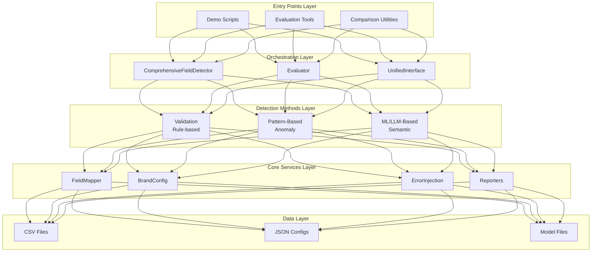

# Data Quality Detection System Documentation

Welcome to the technical reference documentation for the Data Quality Detection System - a comprehensive, multi-method data quality monitoring solution for detecting errors and anomalies in structured data.

## What is the Data Quality Detection System?

The Data Quality Detection System is an advanced data quality monitoring framework that combines multiple detection approaches to identify data quality issues with varying levels of confidence. Originally designed for fashion/retail product catalogs, the system is field-agnostic and can be adapted to various data domains.

## Key Features

- 🎯 **Multi-Method Detection**: Combines rule-based validation, pattern matching, machine learning, and language models
- 📊 **Comprehensive Evaluation**: Built-in metrics, confusion matrix analysis, and performance tracking
- 🔧 **Highly Configurable**: Customizable field mappings, detection thresholds, and brand configurations
- 💾 **Memory Efficient**: Sequential processing, model caching, and optimized resource usage
- 📈 **Performance Optimized**: Weighted combination based on historical performance data
- 🌐 **Brand Agnostic**: Supports multiple brands through configuration files
- 📱 **Visual Interface**: Interactive HTML5 viewer for result exploration

## Detection Methods

The system employs four complementary detection approaches:

1. **Validation (Rule-Based)**: High-confidence error detection using business rules
2. **Pattern-Based Anomaly Detection**: Medium-confidence detection using pattern matching
3. **ML-Based Detection**: Semantic similarity analysis using sentence transformers
4. **LLM-Based Detection**: Advanced semantic understanding with language models

## System Architecture

The system follows a modular, plugin-based architecture with clear separation of concerns:

## Use Cases

- **Data Quality Monitoring**: Continuous monitoring of data quality in production systems
- **Data Validation**: Pre-processing validation before data ingestion
- **Anomaly Detection**: Identifying unusual patterns and outliers in datasets
- **Compliance Checking**: Ensuring data meets business rules and standards
- **Data Cleansing**: Identifying and categorizing data issues for correction

## Documentation Structure

This documentation is organized into the following sections:

- **Getting Started**: Installation, setup, and basic usage
- **Architecture**: System design, components, and data flow
- **Detection Methods**: Detailed guides for each detection approach
- **API Reference**: Complete API documentation for all interfaces
- **Configuration**: How to configure the system for your needs
- **User Guides**: Step-by-step guides for common tasks
- **Development**: Adding new fields, creating validators, and extending the system
- **Operations**: Deployment, monitoring, and troubleshooting

## Quick Navigation

- [Installation Guide](getting-started/installation.md) - Get the system up and running
- [Quick Start Tutorial](getting-started/quick-start.md) - Run your first detection
- [API Reference](api/interfaces.md) - Explore the programming interfaces
- [Configuration Guide](configuration/brand-config.md) - Customize for your data

## Support and Contribution

The Data Quality Detection System is designed to be extensible and customizable. Whether you're adding new fields, creating custom validators, or implementing new detection methods, this documentation provides comprehensive guidance.

For questions, issues, or contributions, please refer to our [Contributing Guide](development/contributing.md).