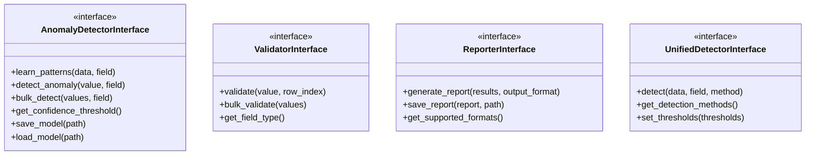

# Core Interfaces API Reference

This document provides comprehensive API documentation for the core interfaces in the Data Quality Detection System. These interfaces define the contracts that all implementations must follow.

## Overview

The system uses abstract base classes (ABCs) to define interfaces, ensuring consistency across different implementations. The main interfaces are:



## AnomalyDetectorInterface

Base interface for all anomaly detection methods.

### Location
`anomaly_detectors/anomaly_detector_interface.py`

### Methods

#### learn_patterns(data: pd.DataFrame, field: str) -> None

Learns patterns from training data for a specific field.

**Parameters:**
- `data` (pd.DataFrame): Training data containing clean examples
- `field` (str): Field name to learn patterns for

**Example:**
```python
detector = MLAnomalyDetector()
detector.learn_patterns(clean_data, 'material')
```

#### detect_anomaly(value: Any, field: str) -> Dict[str, Any]

Detects if a single value is anomalous.

**Parameters:**
- `value` (Any): Value to check for anomalies
- `field` (str): Field name for context

**Returns:**
- Dict containing:
  - `is_anomaly` (bool): Whether value is anomalous
  - `confidence` (float): Confidence score (0-1)
  - `reason` (str): Explanation for detection
  - `details` (Dict): Additional detection details

**Example:**
```python
result = detector.detect_anomaly("unknwn_material", "material")
# {'is_anomaly': True, 'confidence': 0.85, 'reason': 'Unknown material type'}
```

#### bulk_detect(values: List[Any], field: str) -> List[Dict[str, Any]]

Performs batch anomaly detection for efficiency.

**Parameters:**
- `values` (List[Any]): List of values to check
- `field` (str): Field name for context

**Returns:**
- List of detection results (same format as detect_anomaly)

**Example:**
```python
results = detector.bulk_detect(['cotton', 'silk', 'unknwn'], 'material')
```

#### get_confidence_threshold() -> float

Returns the confidence threshold used for anomaly classification.

**Returns:**
- float: Threshold value (0-1)

#### save_model(path: str) -> None

Saves the trained model to disk.

**Parameters:**
- `path` (str): Directory path to save model files

#### load_model(path: str) -> None

Loads a previously trained model from disk.

**Parameters:**
- `path` (str): Directory path containing model files

### Implementations

- `PatternBasedDetector`: Rule-based pattern matching
- `MLAnomalyDetector`: Machine learning based detection
- `LLMAnomalyDetector`: Language model based detection

## ValidatorInterface

Base interface for field validators that enforce business rules.

### Location
`validators/validator_interface.py`

### Methods

#### validate(value: Any, row_index: Optional[int] = None) -> List[ValidationError]

Validates a single value against business rules.

**Parameters:**
- `value` (Any): Value to validate
- `row_index` (Optional[int]): Row index for error reporting

**Returns:**
- List[ValidationError]: List of validation errors found

**Example:**
```python
validator = MaterialValidator()
errors = validator.validate("", row_index=5)
# [ValidationError(type='EMPTY_VALUE', severity='ERROR', confidence=1.0)]
```

#### bulk_validate(values: List[Any]) -> List[List[ValidationError]]

Validates multiple values in batch.

**Parameters:**
- `values` (List[Any]): List of values to validate

**Returns:**
- List of error lists, one per value

#### get_field_type() -> str

Returns the field type this validator handles.

**Returns:**
- str: Field type name

### ValidationError Class

```python
@dataclass
class ValidationError:
    error_type: str          # Error code (e.g., 'EMPTY_VALUE')
    severity: str           # 'ERROR', 'WARNING', or 'INFO'
    confidence: float       # Always 1.0 for validators
    details: Dict[str, Any] # Additional error context
    message: Optional[str]  # Human-readable message
```

### Creating Custom Validators

```python
from validators.validator_interface import ValidatorInterface
from validators.validation_error import ValidationError

class CustomValidator(ValidatorInterface):
    def __init__(self):
        self.field_type = "custom_field"
    
    def validate(self, value, row_index=None):
        errors = []
        
        # Add validation logic
        if not value:
            errors.append(ValidationError(
                error_type="MISSING_VALUE",
                severity="ERROR",
                confidence=1.0,
                details={"value": value, "row": row_index}
            ))
        
        return errors
```

## ReporterInterface

Base interface for report generation across different formats.

### Location
`anomaly_detectors/reporter_interface.py`

### Methods

#### generate_report(results: Dict[str, Any], output_format: str = 'json') -> Any

Generates a report from detection results.

**Parameters:**
- `results` (Dict): Detection results to report
- `output_format` (str): Output format ('json', 'csv', 'html')

**Returns:**
- Report in specified format

#### save_report(report: Any, path: str) -> None

Saves report to file.

**Parameters:**
- `report` (Any): Report data
- `path` (str): File path to save report

#### get_supported_formats() -> List[str]

Returns list of supported output formats.

**Returns:**
- List[str]: Format names

### Report Structure

Standard report structure:

```python
{
    "summary": {
        "total_records": 1000,
        "errors_found": 150,
        "detection_methods": ["validation", "pattern", "ml"],
        "timestamp": "2024-01-01T00:00:00Z"
    },
    "field_results": {
        "material": {
            "errors": 25,
            "error_rate": 0.025,
            "top_errors": [...]
        }
    },
    "detailed_results": [...]
}
```

## UnifiedDetectorInterface

High-level interface that combines multiple detection methods.

### Location
`multi_sample_evaluation/unified_detection_interface.py`

### Methods

#### detect(data: pd.DataFrame, field: str, method: str = 'all') -> pd.DataFrame

Runs detection on data using specified method(s).

**Parameters:**
- `data` (pd.DataFrame): Input data
- `field` (str): Field to analyze
- `method` (str): Detection method ('validation', 'pattern', 'ml', 'llm', 'all')

**Returns:**
- pd.DataFrame: Data with detection results added

#### get_detection_methods() -> List[str]

Returns available detection methods.

**Returns:**
- List[str]: Method names

#### set_thresholds(thresholds: Dict[str, float]) -> None

Sets confidence thresholds for each detection method.

**Parameters:**
- `thresholds` (Dict[str, float]): Method-to-threshold mapping

**Example:**
```python
detector.set_thresholds({
    'validation': 0.0,
    'pattern': 0.7,
    'ml': 0.75,
    'llm': 0.6
})
```

## Usage Examples

### Complete Detection Pipeline

```python
from anomaly_detectors.ml_based.ml_anomaly_detector import MLAnomalyDetector
from validators.material.validate import Validator as MaterialValidator
from single_sample_multi_field_demo.consolidated_reporter import ConsolidatedReporter

# Initialize components
ml_detector = MLAnomalyDetector()
validator = MaterialValidator()
reporter = ConsolidatedReporter()

# Load and prepare data
data = pd.read_csv('data.csv')

# Train ML model
ml_detector.learn_patterns(data, 'material')

# Detect anomalies
ml_results = ml_detector.bulk_detect(data['material'].values, 'material')
validation_results = validator.bulk_validate(data['material'].values)

# Generate report
all_results = {
    'ml': ml_results,
    'validation': validation_results
}
report = reporter.generate_report(all_results)
reporter.save_report(report, 'output/report.json')
```

### Custom Implementation

```python
from anomaly_detectors.anomaly_detector_interface import AnomalyDetectorInterface

class CustomDetector(AnomalyDetectorInterface):
    def __init__(self, threshold=0.8):
        self.threshold = threshold
        self.patterns = {}
    
    def learn_patterns(self, data, field):
        # Implement pattern learning
        self.patterns[field] = self._extract_patterns(data[field])
    
    def detect_anomaly(self, value, field):
        # Implement detection logic
        score = self._calculate_score(value, field)
        return {
            'is_anomaly': score > self.threshold,
            'confidence': score,
            'reason': 'Custom detection logic',
            'details': {'patterns': self.patterns.get(field, [])}
        }
    
    def get_confidence_threshold(self):
        return self.threshold
```

## Best Practices

1. **Interface Compliance**: Always implement all required methods
2. **Error Handling**: Handle edge cases gracefully
3. **Documentation**: Document custom implementations thoroughly
4. **Testing**: Write unit tests for interface implementations
5. **Performance**: Implement bulk methods for efficiency

## Next Steps

- Explore specific [Validators](validators.md) implementations
- Learn about [Anomaly Detectors](anomaly-detectors.md) in detail
- Understand [Reporters](reporters.md) and output formats