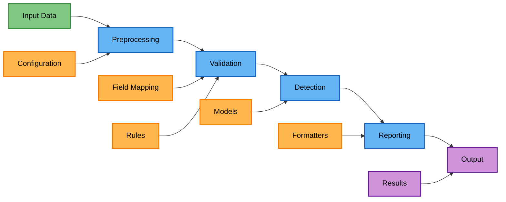
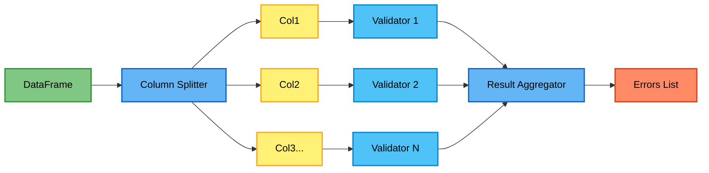
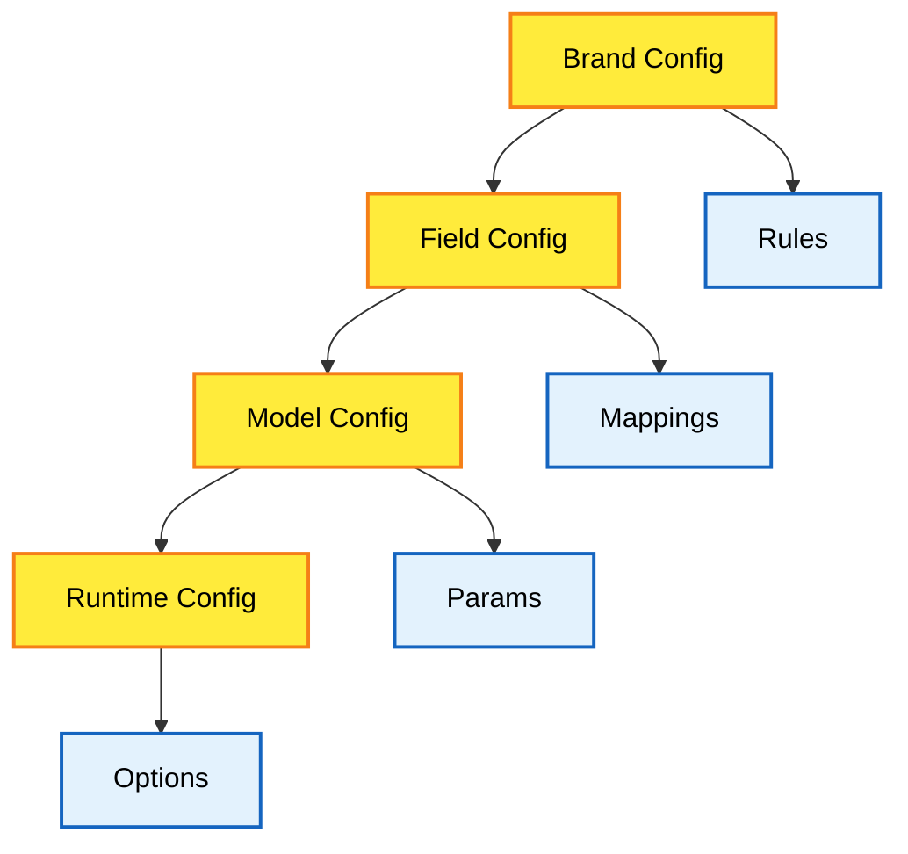
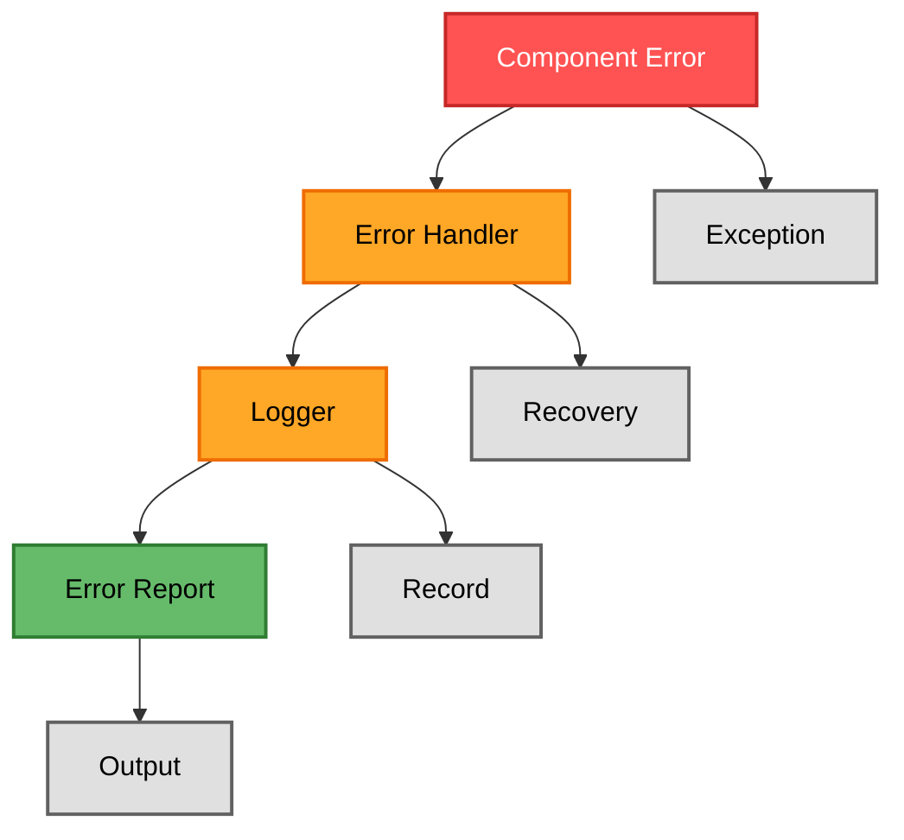

# Data Flow Architecture

This document describes how data flows through the anomaly detection system from input to output.

## Overview

The data flow follows a pipeline architecture:



## Input Stage

### Data Sources

The system accepts data from multiple sources:

1. **CSV Files** - Primary input format
2. **Pandas DataFrames** - In-memory processing
3. **JSON Data** - Configuration and small datasets

### Data Loading

```python
# CSV input
df = pd.read_csv(input_file)

# Direct DataFrame
df = existing_dataframe

# JSON configuration
config = json.load(config_file)
```

## Preprocessing Stage

### Field Mapping

The `FieldMapper` transforms column names:

```python
# Brand-specific mapping
mapper = FieldMapper(brand_config)
df_mapped = mapper.map_columns(df)
```

### Data Cleaning

Common preprocessing steps:

1. **Missing Value Handling**
   - Fill with defaults
   - Remove incomplete rows
   - Interpolate values

2. **Type Conversion**
   - String normalization
   - Numeric parsing
   - Date/time formatting

3. **Feature Engineering**
   - Derived columns
   - Aggregations
   - Encodings

## Validation Stage

### Parallel Validation

Validators process columns in parallel:



### Validation Flow

```python
# For each column
for column in configured_columns:
    validator = get_validator(column.type)
    errors = validator.bulk_validate(df, column.name)
    all_errors.extend(errors)
```

### Error Collection

Validation errors include context:

```python
ValidationError(
    row_index=42,
    column_name="size",
    value="XXL",
    error_type="invalid_format",
    message="Size format not recognized"
)
```

## Detection Stage

The detection stage processes data through multiple detection methods based on configuration.

### Method Selection

The system selects detection methods based on field type and configuration. Data flows through the method selector, then to the detection pipeline, and finally to the result merger.

### Batch Processing

For efficiency, data is processed in batches:

```python
# CPU processing
batch_size = cpu_count() * 100
for batch in chunk_dataframe(df, batch_size):
    results.extend(process_batch(batch))

# GPU processing
optimal_batch = get_optimal_batch_size()
for batch in chunk_dataframe(df, optimal_batch):
    results.extend(gpu_process_batch(batch))
```

### Pattern Learning

ML-based detectors learn from data:

```python
# Training phase
detector.learn_patterns(training_df, column_name)

# Detection phase
anomalies = detector.bulk_detect(test_df, column_name)
```

## Reporting Stage

### Result Aggregation

Results from multiple sources are combined:

```python
all_results = {
    'validation_errors': validation_errors,
    'anomalies': {
        'pattern_based': pattern_anomalies,
        'ml_based': ml_anomalies,
        'llm_based': llm_anomalies
    }
}
```

### Report Generation

Reporters transform raw results:

```python
reporter = get_reporter(output_format)
report = reporter.generate_report(
    anomaly_results=all_results,
    original_df=df,
    threshold=config.threshold
)
```

## Output Stage

### Output Formats

The system supports multiple output formats:

1. **JSON Reports**
   ```json
   {
     "summary": {...},
     "errors": [...],
     "anomalies": [...],
     "statistics": {...}
   }
   ```

2. **CSV Export**
   - Error listings
   - Anomaly scores
   - Annotated data

3. **Console Output**
   - Progress indicators
   - Summary statistics
   - Error highlights

4. **Visualization**
   - Distribution plots
   - Confusion matrix heatmaps
   - Performance comparison charts

## Configuration Flow

### Configuration Sources



### Configuration Loading

```python
# Load brand configuration
brand_config = load_brand_config(brand_name)

# Field mappings
field_mappings = brand_config.field_mappings

# Custom thresholds
thresholds = brand_config.custom_thresholds

# Runtime options
runtime_config = parse_args()
```

## Error Handling Flow

### Error Propagation



### Error Types

1. **Data Errors** - Invalid input data
2. **Configuration Errors** - Missing/invalid config
3. **Processing Errors** - Runtime failures
4. **Resource Errors** - Memory/GPU issues

## Performance Optimization

### Caching Strategy

```python
# Model caching
model_cache = {}
def get_model(model_type):
    if model_type not in model_cache:
        model_cache[model_type] = load_model(model_type)
    return model_cache[model_type]

# Result caching
@lru_cache(maxsize=1000)
def expensive_computation(data_hash):
    return compute_result(data_hash)
```

### Memory Management

```python
# Chunked processing
for chunk in pd.read_csv(file, chunksize=10000):
    process_chunk(chunk)
    
# Garbage collection
import gc
gc.collect()
```

## Monitoring and Logging

### Progress Tracking

The system provides progress feedback through console output during processing. Various components support `show_progress_bar` parameters to enable progress indication.

### Performance Metrics

```python
# Timing
start_time = time.time()
result = process_data(df)
elapsed = time.time() - start_time

# Memory usage
memory_usage = df.memory_usage(deep=True).sum()
```

## Distributed Processing

### Future Architecture

The distributed processing architecture follows a master-worker pattern:
- Master node manages task scheduling
- Task queue distributes work partitions
- Worker nodes process data in parallel
- Result queue collects processed data
- Aggregator merges final results

### Scaling Strategies

1. **Horizontal Scaling**
   - Multiple worker processes
   - Distributed computing
   - Cloud deployment

2. **Vertical Scaling**
   - GPU acceleration
   - Memory optimization
   - CPU vectorization

## Data Privacy

### Sensitive Data Handling

1. **Anonymization** - Remove PII
2. **Encryption** - Secure transmission
3. **Access Control** - Role-based permissions
4. **Audit Logging** - Track data access

## Best Practices

1. **Validate Early** - Check data quality at input
2. **Process in Batches** - Optimize memory usage
3. **Cache Results** - Avoid redundant computation
4. **Monitor Progress** - Provide user feedback
5. **Handle Errors Gracefully** - Continue processing when possible
6. **Clean Up Resources** - Release memory and GPU
7. **Log Everything** - Enable debugging and auditing