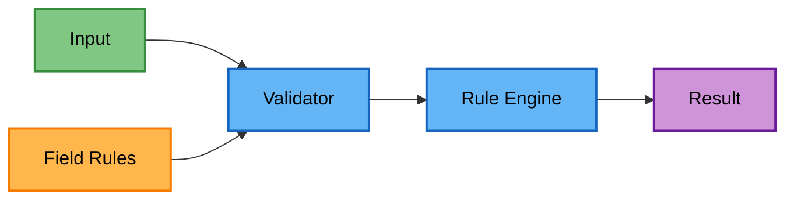
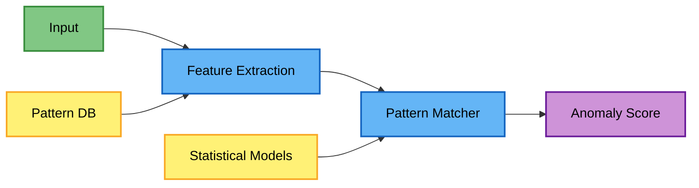
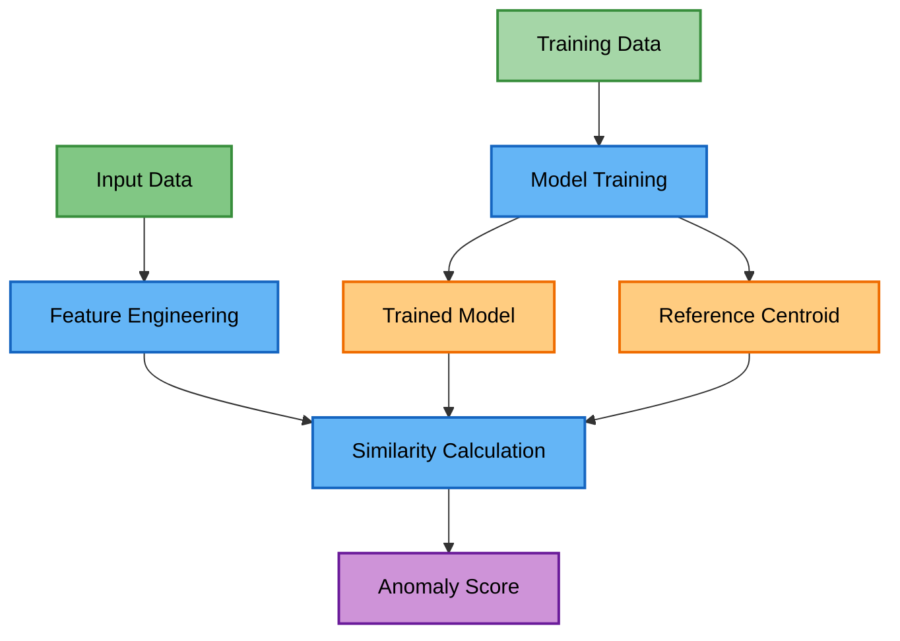
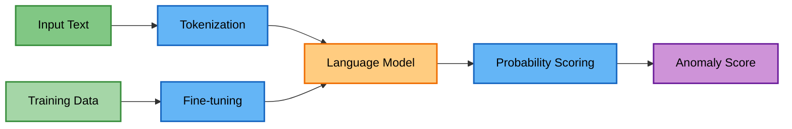

# Detection Methods Architecture

This document provides a comprehensive overview of the detection methods, their theoretical foundations, and implementation details.

## Overview

The Data Quality Detection System employs a multi-layered approach to anomaly detection, combining deterministic rule-based validation with advanced machine learning methods. Each detection method addresses different types of data quality issues:

1. **Rule-Based Validation** - Fast, deterministic checks for format violations and business rules (configured via JSON `rules.json` per field)
2. **Pattern-Based Detection** - JSON-configured pattern matching for known formats
3. **ML-Based Detection** - Machine learning models for semantic anomalies
4. **LLM-Based Detection** - Large language models for complex linguistic patterns

## Detection Philosophy

Our approach uses progressive confidence levels based on the type of anomaly:

- **Deterministic Errors**: Format violations, business rule breaches → Rule-based (100% confidence)
- **Pattern Anomalies**: Known pattern mismatches → Pattern detection (70-80% confidence)
- **Semantic Anomalies**: Contextual inconsistencies → ML detection (60-75% confidence)
- **Complex Linguistic Errors**: Language violations → LLM detection (50-70% confidence)

## Method Comparison

| Method | Confidence | Training Required | Speed | Best Use Cases |
|--------|------------|------------------|--------|----------------|
| **Validation** | 100% | No | ~1ms/record | Format errors, business rules |
| **Pattern-Based** | 70-80% | No | ~5ms/record | Known patterns, regex validation |
| **ML-Based** | 60-75% | Yes | ~20ms/record | Semantic consistency |
| **LLM-Based** | 50-70% | Yes | ~100ms/record | Complex linguistic patterns |

## Architecture Principles

### Modularity

Each detection method implements the `AnomalyDetectorInterface`:

```python
class AnomalyDetectorInterface(ABC):
    @abstractmethod
    def _detect_anomaly(self, value: Any, context: Dict[str, Any] = None) -> Optional[AnomalyError]:
        pass
    
    def learn_patterns(self, df: pd.DataFrame, column_name: str) -> None:
        pass
    
    def bulk_detect(self, df: pd.DataFrame, column_name: str, batch_size: Optional[int], max_workers: int) -> List[AnomalyError]:
        pass
```

### Performance Optimization

The detection pipeline includes several optimizations:

- **Parallel Processing**: Multi-core CPU utilization
- **Batch Processing**: GPU-optimized batch operations
- **Caching**: Pattern and model caching
- **Early Exit**: Fast-fail on obvious anomalies

### Scalability

The architecture supports:

- Horizontal scaling through parallel workers
- Vertical scaling with GPU acceleration
- Batch processing for large datasets
- Distributed execution (future)

## Detection Pipeline

### 1. Data Preprocessing

All detection methods share common preprocessing:

```python
# Data normalization
# Missing value handling
# Type conversion
# Feature extraction
```

### 2. Method Selection

The system can apply methods in sequence or parallel:

- **Sequential**: Rule → Pattern → ML → LLM
- **Parallel**: All methods simultaneously
- **Adaptive**: Based on data characteristics

### 3. Result Aggregation

Multiple detection results are combined:

- **Union**: Any method flags as anomaly
- **Intersection**: All methods agree
- **Weighted**: Confidence-based voting
- **Hierarchical**: Priority-based selection

## Rule-Based Validation

### Architecture



### Components

- **Validators**: Field-specific validation classes
- **Rule Engine**: Executes validation rules
- **Rule Repository**: Stores validation rules

### Characteristics

- Deterministic results
- Fast execution
- No training required
- Limited to known patterns

## Pattern-Based Detection

### Architecture



### Components

- **Feature Extractors**: Convert data to features
- **Pattern Database**: Stores known patterns
- **Statistical Models**: Distribution analysis
- **Anomaly Scorer**: Calculates deviation scores

### Techniques

- Regular expression matching
- Known value lookup
- JSON-configured pattern rules
- Format validation

## ML-Based Detection

### Architecture



### Components

- **Model Registry**: Stores trained models
- **Feature Pipeline**: Standardized feature extraction
- **Model Ensemble**: Multiple model combination
- **GPU Manager**: Handles GPU allocation

### Model Types

The ML-based detection uses:

- **Sentence Transformers**: For text embedding and similarity
- **Reference Centroids**: Pre-computed centers of normality for each field
- **Cosine Similarity**: For anomaly scoring against centroids
- **Triplet Loss Training**: For learning semantic representations
- **Field-specific Models**: Different transformer models per field type

### GPU Acceleration

The ML pipeline includes GPU optimizations:

```python
# Automatic batch sizing
optimal_batch_size = get_optimal_batch_size()

# GPU memory management
with gpu_context():
    predictions = model.predict_batch(data)
```

## LLM-Based Detection

### Architecture



### Components

- **Fine-tuned Language Models**: Field-specific masked language models
- **Tokenizer**: Text preprocessing and token probability calculation
- **Probability Scorer**: Converts token probabilities to anomaly scores
- **Dynamic Context Encoder**: Optional contextual information integration

### Features

- Domain-specific language modeling
- Token probability-based anomaly scoring
- Fine-tuned understanding of field patterns
- Optional temporal and categorical context

## Integration Patterns

The system supports multiple integration approaches:

### Sequential Processing

Detection methods can be run in sequence, with early exit on first detection:
- Fast rule-based checks first
- Pattern-based analysis using JSON configuration rules
- ML models for complex patterns
- LLM for difficult cases (if enabled)

### Parallel Processing

Multiple detectors can run simultaneously:
- All methods process the same data in parallel
- Results are aggregated based on configuration
- Supports different aggregation strategies (union, intersection, voting)

## Performance Characteristics

### Latency Comparison

| Method | Single Record | 1K Records | 100K Records |
|--------|--------------|------------|--------------|
| Rule-Based | &lt;1ms | ~10ms | ~1s |
| Pattern-Based | ~5ms | ~50ms | ~5s |
| ML-Based (CPU) | ~10ms | ~100ms | ~10s |
| ML-Based (GPU) | ~50ms | ~200ms | ~2s |
| LLM-Based | ~500ms | ~5s | ~500s |

### Accuracy Trade-offs

- **Rule-Based**: High precision, low recall
- **Pattern-Based**: Balanced precision/recall
- **ML-Based**: High recall, tunable precision
- **LLM-Based**: High accuracy, expensive

## Configuration

### Method Selection

```json
{
  "detection_methods": {
    "rule_based": {
      "enabled": true,
      "priority": 1
    },
    "pattern_based": {
      "enabled": true,
      "priority": 2
    },
    "ml_based": {
      "enabled": true,
      "priority": 3,
      "use_gpu": true
    },
    "llm_based": {
      "enabled": false,
      "priority": 4
    }
  }
}
```

### Threshold Configuration

Each method supports configurable thresholds:

```json
{
  "thresholds": {
    "pattern_based": {
      "statistical_outlier": 3.0,
      "frequency_threshold": 0.01
    },
    "ml_based": {
      "anomaly_score": 0.7,
      "confidence_threshold": 0.8
    }
  }
}
```

## Theoretical Foundations

### Rule-Based Validation

**Theory**: Grounded in formal logic and domain expertise, providing deterministic results based on predefined constraints.

**Key Concepts**:
- Boolean logic for constraint checking
- Domain-specific business rules
- Format validation using regular expressions
- Hierarchical rule application

**Example Rules**:
- Material must contain percentage and fiber name
- Color names must be from approved list
- Sizes must follow standard format (S, M, L, XL)

### Pattern-Based Detection

**Theory**: Statistical pattern recognition combined with rule-based matching to identify anomalies that deviate from expected patterns.

**Key Concepts**:
- Frequency analysis for rare values
- Pattern matching using regex
- Statistical outlier detection
- Known value whitelisting

**Mathematical Foundation**:
- Z-score for statistical outliers: `z = (x - μ) / σ`
- Frequency threshold: Values appearing < 1% are flagged
- Pattern confidence: Based on match percentage

### ML-Based Detection

**Theory**: Uses deep learning embeddings to capture semantic meaning and identify anomalies through vector similarity.

**Key Concepts**:
- Sentence transformers for text embedding
- Centroid-based anomaly detection
- Cosine similarity for semantic comparison
- Triplet loss for model training

**Mathematical Foundation**:
- Embedding generation: `e = transformer(text)`
- Centroid calculation: `c = mean(embeddings)`
- Anomaly score: `score = 1 - cosine_similarity(e, c)`
- Threshold: Typically 0.7-0.8 based on validation

### LLM-Based Detection

**Theory**: Leverages large language models to understand context and identify complex linguistic anomalies.

**Key Concepts**:
- Contextual understanding using transformers
- Probability-based anomaly scoring
- Few-shot learning for adaptation
- Instruction-following for specific checks

**Mathematical Foundation**:
- Log probability: `log P(text|context)`
- Perplexity: `exp(-1/n * Σ log P(xi|x<i))`
- Anomaly threshold: Based on probability distribution

## Progressive Detection Flow

```
Input → Validation (100% confidence)
  ↓ Pass
Pattern Detection (80% confidence)
  ↓ Uncertain
ML Detection (75% confidence)
  ↓ Still uncertain
LLM Detection (70% confidence)
  ↓
Final Decision with Weighted Confidence
```

## Best Practices

### Method Selection
- Use validation for critical business rules
- Apply pattern detection for known formats
- Enable ML for semantic consistency
- Reserve LLM for complex cases

### Performance Optimization
- Run methods in parallel when possible
- Cache ML model embeddings
- Batch LLM requests
- Use GPU acceleration for ML/LLM

### Accuracy Tuning
- Start with conservative thresholds
- Use evaluation mode to measure performance
- Generate optimized weights from results
- Adjust thresholds based on false positive rates

## Best Practices

1. **Start Simple**: Begin with rule-based validation
2. **Add Complexity Gradually**: Layer detection methods
3. **Monitor Performance**: Track latency and accuracy
4. **Tune Thresholds**: Adjust based on feedback
5. **Cache Results**: Avoid redundant computations
6. **Parallelize**: Use all available cores/GPUs

## Future Enhancements

- **Online Learning**: Continuous model updates
- **Federated Detection**: Distributed anomaly detection
- **Active Learning**: Human-in-the-loop improvements
- **Multi-modal Detection**: Combining structured and unstructured data