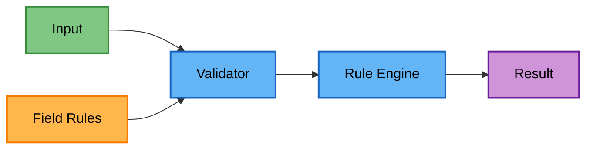
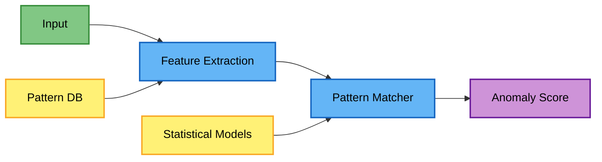
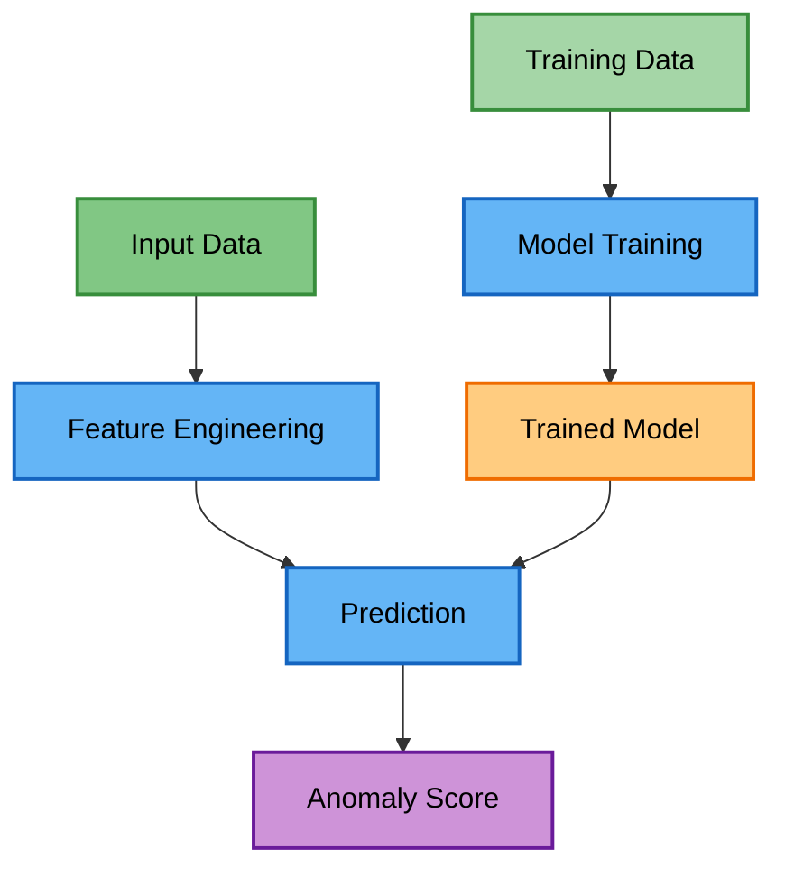
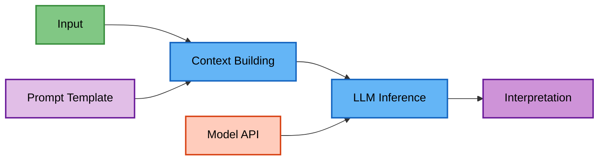

# Detection Methods Architecture

This document describes the architecture of different anomaly detection methods implemented in the system.

## Overview

The system implements a multi-layered approach to anomaly detection:

1. **Rule-Based Validation** - Fast, deterministic checks
2. **Pattern-Based Detection** - Statistical and pattern matching
3. **ML-Based Detection** - Machine learning models
4. **LLM-Based Detection** - Large language model analysis

Each method has its strengths and is suitable for different types of anomalies.

## Architecture Principles

### Modularity

Each detection method implements the `AnomalyDetectorInterface`:

```python
class AnomalyDetectorInterface(ABC):
    @abstractmethod
    def _detect_anomaly(self, value: Any, context: Dict[str, Any] = None) -> Optional[AnomalyError]:
        pass
    
    def learn_patterns(self, df: pd.DataFrame, column_name: str) -> None:
        pass
    
    def bulk_detect(self, df: pd.DataFrame, column_name: str, batch_size: Optional[int], max_workers: int) -> List[AnomalyError]:
        pass
```

### Performance Optimization

The detection pipeline includes several optimizations:

- **Parallel Processing**: Multi-core CPU utilization
- **Batch Processing**: GPU-optimized batch operations
- **Caching**: Pattern and model caching
- **Early Exit**: Fast-fail on obvious anomalies

### Scalability

The architecture supports:

- Horizontal scaling through parallel workers
- Vertical scaling with GPU acceleration
- Batch processing for large datasets
- Distributed execution (future)

## Detection Pipeline

### 1. Data Preprocessing

All detection methods share common preprocessing:

```python
# Data normalization
# Missing value handling
# Type conversion
# Feature extraction
```

### 2. Method Selection

The system can apply methods in sequence or parallel:

- **Sequential**: Rule → Pattern → ML → LLM
- **Parallel**: All methods simultaneously
- **Adaptive**: Based on data characteristics

### 3. Result Aggregation

Multiple detection results are combined:

- **Union**: Any method flags as anomaly
- **Intersection**: All methods agree
- **Weighted**: Confidence-based voting
- **Hierarchical**: Priority-based selection

## Rule-Based Validation

### Architecture



### Components

- **Validators**: Field-specific validation classes
- **Rule Engine**: Executes validation rules
- **Rule Repository**: Stores validation rules

### Characteristics

- Deterministic results
- Fast execution
- No training required
- Limited to known patterns

## Pattern-Based Detection

### Architecture



### Components

- **Feature Extractors**: Convert data to features
- **Pattern Database**: Stores known patterns
- **Statistical Models**: Distribution analysis
- **Anomaly Scorer**: Calculates deviation scores

### Techniques

- Regular expression matching
- Statistical outlier detection
- Frequency analysis
- Template matching

## ML-Based Detection

### Architecture



### Components

- **Model Registry**: Stores trained models
- **Feature Pipeline**: Standardized feature extraction
- **Model Ensemble**: Multiple model combination
- **GPU Manager**: Handles GPU allocation

### Model Types

The ML-based detection uses:

- **Sentence Transformers**: For text embedding and similarity
- **Cosine Similarity**: For anomaly scoring
- **Triplet Loss Training**: For learning representations
- **Field-specific Models**: Different transformer models per field type

### GPU Acceleration

The ML pipeline includes GPU optimizations:

```python
# Automatic batch sizing
optimal_batch_size = get_optimal_batch_size()

# GPU memory management
with gpu_context():
    predictions = model.predict_batch(data)
```

## LLM-Based Detection

### Architecture



### Components

- **Prompt Manager**: Templates and context
- **Model Interface**: LLM API abstraction
- **Response Parser**: Extracts structured results
- **Context Cache**: Reduces API calls

### Features

- Natural language understanding
- Complex pattern recognition
- Contextual analysis
- Explanation generation

## Integration Patterns

The system supports multiple integration approaches:

### Sequential Processing

Detection methods can be run in sequence, with early exit on first detection:
- Fast rule-based checks first
- Pattern-based analysis for statistical anomalies
- ML models for complex patterns
- LLM for difficult cases (if enabled)

### Parallel Processing

Multiple detectors can run simultaneously:
- All methods process the same data in parallel
- Results are aggregated based on configuration
- Supports different aggregation strategies (union, intersection, voting)

## Performance Characteristics

### Latency Comparison

| Method | Single Record | 1K Records | 100K Records |
|--------|--------------|------------|--------------|
| Rule-Based | &lt;1ms | ~10ms | ~1s |
| Pattern-Based | ~5ms | ~50ms | ~5s |
| ML-Based (CPU) | ~10ms | ~100ms | ~10s |
| ML-Based (GPU) | ~50ms | ~200ms | ~2s |
| LLM-Based | ~500ms | ~5s | ~500s |

### Accuracy Trade-offs

- **Rule-Based**: High precision, low recall
- **Pattern-Based**: Balanced precision/recall
- **ML-Based**: High recall, tunable precision
- **LLM-Based**: High accuracy, expensive

## Configuration

### Method Selection

```json
{
  "detection_methods": {
    "rule_based": {
      "enabled": true,
      "priority": 1
    },
    "pattern_based": {
      "enabled": true,
      "priority": 2
    },
    "ml_based": {
      "enabled": true,
      "priority": 3,
      "use_gpu": true
    },
    "llm_based": {
      "enabled": false,
      "priority": 4
    }
  }
}
```

### Threshold Configuration

Each method supports configurable thresholds:

```json
{
  "thresholds": {
    "pattern_based": {
      "statistical_outlier": 3.0,
      "frequency_threshold": 0.01
    },
    "ml_based": {
      "anomaly_score": 0.7,
      "confidence_threshold": 0.8
    }
  }
}
```

## Best Practices

1. **Start Simple**: Begin with rule-based validation
2. **Add Complexity Gradually**: Layer detection methods
3. **Monitor Performance**: Track latency and accuracy
4. **Tune Thresholds**: Adjust based on feedback
5. **Cache Results**: Avoid redundant computations
6. **Parallelize**: Use all available cores/GPUs

## Future Enhancements

- **Online Learning**: Continuous model updates
- **Federated Detection**: Distributed anomaly detection
- **Active Learning**: Human-in-the-loop improvements
- **Multi-modal Detection**: Combining structured and unstructured data