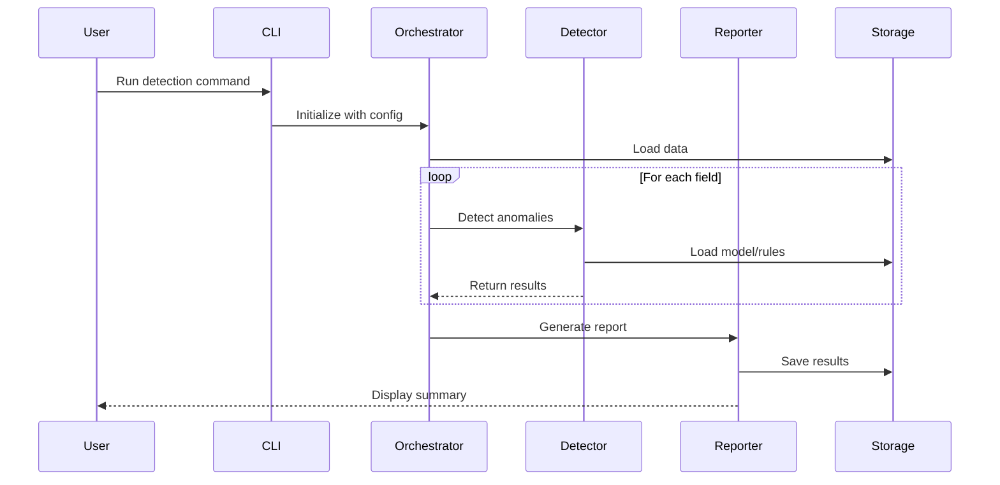
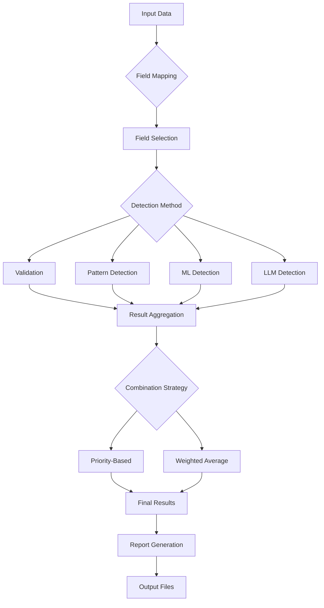
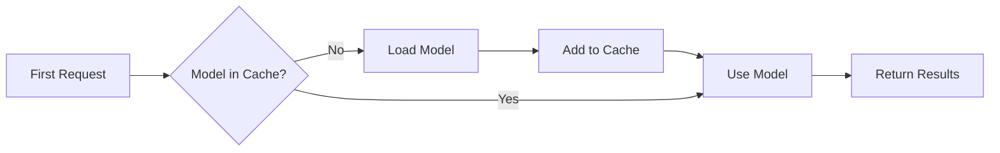
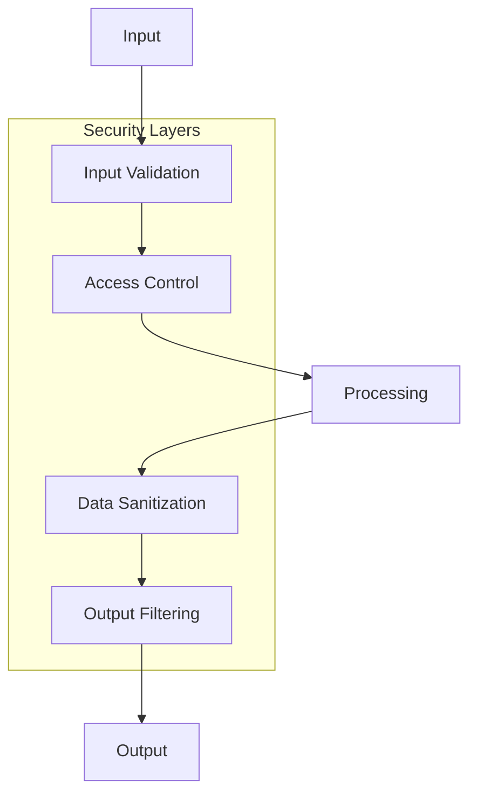

# System Architecture Overview

The Data Quality Detection System is built on a modular, extensible architecture that enables multiple detection methods to work together seamlessly. This document provides a comprehensive overview of the system's architecture, design principles, and key components.

## Design Principles

### 1. Modularity
Each detection method is self-contained and implements common interfaces, allowing new methods to be added without modifying existing code.

### 2. Extensibility
The system is designed to be easily extended with new fields, detection methods, and output formats through configuration and plugins.

### 3. Performance
Sequential processing, model caching, and GPU acceleration ensure efficient resource usage even with large datasets.

### 4. Flexibility
Configurable thresholds, weights, and field mappings allow the system to adapt to different domains and use cases.

## High-Level Architecture

```mermaid
graph TB
    subgraph "User Interface"
        style "User Interface" fill:#e3f2fd,stroke:#0d47a1,stroke-width:2px
        UI1[CLI Tools]:::ui
        UI2[HTML Viewer]:::ui
        UI3[API Endpoints]:::ui
    end
    
    subgraph "Entry Points"
        style "Entry Points" fill:#e8f5e9,stroke:#1b5e20,stroke-width:2px
        EP1[single_sample_demo]:::entry
        EP2[multi_sample_evaluation]:::entry
        EP3[ml_curve_generator]:::entry
        EP4[analyze_column]:::entry
    end
    
    subgraph "Orchestration"
        style "Orchestration" fill:#f3e5f5,stroke:#4a148c,stroke-width:2px
        O1[ComprehensiveFieldDetector]:::orchestrator
        O2[ConsolidatedReporter]:::orchestrator
        O3[ConfusionMatrixAnalyzer]:::orchestrator
    end
    
    subgraph "Detection Engine"
        style "Detection Engine" fill:#fff8e1,stroke:#f57f17,stroke-width:2px
        DE1[Validation Engine]:::validator
        DE2[Pattern Detector]:::detector
        DE3[ML Detector]:::ml
        DE4[LLM Detector]:::llm
    end
    
    subgraph "Core Services"
        style "Core Services" fill:#fce4ec,stroke:#880e4f,stroke-width:2px
        CS1[Field Mapper]:::service
        CS2[Brand Config]:::service
        CS3[Error Injector]:::service
        CS4[Model Cache]:::service
    end
    
    subgraph "Data Storage"
        style "Data Storage" fill:#eceff1,stroke:#263238,stroke-width:2px
        DS1[(CSV Data)]:::storage
        DS2[(JSON Configs)]:::storage
        DS3[(ML Models)]:::storage
        DS4[(Detection Results)]:::storage
    end
    
    UI1 --> EP1 & EP2 & EP3 & EP4
    EP1 & EP2 --> O1
    O1 --> DE1 & DE2 & DE3 & DE4
    DE1 & DE2 & DE3 & DE4 --> CS1 & CS2 & CS3 & CS4
    CS1 & CS2 & CS3 & CS4 --> DS1 & DS2 & DS3
    O1 --> O2 & O3
    O2 & O3 --> DS4
    UI2 --> DS4
    
    classDef ui fill:#64b5f6,stroke:#1565c0,stroke-width:2px,color:#000
    classDef entry fill:#81c784,stroke:#388e3c,stroke-width:2px,color:#000
    classDef orchestrator fill:#ba68c8,stroke:#6a1b9a,stroke-width:2px,color:#fff
    classDef validator fill:#4fc3f7,stroke:#0288d1,stroke-width:2px,color:#000
    classDef detector fill:#ffb74d,stroke:#f57c00,stroke-width:2px,color:#000
    classDef ml fill:#ff8a65,stroke:#d84315,stroke-width:2px,color:#000
    classDef llm fill:#f06292,stroke:#c2185b,stroke-width:2px,color:#fff
    classDef service fill:#fff176,stroke:#f9a825,stroke-width:2px,color:#000
    classDef storage fill:#b0bec5,stroke:#455a64,stroke-width:2px,color:#000
```

## Layer Architecture

The system is organized into distinct layers, each with specific responsibilities:

### 1. Entry Points Layer

This layer provides various ways to interact with the system:

- **Demo Scripts**: Quick demonstration and testing
- **Evaluation Tools**: Performance measurement and comparison
- **Utility Scripts**: Data analysis and preparation

### 2. Orchestration Layer

Coordinates the detection workflow:

- **ComprehensiveFieldDetector**: Manages detection across all fields and methods
- **Evaluator**: Handles performance evaluation and metrics


### 3. Detection Methods Layer

Implements the core detection algorithms:

```mermaid
graph LR
    subgraph "Detection Methods"
        style "Detection Methods" fill:#e8f5e9,stroke:#1b5e20,stroke-width:2px
        V[Validation<br/>100% Confidence]:::validator
        P[Pattern-Based<br/>70-80% Confidence]:::pattern
        M[ML-Based<br/>Configurable]:::ml
        L[LLM-Based<br/>Configurable]:::llm
    end
    
    V --> VR[Rule Engine]:::engine
    P --> PR[Pattern Matcher]:::engine
    M --> MR[Similarity Engine]:::engine
    L --> LR[Language Model]:::engine
    
    classDef validator fill:#4fc3f7,stroke:#0288d1,stroke-width:2px,color:#000
    classDef pattern fill:#ffb74d,stroke:#f57c00,stroke-width:2px,color:#000
    classDef ml fill:#ff8a65,stroke:#d84315,stroke-width:2px,color:#000
    classDef llm fill:#f06292,stroke:#c2185b,stroke-width:2px,color:#fff
    classDef engine fill:#b39ddb,stroke:#512da8,stroke-width:2px,color:#000
```

### 4. Core Services Layer

Provides shared functionality:

- **FieldMapper**: Translates between standard fields and column names
- **BrandConfig**: Manages brand-specific configurations
- **ErrorInjector**: Generates synthetic errors for testing
- **Reporters**: Formats and outputs detection results

### 5. Data Layer

Handles all data storage and retrieval:

- **Input Data**: CSV files with structured data
- **Configuration**: JSON files for settings and rules
- **Models**: Trained ML/LLM models
- **Results**: Detection reports and analyzed data

## Component Interactions



## Detection Flow

The system processes data through a well-defined flow:



## Memory Management

The system implements several strategies for efficient memory usage:

### Sequential Processing
Fields are processed one at a time to minimize memory footprint:

```python
for field in fields:
    results = detect_field(field)
    save_results(results)
    clear_cache()
```

### Model Caching
Models are loaded once and reused:



### Batch Processing
Data is processed in configurable batches to balance memory and performance.

## Scalability Considerations

### Horizontal Scaling
- Field-level parallelization
- Independent detection methods
- Distributed processing support

### Vertical Scaling
- GPU acceleration for ML/LLM
- Optimized algorithms
- Efficient data structures

## Security Architecture



## Extension Points

The architecture provides several extension points for customization:

1. **New Detection Methods**: Implement `AnomalyDetectorInterface`
2. **Custom Validators**: Implement `ValidatorInterface`
3. **Output Formats**: Implement `ReporterInterface`
4. **Field Types**: Add configuration and rules
5. **Brand Support**: Add brand configuration files

## Performance Optimization

The system includes several performance optimizations:

- **Lazy Loading**: Models loaded only when needed
- **Result Caching**: Avoid redundant computations
- **Parallel Processing**: Multi-threading for independent operations
- **GPU Acceleration**: CUDA support for ML operations

## Next Steps

- Understand [Detection Methods](../detection-methods/overview.md) implementation
- Explore the [API Reference](../api/interfaces.md)
- Learn about [Configuration](../configuration/brand-config.md)