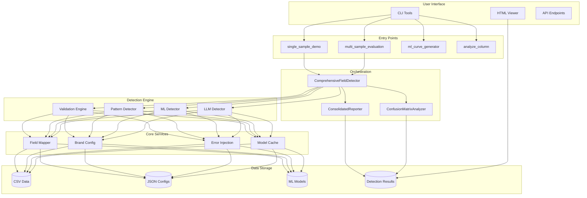
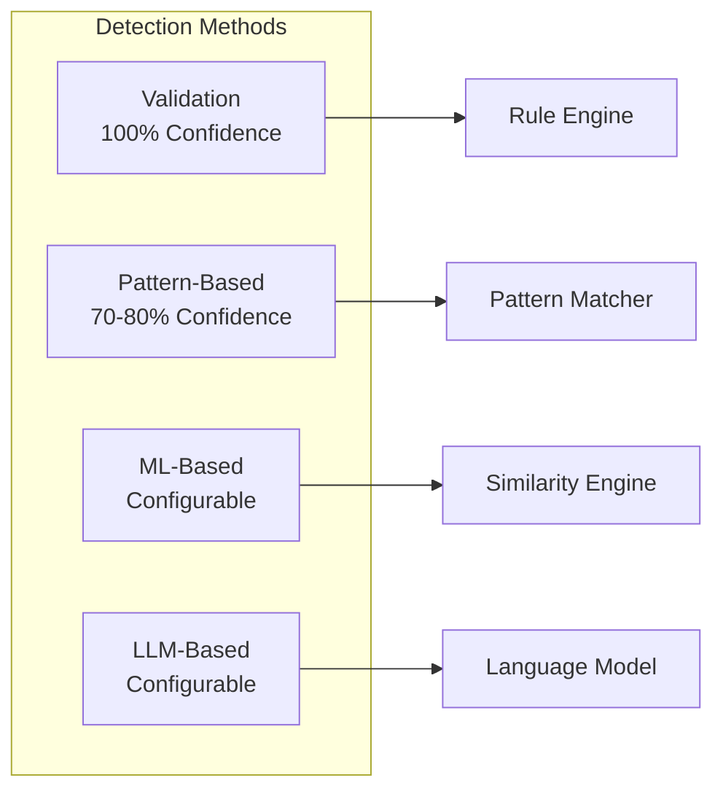
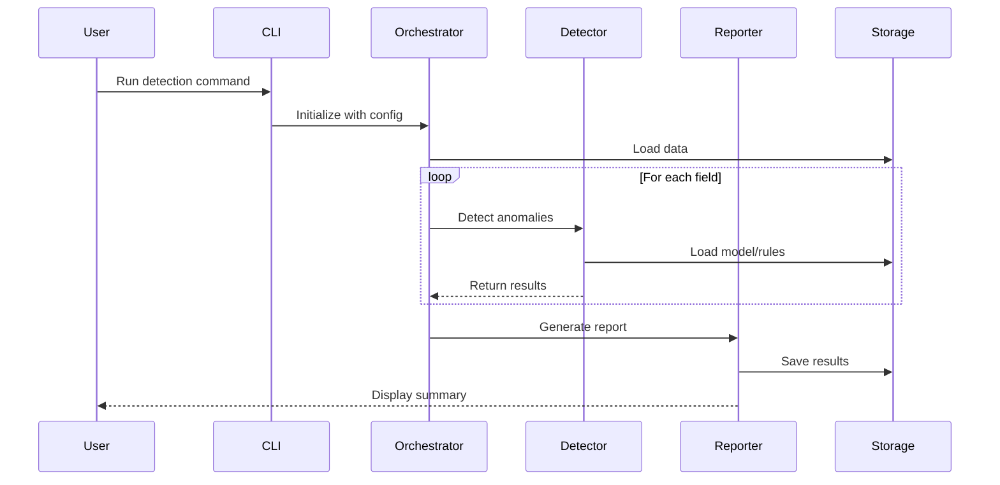
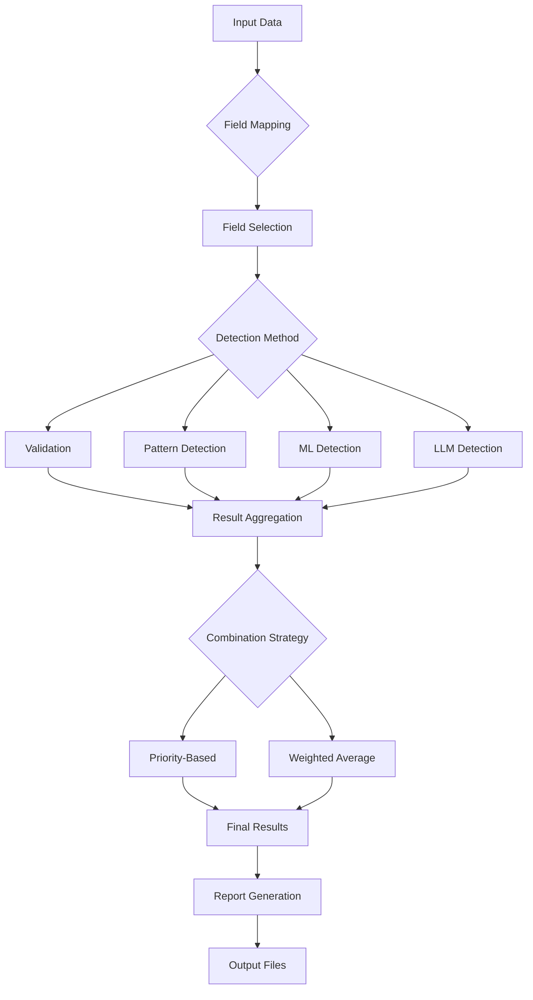
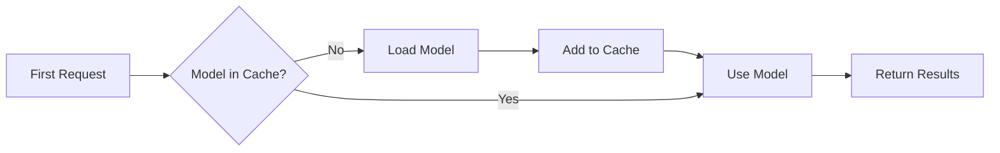
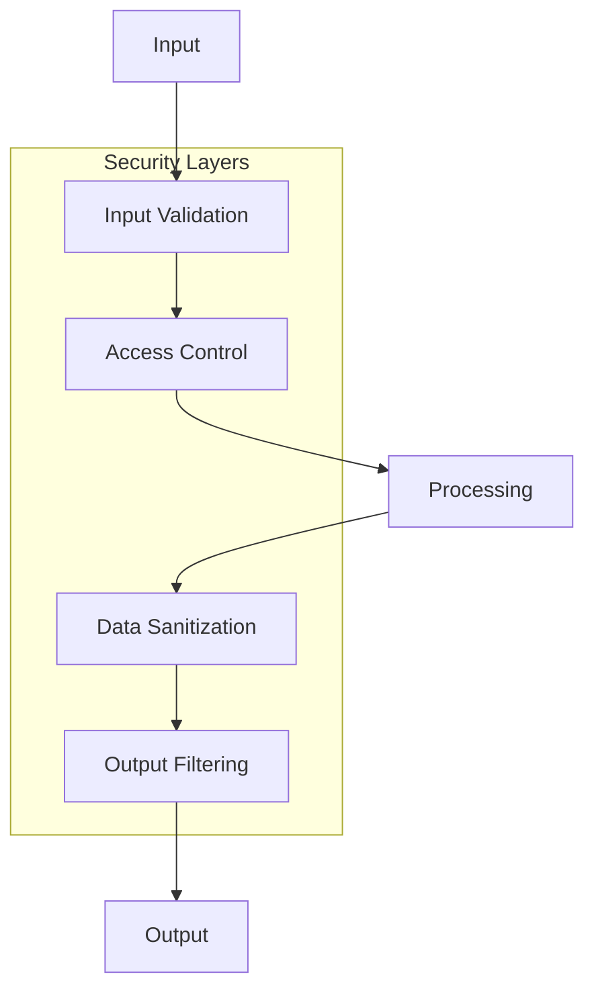

# System Architecture Overview

The Data Quality Detection System is built on a modular, extensible architecture that enables multiple detection methods to work together seamlessly. This document provides a comprehensive overview of the system's architecture, design principles, and key components.

## Design Principles

### 1. Modularity
Each detection method is self-contained and implements common interfaces, allowing new methods to be added without modifying existing code.

### 2. Extensibility
The system is designed to be easily extended with new fields, detection methods, and output formats through configuration and plugins.

### 3. Performance
Sequential processing, model caching, and GPU acceleration ensure efficient resource usage even with large datasets.

### 4. Flexibility
Configurable thresholds, weights, and field mappings allow the system to adapt to different domains and use cases.

## High-Level Architecture



## Layer Architecture

The system is organized into distinct layers, each with specific responsibilities:

### 1. Entry Points Layer

This layer provides various ways to interact with the system:

- **Demo Scripts**: Quick demonstration and testing
- **Evaluation Tools**: Performance measurement and comparison
- **Utility Scripts**: Data analysis and preparation

### 2. Orchestration Layer

Coordinates the detection workflow:

- **ComprehensiveFieldDetector**: Manages detection across all fields and methods
- **Evaluator**: Handles performance evaluation and metrics
- **UnifiedInterface**: Provides consistent API for all detection methods

### 3. Detection Methods Layer

Implements the core detection algorithms:



### 4. Core Services Layer

Provides shared functionality:

- **FieldMapper**: Translates between standard fields and column names
- **BrandConfig**: Manages brand-specific configurations
- **ErrorInjection**: Generates synthetic errors for testing
- **Reporters**: Formats and outputs detection results

### 5. Data Layer

Handles all data storage and retrieval:

- **Input Data**: CSV files with structured data
- **Configuration**: JSON files for settings and rules
- **Models**: Trained ML/LLM models
- **Results**: Detection reports and analyzed data

## Component Interactions



## Detection Flow

The system processes data through a well-defined flow:



## Memory Management

The system implements several strategies for efficient memory usage:

### Sequential Processing
Fields are processed one at a time to minimize memory footprint:

```python
for field in fields:
    results = detect_field(field)
    save_results(results)
    clear_cache()
```

### Model Caching
Models are loaded once and reused:



### Batch Processing
Data is processed in configurable batches to balance memory and performance.

## Scalability Considerations

### Horizontal Scaling
- Field-level parallelization
- Independent detection methods
- Distributed processing support

### Vertical Scaling
- GPU acceleration for ML/LLM
- Optimized algorithms
- Efficient data structures

## Security Architecture



## Extension Points

The architecture provides several extension points for customization:

1. **New Detection Methods**: Implement `AnomalyDetectorInterface`
2. **Custom Validators**: Implement `ValidatorInterface`
3. **Output Formats**: Implement `ReporterInterface`
4. **Field Types**: Add configuration and rules
5. **Brand Support**: Add brand configuration files

## Performance Optimization

The system includes several performance optimizations:

- **Lazy Loading**: Models loaded only when needed
- **Result Caching**: Avoid redundant computations
- **Parallel Processing**: Multi-threading for independent operations
- **GPU Acceleration**: CUDA support for ML operations

## Next Steps

- Learn about [Core Components](core-components.md) in detail
- Understand [Detection Methods](detection-methods.md) implementation
- Explore [Data Flow](data-flow.md) through the system