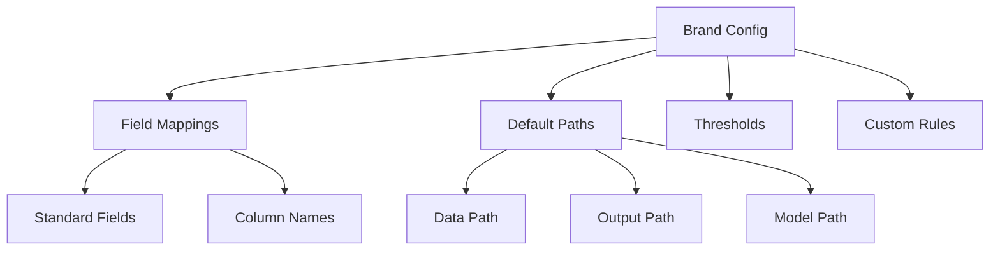

# Brand Configuration Guide

The Brand Configuration system allows the Data Quality Detection System to adapt to different data sources, brands, and domains. This guide covers how to configure the system for your specific needs.

## Overview

Brand configuration defines:
- Field mappings between your data columns and standard fields
- Default data paths and output locations
- Brand-specific thresholds and rules
- Custom field configurations

## Configuration Structure



## Basic Configuration

### Location
Brand configurations are stored in `brand_configs/` directory:
```
brand_configs/
├── esqualo.json      # Esqualo brand config
├── template.json     # Template for new brands
└── your_brand.json   # Your custom brand
```

### Configuration File Structure

```json
{
    "brand_name": "your_brand",
    "description": "Configuration for Your Brand data",
    "version": "1.0",
    
    "field_mappings": {
        "material": "Material_Column",
        "color_name": "Color_Description",
        "category": "Product_Category",
        "size": "Size_Value",
        "care_instructions": "Care_Info",
        "season": "Season_Code"
    },
    
    "default_paths": {
        "data_path": "data/your_brand_data.csv",
        "output_path": "results/your_brand/",
        "model_path": "models/your_brand/"
    },
    
    "thresholds": {
        "validation": 0.0,
        "pattern": 0.7,
        "ml": 0.75,
        "llm": 0.6
    },
    
    "custom_fields": {
        "brand_specific_field": {
            "type": "text",
            "required": true,
            "validation_rules": ["not_empty", "format_check"]
        }
    }
}
```

## Field Mappings

Field mappings translate between standard field names used by the detection system and actual column names in your data.

### Standard Fields

The system recognizes these standard fields:

| Standard Field | Description | Example Values |
|----------------|-------------|----------------|
| `material` | Product material composition | "100% Cotton", "Polyester blend" |
| `color_name` | Color description | "Navy Blue", "Forest Green" |
| `category` | Product category | "Tops", "Dresses", "Shoes" |
| `size` | Size information | "S", "M", "L", "42" |
| `care_instructions` | Care/washing instructions | "Machine wash cold" |
| `season` | Season code | "SS23", "FW24" |

### Mapping Examples

```json
{
    "field_mappings": {
        // Map standard field to your column name
        "material": "product_material",
        "color_name": "colour_desc",
        "category": "product_type",
        
        // Use exact column names from your CSV
        "size": "Size",
        
        // Can map to columns with spaces
        "care_instructions": "Care Instructions"
    }
}
```

## Advanced Configuration

### Multiple Data Sources

Support multiple data formats:

```json
{
    "data_sources": {
        "primary": {
            "path": "data/main_catalog.csv",
            "format": "csv",
            "encoding": "utf-8"
        },
        "secondary": {
            "path": "data/inventory.xlsx",
            "format": "excel",
            "sheet_name": "Products"
        }
    }
}
```

### Field-Specific Thresholds

Override detection thresholds per field:

```json
{
    "field_thresholds": {
        "material": {
            "validation": 0.0,
            "pattern": 0.8,
            "ml": 0.85
        },
        "color_name": {
            "pattern": 0.7,
            "ml": 0.7
        }
    }
}
```

### Custom Validation Rules

Add brand-specific validation rules:

```json
{
    "custom_rules": {
        "material": {
            "allowed_prefixes": ["100%", "Pure"],
            "forbidden_terms": ["Unknown", "TBD"],
            "max_length": 50
        },
        "category": {
            "allowed_values": ["Tops", "Bottoms", "Dresses", "Accessories"],
            "hierarchical": true
        }
    }
}
```

## Using Brand Configuration

### Command Line

Specify brand configuration when running detection:

```bash
# Use specific brand config
python single_sample_multi_field_demo.py \
    --brand esqualo \
    --data-file data/esqualo_products.csv

# Override config file
python single_sample_multi_field_demo.py \
    --config brand_configs/custom_brand.json
```

### Programmatic Usage

```python
from common.brand_config import BrandConfig

# Load brand configuration
config = BrandConfig("your_brand")

# Access field mappings
material_column = config.get_field_mapping("material")

# Get thresholds
thresholds = config.get_thresholds()

# Use in detection
detector.set_config(config)
```

## Creating a New Brand Configuration

### Step 1: Copy Template

```bash
cp brand_configs/template.json brand_configs/new_brand.json
```

### Step 2: Analyze Your Data

```bash
# Examine column names
python analyze_column.py --data-file your_data.csv --list-columns

# Analyze specific column
python analyze_column.py --data-file your_data.csv --column Material
```

### Step 3: Map Fields

Edit `new_brand.json`:

```json
{
    "brand_name": "new_brand",
    "field_mappings": {
        "material": "Material_Description",
        "color_name": "Color",
        "category": "Product_Type"
        // Add all relevant mappings
    }
}
```

### Step 4: Test Configuration

```bash
# Test with small sample
python single_sample_multi_field_demo.py \
    --brand new_brand \
    --sample-size 100 \
    --dry-run
```

## Multi-Brand Setup

### Directory Structure

```
brand_configs/
├── brands/
│   ├── brand_a/
│   │   ├── config.json
│   │   ├── rules/
│   │   └── models/
│   └── brand_b/
│       ├── config.json
│       ├── rules/
│       └── models/
└── global_config.json
```

### Global Configuration

`global_config.json`:
```json
{
    "active_brands": ["brand_a", "brand_b"],
    "default_brand": "brand_a",
    "shared_models": true,
    "brand_isolation": false
}
```

## Environment-Specific Configuration

### Development

```json
{
    "environment": "development",
    "debug": true,
    "sample_size": 1000,
    "error_injection": {
        "enabled": true,
        "intensity": 0.2
    }
}
```

### Production

```json
{
    "environment": "production",
    "debug": false,
    "batch_size": 10000,
    "parallel_processing": true,
    "monitoring": {
        "enabled": true,
        "metrics_endpoint": "http://metrics.example.com"
    }
}
```

## Dynamic Configuration

### Runtime Overrides

```python
# Override configuration at runtime
config = BrandConfig("default")
config.update({
    "thresholds": {
        "ml": 0.8  # Increase ML threshold
    }
})
```

### Configuration Validation

The system validates configurations on load:

```python
def validate_config(config):
    # Check required fields
    assert "brand_name" in config
    assert "field_mappings" in config
    
    # Validate mappings
    for std_field in STANDARD_FIELDS:
        if std_field in config["field_mappings"]:
            validate_column_exists(config["field_mappings"][std_field])
```

## Best Practices

1. **Version Control**: Track configuration changes
   ```json
   {
       "version": "1.2",
       "last_updated": "2024-01-15",
       "updated_by": "data_team"
   }
   ```

2. **Documentation**: Document custom fields
   ```json
   {
       "custom_fields": {
           "sku_format": {
               "description": "Product SKU in format XXX-YYY-ZZZ",
               "pattern": "^[A-Z]{3}-[0-9]{3}-[A-Z]{3}$"
           }
       }
   }
   ```

3. **Modular Configuration**: Split large configs
   ```json
   {
       "includes": [
           "brand_configs/shared/materials.json",
           "brand_configs/shared/colors.json"
       ]
   }
   ```

4. **Testing**: Always test with sample data
   ```bash
   python single_sample_multi_field_demo.py \
       --brand new_config \
       --test-mode \
       --sample-size 100
   ```

## Troubleshooting

### Common Issues

1. **Field Not Found**
   - Check field mappings match CSV column names exactly
   - Use `--list-columns` to see available columns

2. **Configuration Not Loading**
   - Verify JSON syntax
   - Check file permissions
   - Ensure brand name matches filename

3. **Unexpected Results**
   - Review threshold settings
   - Check custom rules
   - Verify field mappings

### Debug Mode

Enable debug logging:

```json
{
    "logging": {
        "level": "DEBUG",
        "show_mappings": true,
        "trace_detection": true
    }
}
```

## Next Steps

- Configure [Field Mappings](field-mappings.md) in detail
- Set up [Detection Thresholds](thresholds.md)
- Learn about [Model Configuration](models.md)