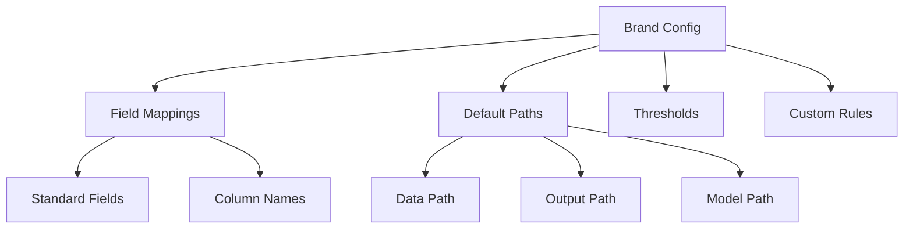

# Brand Configuration Guide

The Brand Configuration system allows the Data Quality Detection System to adapt to different data sources, brands, and domains. This guide covers how to configure the system for your specific needs.

## Overview

Brand configuration defines:
- Field mappings between your data columns and standard fields
- Default data paths and output locations
- Brand-specific thresholds and rules
- Custom field configurations

## Configuration Structure



## Basic Configuration

### Location
Brand configurations are stored in `brand_configs/` directory:
```
brand_configs/
├── esqualo.json      # Esqualo brand config
└── your_brand.json   # Your custom brand config
```

### Configuration File Structure

```json
{
    "brand_name": "your_brand",
    
    "field_mappings": {
        "material": "Material_Column",
        "color_name": "Color_Description",
        "category": "Product_Category",
        "size": "Size_Value",
        "care_instructions": "Care_Info",
        "season": "Season_Code"
    },
    
    "default_data_path": "data/your_brand_data.csv",
    "training_data_path": "data/your_brand_training.csv",
    
    "enabled_fields": [
        "material",
        "color_name",
        "category",
        "size"
    ],
    
    "custom_thresholds": {
        "validation": 0.0,
        "anomaly": 0.7,
        "ml": 0.7,
        "llm": 0.6
    }
}
```

## Field Mappings

Field mappings translate between standard field names used by the detection system and actual column names in your data.

### Standard Fields

The system recognizes these standard fields:

| Standard Field | Description | Example Values |
|----------------|-------------|----------------|
| `material` | Product material composition | "100% Cotton", "Polyester blend" |
| `color_name` | Color description | "Navy Blue", "Forest Green" |
| `category` | Product category | "Tops", "Dresses", "Shoes" |
| `size` | Size information | "S", "M", "L", "42" |
| `care_instructions` | Care/washing instructions | "Machine wash cold" |
| `season` | Season code | "SS23", "FW24" |

### Mapping Examples

```json
{
    "field_mappings": {
        // Map standard field to your column name
        "material": "product_material",
        "color_name": "colour_desc",
        "category": "product_type",
        
        // Use exact column names from your CSV
        "size": "Size",
        
        // Can map to columns with spaces
        "care_instructions": "Care Instructions"
    }
}
```

## Advanced Configuration

### Enabled Fields

The `enabled_fields` array specifies which fields should be processed:

```json
{
    "enabled_fields": [
        "material",
        "color_name", 
        "category",
        "size",
        "care_instructions"
    ]
}
```

### Custom Thresholds

Override global detection thresholds:

```json
{
    "custom_thresholds": {
        "validation": 0.0,
        "anomaly": 0.7,
        "ml": 0.75,
        "llm": 0.6
    }
}
```

## Using Brand Configuration

### Command Line

Brand configuration is now statically configured in the system:

```bash
# The demo uses static brand configuration (esqualo)
python main.py single-demo \
    --data-file data/esqualo_products.csv

# Brand options are deprecated in favor of static configuration
```

### Programmatic Usage

```python
from common.brand_config import load_brand_config

# Load brand configuration
config = load_brand_config("your_brand")

# Access field mappings
material_column = config.get_column_name("material")

# Get custom thresholds
if config.custom_thresholds:
    ml_threshold = config.custom_thresholds.get("ml", 0.7)

# Check if field is enabled
if config.enabled_fields and "color_name" in config.enabled_fields:
    # Process color field
    pass
```

## Creating a New Brand Configuration

### Step 1: Create Configuration File

```bash
# Create a new brand configuration file
touch brand_configs/new_brand.json
```

## Analyzing Your Data

First, understand your data structure:

```bash
# List all columns in your data
python main.py analyze-column your_data.csv

# Analyze a specific column
python main.py analyze-column your_data.csv Material
```

### Step 3: Map Fields

Edit `new_brand.json`:

```json
{
    "brand_name": "new_brand",
    "field_mappings": {
        "material": "Material_Description",
        "color_name": "Color",
        "category": "Product_Type"
        // Add all relevant mappings
    }
}
```

### Step 4: Test Configuration

```bash
# Test with small sample
python main.py single-demo \
    --data-file your_data.csv
```

## Multi-Brand Setup

To support multiple brands, create separate configuration files in the `brand_configs/` directory:

```
brand_configs/
├── esqualo.json      # Esqualo brand config
├── brand_a.json      # Brand A config
└── brand_b.json      # Brand B config
```

Each brand has its own configuration file with the same structure.

## Environment-Specific Configuration

While the system doesn't currently support environment-specific configuration files, you can achieve similar results by:

1. Using different brand configuration files for different environments
2. Passing different command-line arguments based on environment
3. Setting appropriate thresholds and options at runtime

## Dynamic Configuration

### Runtime Overrides

```python
# Override configuration at runtime
config = BrandConfig("default")
config.update({
    "thresholds": {
        "ml": 0.8  # Increase ML threshold
    }
})
```

### Configuration Validation

The system validates configurations on load:

```python
def validate_config(config):
    # Check required fields
    assert "brand_name" in config
    assert "field_mappings" in config
    
    # Validate mappings
    for std_field in STANDARD_FIELDS:
        if std_field in config["field_mappings"]:
            validate_column_exists(config["field_mappings"][std_field])
```

## Best Practices

1. **Version Control**: Track configuration changes
   ```json
   {
       "version": "1.2",
       "last_updated": "2024-01-15",
       "updated_by": "data_team"
   }
   ```

2. **Documentation**: Document custom fields
   ```json
   {
       "custom_fields": {
           "sku_format": {
               "description": "Product SKU in format XXX-YYY-ZZZ",
               "pattern": "^[A-Z]{3}-[0-9]{3}-[A-Z]{3}$"
           }
       }
   }
   ```

3. **Modular Configuration**: Split large configs
   ```json
   {
       "includes": [
           "brand_configs/shared/materials.json",
           "brand_configs/shared/colors.json"
       ]
   }
   ```

4. **Testing**: Always test with sample data
   ```bash
   python main.py single-demo \
       --data-file your_test_data.csv \
       --output-dir test_results
   ```

## Troubleshooting

### Common Issues

1. **Field Not Found**
   - Check field mappings match CSV column names exactly
   - Use `python main.py analyze-column your_data.csv` to see available columns

2. **Configuration Not Loading**
   - Verify JSON syntax
   - Check file permissions
   - Ensure brand name matches filename

3. **Unexpected Results**
   - Review threshold settings
   - Check custom rules
   - Verify field mappings

### Debug Mode

Enable debug logging:

```json
{
    "logging": {
        "level": "DEBUG",
        "show_mappings": true,
        "trace_detection": true
    }
}
```

## Next Steps

- Configure field mappings in detail (documentation coming soon)
- Set up detection thresholds (documentation coming soon)
- Learn about model configuration (documentation coming soon)