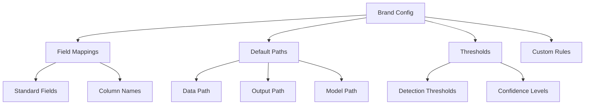

# Adding New Brands Guide

## Overview

The Brand Configuration system allows the Data Quality Detection System to adapt to different data sources, brands, and domains. This guide covers how to configure the system for your specific brand, including field mappings, thresholds, and custom rules.

## Configuration Structure



## Step 1: Create Brand Configuration

### 1.1 Create Configuration File

Brand configurations are stored in the `brand_configs/` directory:

```bash
# Create a new brand configuration
touch brand_configs/your_brand.json

# Directory structure
brand_configs/
├── esqualo.json      # Example: Esqualo brand
├── your_brand.json   # Your new brand
└── README.md         # Configuration documentation
```

### 1.2 Basic Configuration Structure

Create the basic structure in `brand_configs/your_brand.json`:

```json
{
    "brand_name": "your_brand",
    "description": "Configuration for Your Brand data quality detection",
    "version": "1.0",
    "last_updated": "2024-01-15",
    
    "field_mappings": {},
    "default_data_path": "",
    "enabled_fields": [],
    "custom_thresholds": {}
}
```

## Step 2: Analyze Your Data

Before configuring field mappings, analyze your data structure:

### 2.1 List Columns

```bash
# View all columns in your data
python main.py analyze-column your_data.csv

# This will show:
# - All column names
# - Basic statistics
# - Sample values
```

### 2.2 Analyze Specific Columns

```bash
# Analyze individual columns
python main.py analyze-column your_data.csv "Material_Description"
python main.py analyze-column your_data.csv "Product_Color"
python main.py analyze-column your_data.csv "Category_Name"
```

### 2.3 Document Column Characteristics

Create a mapping document:

```markdown
## Column Mapping for Your Brand

| Standard Field | Your Column Name | Notes |
|----------------|------------------|-------|
| material | Material_Description | Contains fabric composition |
| color_name | Product_Color | Color names and codes |
| category | Category_Name | Product hierarchy |
| size | Size_Value | Size specifications |
| care_instructions | Care_Info | Washing instructions |
| season | Season_Code | SS23, FW24, etc. |
```

## Step 3: Configure Field Mappings

### 3.1 Map Standard Fields

Update your configuration with field mappings:

```json
{
    "brand_name": "your_brand",
    
    "field_mappings": {
        "material": "Material_Description",
        "color_name": "Product_Color",
        "category": "Category_Name",
        "size": "Size_Value",
        "care_instructions": "Care_Info",
        "season": "Season_Code"
    }
}
```

### 3.2 Handle Complex Mappings

For fields that need transformation:

```json
{
    "field_mappings": {
        // Direct mapping
        "material": "Material_Description",
        
        // Mapping with transformation rules
        "color_name": {
            "column": "Product_Color",
            "transform": "lowercase",
            "split_delimiter": "/"
        },
        
        // Composite fields
        "category": {
            "columns": ["Category_L1", "Category_L2", "Category_L3"],
            "join_delimiter": " > "
        }
    }
}
```

### 3.3 Custom Field Types

For non-standard fields specific to your brand:

```json
{
    "custom_fields": {
        "product_code": {
            "column": "SKU",
            "type": "string",
            "pattern": "^[A-Z]{3}-\\d{6}$",
            "required": true
        },
        "supplier_ref": {
            "column": "Supplier_Reference",
            "type": "string",
            "validators": ["not_empty", "unique"]
        }
    }
}
```

## Step 4: Configure Detection Settings

### 4.1 Enable Fields

Specify which fields to process:

```json
{
    "enabled_fields": [
        "material",
        "color_name",
        "category",
        "size",
        "care_instructions"
    ],
    
    // Optional: Core fields only for faster processing
    "core_fields": [
        "material",
        "color_name",
        "category"
    ]
}
```

### 4.2 Set Custom Thresholds

Configure detection sensitivity:

```json
{
    "custom_thresholds": {
        "validation": 0.0,      // 100% confidence for rules
        "anomaly": 0.75,        // 75% confidence for patterns
        "ml": 0.80,            // 80% for ML detection
        "llm": 0.65            // 65% for LLM detection
    },
    
    // Field-specific thresholds
    "field_thresholds": {
        "material": {
            "validation": 0.0,
            "anomaly": 0.8,
            "ml": 0.85
        },
        "color_name": {
            "validation": 0.0,
            "anomaly": 0.7,
            "ml": 0.75
        }
    }
}
```

### 4.3 Configure Data Paths

Set default paths for your brand:

```json
{
    "default_data_path": "data/your_brand_catalog.csv",
    "training_data_path": "data/your_brand_training.csv",
    "output_base_path": "results/your_brand/",
    
    "model_paths": {
        "ml_models": "data/models/your_brand/",
        "pattern_rules": "anomaly_detectors/pattern_based/rules/your_brand/"
    }
}
```

## Step 5: Add Brand-Specific Rules

### 5.1 Validation Rules

Create brand-specific validation rules:

```json
{
    "custom_validation_rules": {
        "material": {
            "allowed_prefixes": ["100%", "Pure", "Genuine"],
            "forbidden_words": ["Unknown", "TBD", "N/A"],
            "min_length": 5,
            "max_length": 100
        },
        "category": {
            "valid_hierarchies": [
                "Clothing > Tops > T-Shirts",
                "Clothing > Bottoms > Jeans",
                "Accessories > Bags > Handbags"
            ],
            "max_depth": 3
        }
    }
}
```

### 5.2 Pattern Rules

Define expected patterns:

```json
{
    "pattern_rules": {
        "season": {
            "patterns": [
                "^(SS|FW)\\d{2}$",     // SS23, FW24
                "^(Spring|Fall)\\s\\d{4}$"  // Spring 2024
            ],
            "frequency_threshold": 0.001
        },
        "size": {
            "size_systems": ["EU", "US", "UK"],
            "valid_ranges": {
                "EU": [32, 52],
                "US": [0, 16],
                "UK": [4, 20]
            }
        }
    }
}
```

### 5.3 Business Logic Rules

Implement brand-specific business logic:

```json
{
    "business_rules": {
        "price_material_consistency": {
            "description": "Premium materials should have higher prices",
            "rules": [
                {
                    "if": {"material": ["Silk", "Cashmere", "Leather"]},
                    "then": {"min_price": 100}
                },
                {
                    "if": {"material": ["Polyester", "Acrylic"]},
                    "then": {"max_price": 50}
                }
            ]
        }
    }
}
```

## Step 6: Complete Configuration Example

Here's a complete brand configuration:

```json
{
    "brand_name": "fashion_brand",
    "description": "Fashion Brand Product Catalog Configuration",
    "version": "2.0",
    "last_updated": "2024-01-15",
    "updated_by": "data_team",
    
    "field_mappings": {
        "material": "Fabric_Composition",
        "color_name": "Color_Description",
        "category": "Product_Category",
        "size": "Size_Value",
        "care_instructions": "Care_Label",
        "season": "Collection_Season"
    },
    
    "enabled_fields": [
        "material",
        "color_name",
        "category",
        "size",
        "care_instructions",
        "season"
    ],
    
    "custom_thresholds": {
        "validation": 0.0,
        "anomaly": 0.75,
        "ml": 0.80,
        "llm": 0.65
    },
    
    "default_data_path": "data/fashion_brand_catalog.csv",
    "training_data_path": "data/fashion_brand_clean.csv",
    
    "custom_validation_rules": {
        "material": {
            "percentage_sum": 100,
            "allowed_materials": [
                "Cotton", "Polyester", "Wool", "Silk", 
                "Linen", "Viscose", "Elastane", "Nylon"
            ]
        },
        "color_name": {
            "standardize": true,
            "color_mapping": {
                "Off White": "Ivory",
                "Ecru": "Beige"
            }
        }
    },
    
    "quality_checks": {
        "completeness_threshold": 0.95,
        "required_fields": ["material", "color_name", "size"],
        "unique_fields": ["product_id", "sku"]
    }
}
```

## Step 7: Testing Your Configuration

### 7.1 Validate Configuration

Create a validation script:

```python
# scripts/validate_brand_config.py
import json
import pandas as pd
from common.field_mapping import FieldMapper

def validate_brand_config(brand_name):
    # Load configuration
    with open(f'brand_configs/{brand_name}.json', 'r') as f:
        config = json.load(f)
    
    # Load sample data
    data_path = config.get('default_data_path')
    df = pd.read_csv(data_path, nrows=100)
    
    # Check field mappings
    mapper = FieldMapper(config)
    missing_columns = []
    
    for field, column in config['field_mappings'].items():
        if column not in df.columns:
            missing_columns.append(f"{field} -> {column}")
    
    if missing_columns:
        print(f"Missing columns: {missing_columns}")
    else:
        print("All field mappings valid!")
    
    # Test detection
    print("\nTesting detection with sample data...")
    # Run basic detection test

validate_brand_config('your_brand')
```

### 7.2 Run Test Detection

Test with a small sample:

```bash
# Test with 100 rows
head -n 101 your_data.csv > test_sample.csv

# Run detection
python main.py single-demo \
    --data-file test_sample.csv \
    --output-dir test_results \
    --enable-validation

# Check results
cat test_results/report.json | jq '.summary'
```

### 7.3 Iterative Refinement

```bash
# Analyze detection results
python scripts/analyze_results.py test_results/report.json

# Common adjustments:
# 1. Update field mappings if columns not found
# 2. Adjust thresholds if too many false positives
# 3. Add custom rules for brand-specific patterns
# 4. Update validation rules based on errors
```

## Step 8: Multi-Brand Setup

### 8.1 Environment-Specific Configurations

Create environment overlays:

```json
// brand_configs/your_brand_dev.json
{
    "extends": "your_brand.json",
    "environment": "development",
    "custom_thresholds": {
        "ml": 0.7  // Lower threshold for dev
    },
    "debug": true
}

// brand_configs/your_brand_prod.json
{
    "extends": "your_brand.json",
    "environment": "production",
    "custom_thresholds": {
        "ml": 0.85  // Higher threshold for prod
    },
    "parallel_processing": true
}
```

### 8.2 Brand Comparison

Set up multiple brands:

```bash
# Directory structure
brand_configs/
├── global/
│   ├── shared_rules.json
│   └── material_database.json
├── brand_a/
│   ├── config.json
│   └── custom_rules.json
├── brand_b/
│   ├── config.json
│   └── custom_rules.json
└── config_loader.py
```

## Step 9: Advanced Configuration

### 9.1 Dynamic Field Discovery

For flexible schemas:

```json
{
    "dynamic_fields": {
        "enabled": true,
        "field_pattern": "^attr_.*",
        "detection_methods": ["pattern", "ml"],
        "auto_threshold": 0.7
    }
}
```

### 9.2 Conditional Rules

Complex business logic:

```json
{
    "conditional_rules": [
        {
            "name": "seasonal_color_check",
            "condition": {
                "season": ["FW23", "FW24"]
            },
            "apply_rules": {
                "color_name": {
                    "preferred": ["Black", "Navy", "Grey", "Brown"],
                    "warning_if_not": true
                }
            }
        }
    ]
}
```

### 9.3 Integration Hooks

For external systems:

```json
{
    "integrations": {
        "pre_processing": {
            "webhook": "https://api.brand.com/validate",
            "timeout": 30
        },
        "post_detection": {
            "notification": "email://data-team@brand.com",
            "threshold": "critical_errors > 0"
        }
    }
}
```

## Best Practices

### 1. Version Control
- Track all configuration changes in git
- Use semantic versioning
- Document changes in changelog

### 2. Documentation
- Document all custom fields and rules
- Maintain mapping spreadsheets
- Create field-specific guides

### 3. Testing Strategy
- Start with small data samples
- Test each field independently
- Validate with domain experts

### 4. Performance Optimization
- Enable only necessary fields
- Use appropriate thresholds
- Configure batch sizes

### 5. Maintenance
- Regular threshold tuning
- Update rules based on feedback
- Monitor false positive rates

## Troubleshooting

### Common Issues

1. **Field Not Found**
   ```bash
   # Check exact column names
   head -n 1 your_data.csv | tr ',' '\n'
   
   # Update mapping with exact name (case-sensitive)
   ```

2. **High False Positive Rate**
   ```json
   // Increase thresholds
   {
       "custom_thresholds": {
           "anomaly": 0.85,  // Increase from 0.75
           "ml": 0.90        // Increase from 0.80
       }
   }
   ```

3. **Missing Detections**
   ```json
   // Lower thresholds or add specific rules
   {
       "field_thresholds": {
           "problem_field": {
               "anomaly": 0.65,  // Lower threshold
               "ml": 0.70
           }
       }
   }
   ```

### Debug Mode

Enable detailed logging:

```json
{
    "debug_settings": {
        "enabled": true,
        "log_level": "DEBUG",
        "trace_mappings": true,
        "save_intermediate": true,
        "explain_detections": true
    }
}
```

## Migration Guide

### From Version 1.x to 2.x

```python
# Migration script
def migrate_config_v1_to_v2(old_config):
    new_config = {
        "version": "2.0",
        "brand_name": old_config["brand"],
        "field_mappings": old_config["mappings"],
        "enabled_fields": list(old_config["mappings"].keys()),
        "custom_thresholds": old_config.get("thresholds", {})
    }
    return new_config
```

## Next Steps

- Deploy your configuration: [Operations Guide](09-operations.md)
- Add custom fields: [Adding New Fields](07-adding-fields.md)
- Optimize detection: [Command Line Usage](03-command-line-usage.md)