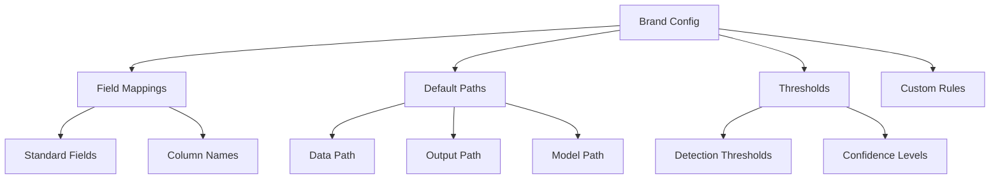

# Adding New Brands Guide

## Overview

The Brand Configuration system allows the Data Quality Detection System to adapt to different data sources, brands, and domains. This guide covers how to configure the system for your specific brand, including field mappings, thresholds, and custom rules.

## Configuration Structure



## Step 1: Create Brand Configuration

### 1.1 Create Configuration File

Brand configurations are stored in the `brand_configs/` directory:

```bash
# Create a new brand configuration
touch brand_configs/your_brand.json

# Directory structure
brand_configs/
├── esqualo.json      # Example: Esqualo brand
├── your_brand.json   # Your new brand
└── README.md         # Configuration documentation
```

### 1.2 Basic Configuration Structure

Create the basic structure in `brand_configs/your_brand.json`:

```json
{
    "brand_name": "your_brand",
    "description": "Configuration for Your Brand data quality detection",
    "version": "1.0",
    "last_updated": "2024-01-15",
    
    "field_mappings": {},
    "default_data_path": "",
    "enabled_fields": [],
    "custom_thresholds": {}
}
```

## Step 2: Analyze Your Data

Before configuring field mappings, analyze your data structure:

### 2.1 List Columns

```bash
# View all columns in your data
python main.py analyze-column your_data.csv

# This will show:
# - All column names
# - Basic statistics
# - Sample values
```

### 2.2 Analyze Specific Columns

```bash
# Analyze individual columns
python main.py analyze-column your_data.csv "Material_Description"
python main.py analyze-column your_data.csv "Product_Color"
python main.py analyze-column your_data.csv "Category_Name"
```

### 2.3 Document Column Characteristics

Create a mapping document:

```markdown
## Column Mapping for Your Brand

| Standard Field | Your Column Name | Notes |
|----------------|------------------|-------|
| material | Material_Description | Contains fabric composition |
| color_name | Product_Color | Color names and codes |
| category | Category_Name | Product hierarchy |
| size | Size_Value | Size specifications |
| care_instructions | Care_Info | Washing instructions |
| season | Season_Code | SS23, FW24, etc. |
```

## Step 3: Configure Field Mappings

### 3.1 Map Standard Fields

Update your configuration with field mappings:

```json
{
    "brand_name": "your_brand",
    
    "field_mappings": {
        "material": "Material_Description",
        "color_name": "Product_Color",
        "category": "Category_Name",
        "size": "Size_Value",
        "care_instructions": "Care_Info",
        "season": "Season_Code"
    }
}
```

### 3.2 Field Mapping Notes

Currently, the system only supports direct column name mappings:

```json
{
    "field_mappings": {
        // Direct mapping only - no transformations
        "material": "Material_Description",
        "color_name": "Product_Color",
        "category": "Category_Name"
    }
}
```

Note: Complex transformations, composite fields, and field-level processing are not currently supported.

### 3.3 Additional Fields

To process additional fields beyond the standard ones, you need to:
1. Add the field mapping to `field_mappings`
2. Include it in `enabled_fields`
3. Create validators and detection rules separately (see Adding New Fields guide)

## Step 4: Configure Detection Settings

### 4.1 Enable Fields

Specify which fields to process:

```json
{
    "enabled_fields": [
        "material",
        "color_name",
        "category",
        "size",
        "care_instructions"
    ],
    
    // Optional: Core fields only for faster processing
    "core_fields": [
        "material",
        "color_name",
        "category"
    ]
}
```

### 4.2 Set Custom Thresholds

Configure detection sensitivity:

```json
{
    "custom_thresholds": {
        "validation": 0.0,      // 100% confidence for rules
        "anomaly": 0.75,        // 75% confidence for patterns
        "ml": 0.80,            // 80% for ML detection
        "llm": 0.65            // 65% for LLM detection
    },
    

}
```

### 4.3 Configure Data Paths

Set default paths for your brand:

```json
{
    "default_data_path": "data/your_brand_catalog.csv",
    "training_data_path": "data/your_brand_training.csv",
    "output_base_path": "results/your_brand/",
    
    "model_paths": {
        "ml_models": "data/models/your_brand/",
        "pattern_rules": "anomaly_detectors/pattern_based/rules/your_brand/"
    }
}
```

## Step 5: Add Brand-Specific Rules

### 5.1 Validation Rules

Create brand-specific validation rules:

```json
{
    "custom_validation_rules": {
        "material": {
            "allowed_prefixes": ["100%", "Pure", "Genuine"],
            "forbidden_words": ["Unknown", "TBD", "N/A"],
            "min_length": 5,
            "max_length": 100
        },
        "category": {
            "valid_hierarchies": [
                "Clothing > Tops > T-Shirts",
                "Clothing > Bottoms > Jeans",
                "Accessories > Bags > Handbags"
            ],
            "max_depth": 3
        }
    }
}
```

### 5.2 Pattern Rules

Define expected patterns:

```json
{
    "pattern_rules": {
        "season": {
            "patterns": [
                "^(SS|FW)\\d{2}$",     // SS23, FW24
                "^(Spring|Fall)\\s\\d{4}$"  // Spring 2024
            ],
            "frequency_threshold": 0.001
        },
        "size": {
            "size_systems": ["EU", "US", "UK"],
            "valid_ranges": {
                "EU": [32, 52],
                "US": [0, 16],
                "UK": [4, 20]
            }
        }
    }
}
```

### 5.3 Business Logic Rules

Implement brand-specific business logic:

```json
{
    "business_rules": {
        "price_material_consistency": {
            "description": "Premium materials should have higher prices",
            "rules": [
                {
                    "if": {"material": ["Silk", "Cashmere", "Leather"]},
                    "then": {"min_price": 100}
                },
                {
                    "if": {"material": ["Polyester", "Acrylic"]},
                    "then": {"max_price": 50}
                }
            ]
        }
    }
}
```

## Step 6: Complete Configuration Example

Here's a complete brand configuration based on the actual supported features:

```json
{
    "brand_name": "fashion_brand",
    
    "field_mappings": {
        "material": "Fabric_Composition",
        "color_name": "Color_Description",
        "category": "Product_Category",
        "size": "Size_Value",
        "care_instructions": "Care_Label",
        "season": "Collection_Season"
    },
    
    "enabled_fields": [
        "material",
        "color_name",
        "category",
        "size",
        "care_instructions",
        "season"
    ],
    
    "custom_thresholds": {
        "validation": 0.0,
        "anomaly": 0.75,
        "ml": 0.80,
        "llm": 0.65
    },
    
    "default_data_path": "data/fashion_brand_catalog.csv",
    "training_data_path": "data/fashion_brand_clean.csv"
}
```

Note: Additional features like custom validation rules, quality checks, and field-specific configurations shown in some examples are not currently implemented in the system.

## Step 7: Testing Your Configuration

### 7.1 Validate Configuration

To validate your configuration, you can:

1. Check that all mapped columns exist in your data:
```bash
# List all columns in your data
python main.py analyze-column your_data.csv
```

2. Test with a small sample to ensure mappings work:
```bash
# Test with sample data
python main.py single-demo \
    --data-file your_data.csv \
    --output-dir test_results \
    --sample-size 100
```

### 7.2 Run Test Detection

Test with a small sample:

```bash
# Test with 100 rows
head -n 101 your_data.csv > test_sample.csv

# Run detection
python main.py single-demo \
    --data-file test_sample.csv \
    --output-dir test_results \
    --enable-validation

# Check results
cat test_results/report.json | jq '.summary'
```

### 7.3 Iterative Refinement

After testing, you may need to:

1. Update field mappings if columns weren't found
2. Adjust thresholds if too many false positives occur
3. Create new validators for brand-specific fields (see Adding New Fields guide)
4. Fine-tune detection parameters based on results

## Step 8: Multi-Brand Setup

To support multiple brands, simply create separate configuration files:

```bash
brand_configs/
├── brand_a.json
├── brand_b.json
└── brand_c.json
```

Each brand configuration is independent and can have its own:
- Field mappings
- Enabled fields
- Custom thresholds
- Data paths

Note: The system currently uses static brand configuration. Environment-specific configurations and configuration inheritance are not supported.

## Step 9: Working with Custom Fields

If your brand has fields beyond the standard ones supported by the system, you'll need to:

1. Add the field mapping to your brand configuration
2. Create a custom validator (see Adding New Fields guide)
3. Add pattern-based rules if applicable
4. Consider training ML models for the field

The system is designed to be extensible, but adding new fields requires development work beyond just configuration.

## Best Practices

### 1. Version Control
- Track all configuration changes in git
- Use semantic versioning
- Document changes in changelog

### 2. Documentation
- Document all custom fields and rules
- Maintain mapping spreadsheets
- Create field-specific guides

### 3. Testing Strategy
- Start with small data samples
- Test each field independently
- Validate with domain experts

### 4. Performance Optimization
- Enable only necessary fields
- Use appropriate thresholds
- Configure batch sizes

### 5. Maintenance
- Regular threshold tuning
- Update rules based on feedback
- Monitor false positive rates

## Troubleshooting

### Common Issues

1. **Field Not Found**
   ```bash
   # Check exact column names
   head -n 1 your_data.csv | tr ',' '\n'
   
   # Update mapping with exact name (case-sensitive)
   ```

2. **High False Positive Rate**
   ```json
   // Increase thresholds
   {
       "custom_thresholds": {
           "anomaly": 0.85,  // Increase from 0.75
           "ml": 0.90        // Increase from 0.80
       }
   }
   ```

3. **Missing Detections**
   ```json
   // Lower thresholds globally
   {
       "custom_thresholds": {
           "anomaly": 0.65,  // Lower from 0.75
           "ml": 0.70       // Lower from 0.80
       }
   }
   ```

### Debug Mode

To enable debug output, use the `--debug` flag when running commands:

```bash
python main.py single-demo --data-file your_data.csv --debug
```


## Next Steps

- Deploy your configuration: [Operations Guide](09-operations.md)
- Add custom fields: [Adding New Fields](07-adding-fields.md)
- Optimize detection: [Command Line Usage](03-command-line-usage.md)