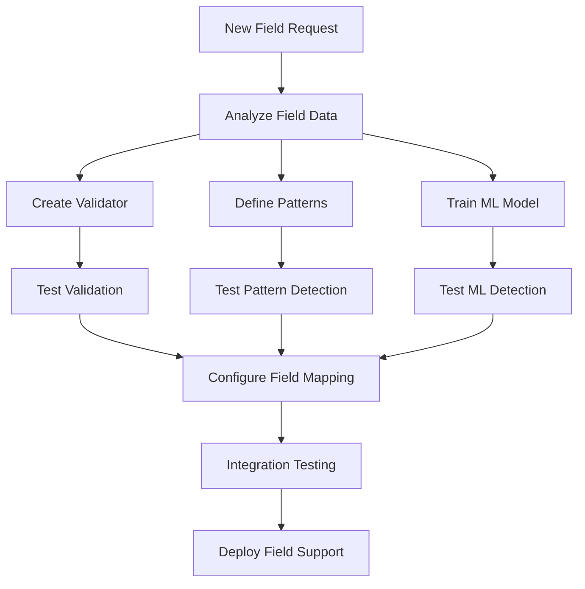

# Adding New Fields Guide

## Overview

This guide walks you through the process of adding support for new fields in the Data Quality Detection System. The system's modular architecture makes it straightforward to extend with new field types by implementing validators, configuring detection rules, and optionally training ML models.

## Process Overview

Adding a new field involves:



## Step 1: Analyze the Field

Before implementing, understand your field's characteristics:

### 1.1 Run Field Analysis

```bash
# Analyze field data distribution
python main.py analyze-column data/sample.csv new_field_name
```

This provides:
- Unique values count
- Top values and frequencies
- Pattern analysis
- Sample values
- Character distribution

### 1.2 Identify Validation Rules

Based on the analysis, determine:
- Format requirements (regex patterns)
- Business logic constraints
- Value ranges or allowed values
- Relationships with other fields

### 1.3 Document Field Characteristics

Create a field specification:
```markdown
## New Field Specification

**Field Name**: new_field
**Data Type**: String
**Format**: XX9999 (2 letters + 4 digits)
**Constraints**:
- Required field
- Must be unique
- Letters must be uppercase
**Examples**: AB1234, CD5678
**Common Errors**: 
- Missing values
- Invalid format
- Test data (TEST0000)
```

## Step 2: Create a Validator

Validators provide high-confidence error detection through business rules.

### 2.1 Create Directory Structure

```bash
mkdir -p validators/new_field
cd validators/new_field
```

### 2.2 Implement Validator Class

Create `validators/new_field/validate.py`:

```python
from validators.validator_interface import ValidatorInterface
from validators.validation_error import ValidationError
import re
from typing import Any, Optional

class Validator(ValidatorInterface):
    def __init__(self):
        self.field_type = "new_field"
        
        # Define validation patterns
        self.valid_pattern = re.compile(r'^[A-Z]{2}\d{4}$')
        self.test_pattern = re.compile(r'TEST|DEMO|SAMPLE', re.IGNORECASE)
        
        # Define constraints
        self.min_length = 6
        self.max_length = 6
        
        # Define known valid prefixes (optional)
        self.valid_prefixes = {'AB', 'CD', 'EF', 'GH'}
        
    def _validate_entry(self, value: Any) -> Optional[ValidationError]:
        """Validate a single value."""
        # Convert to string for validation
        str_value = str(value).strip()
        
        # Check for empty values
        if not str_value or str_value.lower() in ['nan', 'none', 'null', '']:
            return ValidationError(
                error_type="EMPTY_VALUE",
                probability=1.0,
                error_data={"value": value, "reason": "Empty or null value"}
            )
        
        # Check length
        if len(str_value) != self.min_length:
            return ValidationError(
                error_type="INVALID_LENGTH",
                probability=1.0,
                error_data={
                    "value": str_value,
                    "expected_length": self.min_length,
                    "actual_length": len(str_value)
                }
            )
        
        # Check format
        if not self.valid_pattern.match(str_value):
            return ValidationError(
                error_type="INVALID_FORMAT",
                probability=1.0,
                error_data={
                    "value": str_value,
                    "expected_format": "XX9999 (2 uppercase letters + 4 digits)",
                    "pattern": self.valid_pattern.pattern
                }
            )
        
        # Check for test data
        if self.test_pattern.search(str_value):
            return ValidationError(
                error_type="TEST_DATA",
                probability=1.0,
                error_data={
                    "value": str_value,
                    "reason": "Contains test data markers"
                }
            )
        
        # Check prefix validity (optional business rule)
        prefix = str_value[:2]
        if self.valid_prefixes and prefix not in self.valid_prefixes:
            return ValidationError(
                error_type="INVALID_PREFIX",
                probability=1.0,
                error_data={
                    "value": str_value,
                    "prefix": prefix,
                    "valid_prefixes": list(self.valid_prefixes)
                }
            )
        
        # All checks passed
        return None
```

### 2.3 Create Error Messages

Create `validators/new_field/error_messages.json`:

```json
{
    "EMPTY_VALUE": {
        "message": "New field value is empty or missing",
        "severity": "ERROR",
        "fix_suggestion": "Provide a valid new field value in format XX9999"
    },
    "INVALID_LENGTH": {
        "message": "New field has incorrect length",
        "severity": "ERROR",
        "fix_suggestion": "New field must be exactly 6 characters (2 letters + 4 digits)"
    },
    "INVALID_FORMAT": {
        "message": "New field format is invalid",
        "severity": "ERROR",
        "fix_suggestion": "Use format XX9999 with uppercase letters followed by 4 digits"
    },
    "TEST_DATA": {
        "message": "New field contains test data",
        "severity": "WARNING",
        "fix_suggestion": "Replace test data with actual production values"
    },
    "INVALID_PREFIX": {
        "message": "New field prefix is not recognized",
        "severity": "ERROR",
        "fix_suggestion": "Use one of the valid prefixes: AB, CD, EF, GH"
    }
}
```

## Step 3: Define Pattern-Based Rules

Pattern-based detection catches anomalies that pass validation but are statistically unusual.

### 3.1 Create Pattern Rules

Create `anomaly_detectors/pattern_based/rules/new_field.json`:

```json
{
    "field_name": "new_field",
    "description": "Pattern rules for new field detection",
    
    "frequency_rules": {
        "min_frequency_threshold": 0.001,
        "rare_value_confidence": 0.8,
        "common_patterns": [
            "^[A-Z]{2}[0-9]{4}$"
        ]
    },
    
    "pattern_analysis": {
        "expected_patterns": [
            {
                "name": "standard_format",
                "pattern": "^[A-Z]{2}\\d{4}$",
                "confidence_if_not_matched": 0.9
            }
        ],
        "length_distribution": {
            "expected": 6,
            "confidence_if_different": 0.85
        },
        "character_distribution": {
            "letters": 0.33,
            "digits": 0.67,
            "special": 0.0
        }
    },
    
    "validation_rules": [
        {
            "name": "not_empty",
            "type": "not_empty",
            "message": "Value cannot be empty"
        },
        {
            "name": "no_special_chars",
            "type": "regex",
            "pattern": "^[A-Za-z0-9]+$",
            "message": "Contains special characters"
        }
    ],
    
    "anomaly_patterns": [
        {
            "name": "suspicious_pattern",
            "pattern": "(00000|11111|99999)",
            "confidence": 0.9,
            "message": "Contains suspicious repeated digits"
        },
        {
            "name": "test_data",
            "pattern": "(TEST|DEMO|SAMPLE)",
            "confidence": 0.95,
            "message": "Appears to be test data"
        },
        {
            "name": "sequential_digits",
            "pattern": "(1234|2345|3456|4567|5678|6789)",
            "confidence": 0.7,
            "message": "Contains sequential digits"
        }
    ],
    
    "contextual_rules": [
        {
            "name": "prefix_consistency",
            "description": "Check if prefix matches expected category",
            "confidence": 0.75
        }
    ]
}
```

### 3.2 Configure Statistical Detection

Add statistical checks for the field:

```python
# In anomaly_detectors/pattern_based/statistical_rules.py

FIELD_STATISTICAL_RULES = {
    'new_field': {
        'outlier_detection': {
            'method': 'isolation_forest',
            'contamination': 0.01,
            'features': ['length', 'digit_ratio', 'uniqueness']
        },
        'distribution_check': {
            'expected_distribution': 'uniform',
            'confidence_if_skewed': 0.7
        }
    }
}
```

## Step 4: Configure ML Detection (Optional)

For semantic understanding, configure ML-based detection.

### 4.1 Prepare Training Data

```python
import pandas as pd

# Script to prepare training data
def prepare_training_data():
    # Load and filter clean data
    data = pd.read_csv('data/full_dataset.csv')
    
    # Filter for quality data
    clean_data = data[
        (data['quality_flag'] == 'clean') & 
        (data['new_field'].notna())
    ]
    
    # Extract unique valid examples
    field_values = clean_data['new_field'].unique()
    
    # Create training dataset
    training_df = pd.DataFrame({
        'new_field': field_values,
        'is_valid': 1  # All are valid examples
    })
    
    # Save training data
    training_df.to_csv('data/new_field_training.csv', index=False)
    
    print(f"Prepared {len(field_values)} training examples")
    
prepare_training_data()
```

### 4.2 Configure ML Model

Add to `anomaly_detectors/ml_based/model_config.py`:

```python
FIELD_CONFIGS = {
    # ... existing fields ...
    
    'new_field': {
        'model_name': 'sentence-transformers/all-MiniLM-L6-v2',
        'max_length': 128,
        'training_params': {
            'epochs': 10,
            'batch_size': 32,
            'learning_rate': 2e-5,
            'warmup_steps': 100
        },
        'similarity_threshold': 0.75,
        'min_training_samples': 100,
        'preprocessing': {
            'lowercase': False,  # Keep case for this field
            'remove_special': True,
            'normalize_whitespace': True
        }
    }
}
```

### 4.3 Train and Test

```bash
# Run hyperparameter search
python main.py ml-train \
    --use-hp-search \
    --fields new_field \
    --hp-trials 15

# Test anomaly detection
python main.py ml-train \
    --check-anomalies new_field \
    --threshold 0.75 \
    --output new_field_anomalies.csv
```

## Step 5: Configure Field Mapping

### 5.1 Update Brand Configuration

Edit `brand_configs/your_brand.json`:

```json
{
    "brand_name": "your_brand",
    
    "field_mappings": {
        // ... existing mappings ...
        "new_field": "Product_Code"  // Map to actual column name
    },
    
    "enabled_fields": [
        "material",
        "color_name",
        "category",
        "size",
        "care_instructions",
        "season",
        "new_field"  // Add new field
    ],
    
    "field_specific_config": {
        "new_field": {
            "required": true,
            "unique": true,
            "validation_threshold": 0.0,
            "anomaly_threshold": 0.8,
            "ml_threshold": 0.75
        }
    }
}
```

### 5.2 Update System Constants

Add to `common/constants.py`:

```python
# Add to field type constants
FIELD_TYPES = {
    # ... existing fields ...
    'new_field': {
        'display_name': 'Product Code',
        'data_type': 'string',
        'validation_enabled': True,
        'pattern_detection_enabled': True,
        'ml_detection_enabled': True,
        'llm_detection_enabled': False  # Enable if needed
    }
}
```

## Step 6: Testing

### 6.1 Unit Tests

Create `tests/test_new_field.py`:

```python
import pytest
from validators.new_field.validate import Validator
from anomaly_detectors.pattern_based.pattern_based_detector import PatternBasedDetector

class TestNewFieldValidator:
    def setup_method(self):
        self.validator = Validator()
    
    def test_valid_values(self):
        """Test that valid values pass validation."""
        valid_values = ['AB1234', 'CD5678', 'EF9012', 'GH3456']
        for value in valid_values:
            error = self.validator._validate_entry(value)
            assert error is None, f"Valid value {value} failed validation"
    
    def test_empty_values(self):
        """Test that empty values are caught."""
        empty_values = ['', None, 'nan', 'NULL', '   ']
        for value in empty_values:
            error = self.validator._validate_entry(value)
            assert error is not None
            assert error.error_type == 'EMPTY_VALUE'
    
    def test_invalid_format(self):
        """Test that invalid formats are caught."""
        invalid_values = [
            'ABC123',      # Too short
            'A12345',      # Wrong pattern
            'ab1234',      # Lowercase
            'AB12345',     # Too long
            '123456',      # No letters
            'ABCDEF'       # No digits
        ]
        for value in invalid_values:
            error = self.validator._validate_entry(value)
            assert error is not None
            assert error.error_type in ['INVALID_FORMAT', 'INVALID_LENGTH']
    
    def test_test_data_detection(self):
        """Test that test data is flagged."""
        test_values = ['TEST00', 'DEMO99', 'SAMPLE']
        for value in test_values:
            error = self.validator._validate_entry(value)
            assert error is not None
            assert error.error_type == 'TEST_DATA'

class TestNewFieldPatternDetection:
    def setup_method(self):
        rules_config = {'field_type': 'new_field'}
        self.detector = PatternBasedDetector(rules_config)
    
    def test_pattern_detection(self):
        """Test pattern-based anomaly detection."""
        # Test suspicious patterns
        suspicious_values = ['AB0000', 'CD1111', 'EF9999']
        for value in suspicious_values:
            anomaly = self.detector._detect_anomaly(value)
            assert anomaly is not None
            assert anomaly.probability >= 0.7
```

### 6.2 Integration Tests

Create an integration test script:

```python
# tests/integration/test_new_field_integration.py
import pandas as pd
from single_sample_multi_field_demo.comprehensive_detector import ComprehensiveFieldDetector

def test_new_field_integration():
    # Create test data
    test_data = pd.DataFrame({
        'Product_Code': [
            'AB1234',  # Valid
            'CD5678',  # Valid
            '',        # Empty
            'TEST00',  # Test data
            'XY9999',  # Invalid prefix
            'ab1234',  # Invalid case
            'ABC123'   # Invalid format
        ]
    })
    
    # Configure detector
    config = {
        'brand': 'your_brand',
        'enable_validation': True,
        'enable_pattern': True,
        'enable_ml': False
    }
    
    detector = ComprehensiveFieldDetector(config)
    results = detector.detect_anomalies(test_data, ['new_field'])
    
    # Verify results
    assert len(results['new_field']['validation_errors']) >= 5
    assert len(results['new_field']['pattern_anomalies']) >= 2
    
test_new_field_integration()
```

### 6.3 End-to-End Testing

Run comprehensive tests:

```bash
# Test with sample data
python main.py single-demo \
    --data-file test_data/new_field_test.csv \
    --enable-validation \
    --enable-pattern \
    --output-dir test_results/new_field

# Check detection results
python main.py analyze-column test_results/new_field/results.csv detected_issues

# Run evaluation
python main.py multi-eval \
    --field new_field \
    --num-samples 50 \
    --output-dir evaluation_results/new_field
```

## Step 7: Documentation

### 7.1 Update Field Documentation

Create `docs/fields/new_field.md`:

```markdown
# New Field Documentation

## Overview
The new_field represents a unique product identifier in format XX9999.

## Format Specification
- **Pattern**: Two uppercase letters followed by four digits
- **Length**: Exactly 6 characters
- **Examples**: AB1234, CD5678

## Validation Rules
1. Required field (cannot be empty)
2. Must match pattern ^[A-Z]{2}\d{4}$
3. Must use approved prefixes
4. Cannot contain test data markers

## Common Issues
- Missing values
- Invalid format (lowercase, wrong length)
- Test data in production
- Invalid prefixes

## Detection Methods
- **Validation**: Format and business rules
- **Pattern**: Statistical anomalies
- **ML**: Semantic similarity (if configured)
```

### 7.2 Update API Documentation

Add to relevant API docs:
- Validator interface implementation
- Pattern rules configuration
- ML model configuration

## Step 8: Deployment

### 8.1 Pre-deployment Checklist

- [ ] Validator implemented and tested
- [ ] Pattern rules configured
- [ ] ML model trained (if applicable)
- [ ] Field mappings updated
- [ ] Unit tests passing
- [ ] Integration tests passing
- [ ] Documentation updated
- [ ] Code reviewed

### 8.2 Deployment Steps

1. **Stage Changes**
   ```bash
   git add validators/new_field/
   git add anomaly_detectors/pattern_based/rules/new_field.json
   git add brand_configs/
   git commit -m "Add support for new_field detection"
   ```

2. **Test in Staging**
   ```bash
   # Run on staging data
   python main.py single-demo \
       --data-file staging_data.csv \
       --output-dir staging_test
   ```

3. **Deploy to Production**
   - Merge to main branch
   - Update production configuration
   - Monitor initial results

### 8.3 Post-deployment Monitoring

```bash
# Monitor detection performance
python main.py ml-curves production_data.csv \
    --fields new_field \
    --output-dir monitoring/new_field

# Check for false positives
grep "new_field" logs/detection.log | grep "false_positive"
```

## Best Practices

### 1. Start Simple
- Implement basic validation first
- Add pattern detection next
- Consider ML only if needed

### 2. Use Real Data
- Analyze actual production data
- Identify real patterns and issues
- Test with representative samples

### 3. Iterate Based on Feedback
- Monitor false positive rates
- Adjust thresholds as needed
- Update rules based on new patterns

### 4. Document Everything
- Document field specifications
- Explain validation rules
- Provide examples of valid/invalid data

### 5. Test Thoroughly
- Unit tests for each validation rule
- Integration tests with other fields
- Performance tests with large datasets

## Troubleshooting

### Common Issues

1. **Validator Not Found**
   - Check directory structure
   - Ensure `__init__.py` exists
   - Verify class name is `Validator`

2. **Pattern Rules Not Loading**
   - Check JSON syntax
   - Verify file path
   - Ensure field name matches

3. **ML Detection Failing**
   - Check training data quality
   - Verify model configuration
   - Ensure sufficient training samples

4. **Field Not Detected**
   - Update brand configuration
   - Check field mapping
   - Verify field is enabled

## Next Steps

- Configure brand settings: [Adding New Brands](08-adding-brands.md)
- Deploy to production: [Operations Guide](09-operations.md)
- Optimize performance: [Command Line Usage](03-command-line-usage.md)