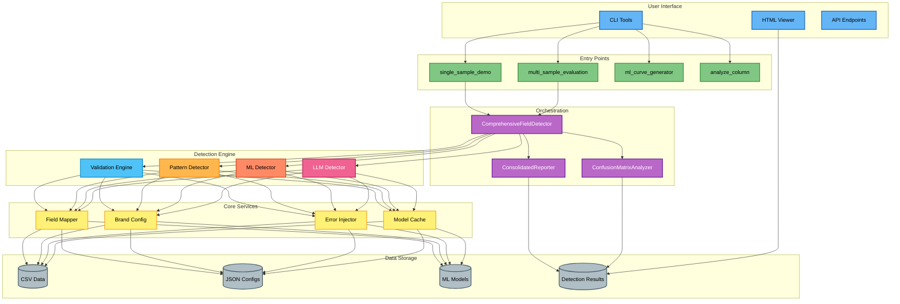
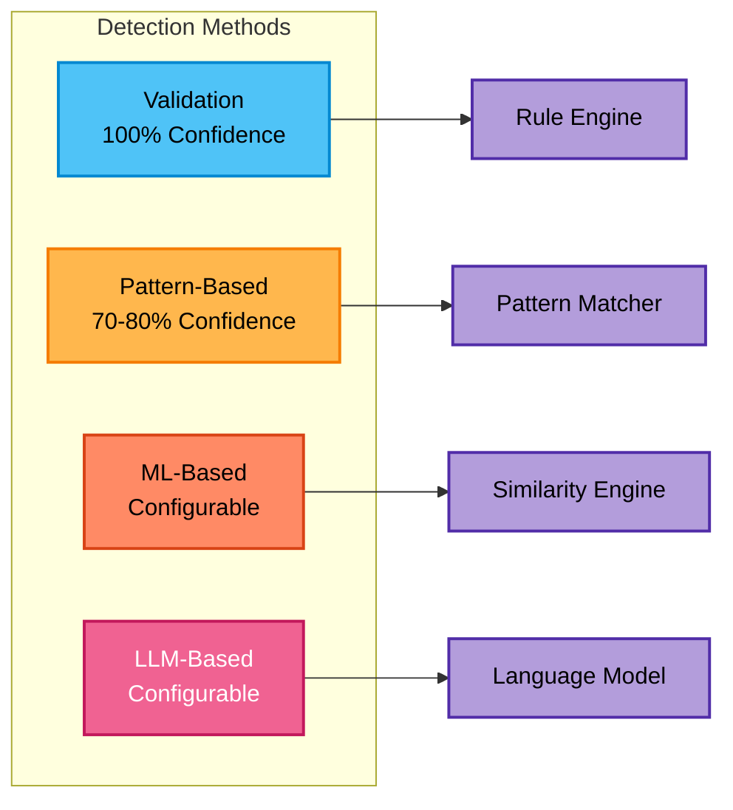
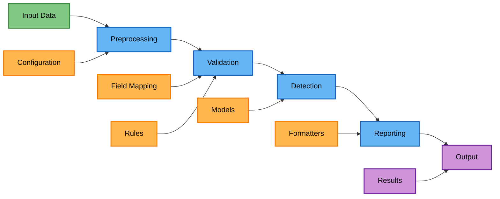
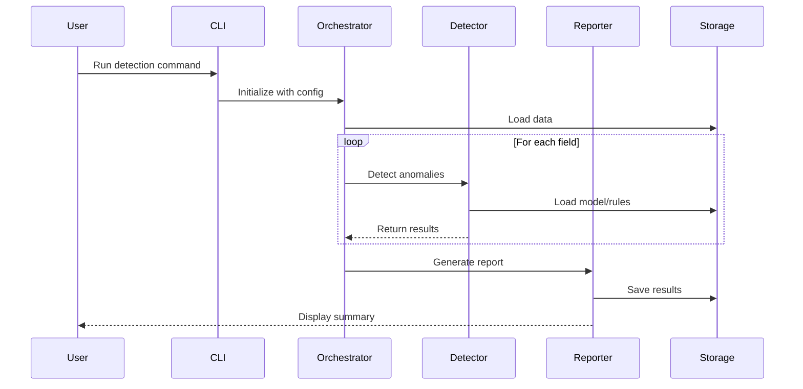
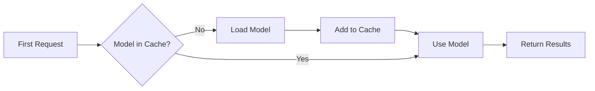
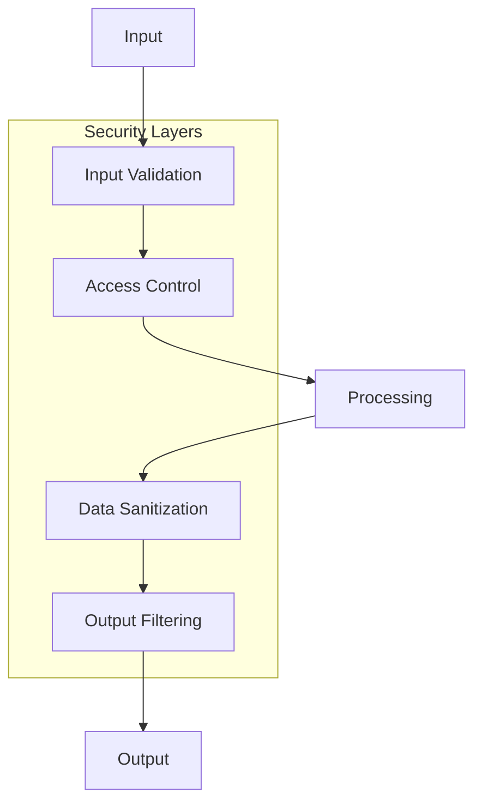
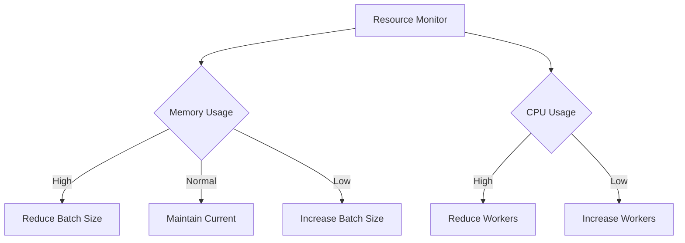

# Architecture and Design

## System Architecture Overview

The Data Quality Detection System is built on a modular, extensible architecture that enables multiple detection methods to work together seamlessly. This document provides a comprehensive overview of the system's architecture, design principles, and key components.

## Design Principles

### 1. Modularity
Each detection method is self-contained and implements common interfaces, allowing new methods to be added without modifying existing code.

### 2. Extensibility
The system is designed to be easily extended with new fields, detection methods, and output formats through configuration and plugins.

### 3. Performance
Sequential processing, model caching, and GPU acceleration ensure efficient resource usage even with large datasets.

### 4. Flexibility
Configurable thresholds, weights, and field mappings allow the system to adapt to different domains and use cases.

### 5. Separation of Concerns
Clear boundaries between layers ensure maintainability and testability.

## High-Level Architecture



## Layer Architecture

### 1. Entry Points Layer

This layer provides various ways to interact with the system:

- **Demo Scripts**: Quick demonstration and testing (`single_sample_demo`)
- **Evaluation Tools**: Performance measurement and comparison (`multi_sample_evaluation`)
- **Utility Scripts**: Data analysis and preparation (`analyze_column`)
- **Training Tools**: Model training and optimization (`ml_curve_generator`)

### 2. Orchestration Layer

Coordinates the detection workflow:

- **ComprehensiveFieldDetector**: Manages detection across all fields and methods
- **Evaluator**: Handles performance evaluation and metrics
- **ConsolidatedReporter**: Generates unified reports from multiple sources
- **ConfusionMatrixAnalyzer**: Analyzes detection performance

### 3. Detection Methods Layer

Implements the core detection algorithms:



### 4. Core Services Layer

Provides shared functionality:

- **FieldMapper**: Translates between standard fields and column names
- **BrandConfig**: Manages brand-specific configurations
- **ErrorInjector**: Generates synthetic errors for testing
- **ModelCache**: Manages model loading and caching
- **Reporters**: Formats and outputs detection results

### 5. Data Layer

Handles all data storage and retrieval:

- **Input Data**: CSV files with structured data
- **Configuration**: JSON files for settings and rules
- **Models**: Trained ML/LLM models
- **Results**: Detection reports and analyzed data

## Core Components

### Validators

The `ValidatorInterface` is the abstract base class for all validators:

```python
class ValidatorInterface(ABC):
    @abstractmethod
    def _validate_entry(self, value: Any) -> Optional[ValidationError]:
        """Validates a single data entry"""
        pass
    
    def bulk_validate(self, df: pd.DataFrame, column_name: str) -> List[ValidationError]:
        """Validates an entire column"""
        pass
```

Available validators include:
- **Care Instructions**: Validates care instruction text and symbols
- **Category**: Validates product category hierarchies
- **Color Name**: Validates color naming conventions
- **Material**: Validates material composition and descriptions
- **Season**: Validates seasonal classifications
- **Size**: Validates size specifications and formats

### Anomaly Detectors

The `AnomalyDetectorInterface` defines the contract for all anomaly detection:

```python
class AnomalyDetectorInterface(ABC):
    @abstractmethod
    def _detect_anomaly(self, value: Any, context: Dict[str, Any] = None) -> Optional[AnomalyError]:
        """Detects anomalies in a single data entry"""
        pass
    
    def learn_patterns(self, df: pd.DataFrame, column_name: str) -> None:
        """Learns patterns from training data (optional)"""
        pass
    
    def bulk_detect(self, df: pd.DataFrame, column_name: str, 
                    batch_size: Optional[int], max_workers: int) -> List[AnomalyError]:
        """Detects anomalies in bulk with parallel processing"""
        pass
```

### Reporters

Transform raw detection results into human-readable formats:

```python
class AnomalyReporterInterface(ABC):
    @abstractmethod
    def generate_report(self, 
                       anomaly_results: Union[List[AnomalyError], List[MLAnomalyResult]], 
                       original_df: pd.DataFrame,
                       threshold: float = 0.7) -> List[Dict[str, Any]]:
        """Generates human-readable reports from anomaly results"""
        pass
```

## Data Flow Architecture

### Overview

The data flow follows a pipeline architecture:



### Processing Stages

#### 1. Input Stage
- Load data from CSV files or DataFrames
- Apply initial data validation
- Handle missing values

#### 2. Preprocessing Stage
- Field mapping using brand configuration
- Data type conversion and normalization
- Feature engineering for ML methods

#### 3. Validation Stage
- Parallel validation across columns
- Rule-based error detection
- Context-aware validation

#### 4. Detection Stage
- Method selection based on configuration
- Batch processing for efficiency
- GPU acceleration for ML/LLM methods

#### 5. Reporting Stage
- Result aggregation across methods
- Report formatting (JSON, CSV, HTML)
- Performance metrics calculation

## Component Interactions



## Memory Management

The system implements several strategies for efficient memory usage:

### Sequential Processing
Fields are processed one at a time to minimize memory footprint:

```python
for field in fields:
    results = detect_field(field)
    save_results(results)
    clear_cache()
```

### Model Caching
Models are loaded once and reused:



### Batch Processing
- Configurable batch sizes for memory/performance balance
- Automatic batch size optimization based on available memory
- GPU memory management for ML/LLM methods

## Parallel Processing Architecture

### CPU Parallelization
- Row-by-row processing using multiprocessing
- Automatic worker count based on CPU cores
- Thread-safe result aggregation

### GPU Acceleration
- Batch processing for ML/LLM methods
- Automatic batch size optimization
- CUDA memory management

```python
# Example parallel processing flow
with ProcessPoolExecutor(max_workers=num_workers) as executor:
    futures = []
    for batch in data_batches:
        future = executor.submit(process_batch, batch)
        futures.append(future)
    
    for future in as_completed(futures):
        results.extend(future.result())
```

## Scalability Considerations

### Horizontal Scaling
- Field-level parallelization
- Independent detection methods
- Distributed processing support (future)

### Vertical Scaling
- GPU acceleration for ML/LLM
- Optimized algorithms
- Efficient data structures

### Resource Management
- Dynamic resource allocation
- Graceful degradation
- Memory pressure handling

## Security Architecture



### Security Measures
- Input validation to prevent injection attacks
- Sanitization of file paths and configurations
- Safe model loading and execution
- Output filtering for sensitive data

## Extension Points

The architecture provides several extension points for customization:

### 1. New Detection Methods
Implement `AnomalyDetectorInterface`:
```python
class CustomDetector(AnomalyDetectorInterface):
    def _detect_anomaly(self, value, context=None):
        # Custom detection logic
        pass
```

### 2. Custom Validators
Implement `ValidatorInterface`:
```python
class CustomValidator(ValidatorInterface):
    def _validate_entry(self, value):
        # Custom validation logic
        pass
```

### 3. Output Formats
Implement `ReporterInterface`:
```python
class CustomReporter(ReporterInterface):
    def generate_report(self, results, df, threshold):
        # Custom report format
        pass
```

### 4. Field Types
Add configuration and rules:
```json
{
    "field_type": "custom_field",
    "validation_rules": [...],
    "detection_config": {...}
}
```

## Performance Optimization

### Caching Strategy
- Model caching with LRU eviction
- Result caching for repeated queries
- Pattern caching for rule-based methods

### Processing Optimization
- Lazy loading of models and data
- Early exit on high-confidence detections
- Vectorized operations where possible

### Resource Utilization


## Monitoring and Telemetry

### Performance Metrics
- Processing time per field
- Detection method accuracy
- Resource utilization
- Error rates and types

### Logging Architecture
- Structured logging with levels
- Performance profiling
- Error tracking
- Audit trails

## Future Architecture Considerations

### Planned Enhancements
1. **Distributed Processing**: Apache Spark integration
2. **Real-time Detection**: Streaming data support
3. **Cloud-Native**: Kubernetes deployment
4. **API Gateway**: RESTful API with rate limiting
5. **Enhanced Caching**: Redis/Memcached support

### Extensibility Roadmap
- Plugin marketplace
- Custom model registry
- Configuration management UI
- Performance dashboard

## Best Practices

### Development Guidelines
1. Follow interface contracts strictly
2. Implement comprehensive error handling
3. Write unit tests for new components
4. Document configuration options
5. Profile performance impact

### Deployment Considerations
1. Use environment-specific configurations
2. Monitor resource usage
3. Implement graceful shutdown
4. Set up alerting for critical errors
5. Regular model updates

## Next Steps

- Explore the [Theoretical Approach](05-theoretical-approach.md) behind detection methods
- Review [Code Structure](06-code-structure.md) for implementation details
- Learn about [Adding New Fields](07-adding-fields.md) to extend the system
- Configure for your needs with [Adding New Brands](08-adding-brands.md)