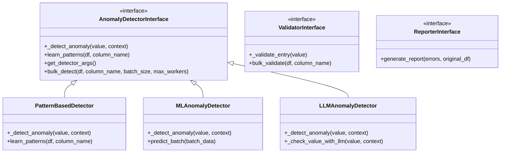
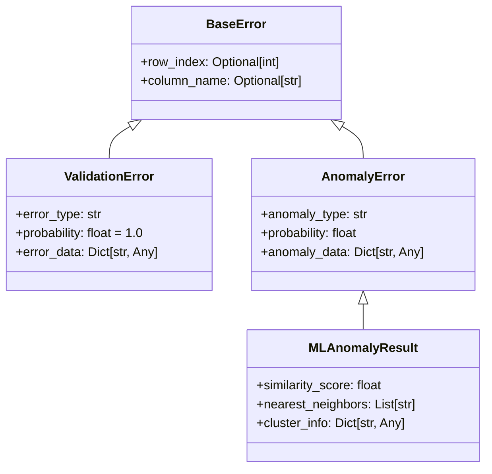

# Code Structure and Classes

## Overview

The Data Quality Detection System follows a well-organized, modular code structure based on interfaces and implementations. This document provides a comprehensive guide to the codebase organization, key classes, and interfaces.

## Project Structure

```
detection-system/
├── main.py                           # Main entry point with CLI commands
├── single_sample_multi_field_demo/   # Demo and evaluation modules
│   ├── comprehensive_detector.py     # Main detection orchestrator
│   ├── consolidated_reporter.py      # Report generation
│   ├── error_injector.py            # Synthetic error injection
│   └── confusion_matrix_analyzer.py  # Performance analysis
├── multi_sample_evaluation/          # Batch evaluation utilities
│   ├── evaluator.py                 # Evaluation orchestrator
│   └── error_messages.json          # Error type definitions
├── validators/                       # Rule-based validators
│   ├── validator_interface.py       # Base interface
│   ├── validation_error.py          # Error class
│   ├── material/                    # Material validator
│   ├── color_name/                  # Color validator
│   ├── category/                    # Category validator
│   ├── size/                        # Size validator
│   ├── care_instructions/           # Care instructions validator
│   └── season/                      # Season validator
├── anomaly_detectors/               # Detection implementations
│   ├── anomaly_detector_interface.py # Base interface
│   ├── anomaly_error.py             # Error class
│   ├── pattern_based/               # Pattern detection
│   ├── ml_based/                    # ML detection
│   └── llm_based/                   # LLM detection
├── common/                          # Shared utilities
│   ├── brand_config.py              # Brand configuration
│   ├── field_mapping.py             # Field name mapping
│   ├── constants.py                 # System constants
│   └── debug.py                     # Debug utilities
└── data/                           # Data and models
    ├── models/                      # Trained models
    └── configs/                     # Configuration files
```

## Core Interfaces

### Interface Hierarchy



## 1. Anomaly Detector Interface

### AnomalyDetectorInterface

Base interface for all anomaly detection methods.

**Location:** `anomaly_detectors/anomaly_detector_interface.py`

```python
from abc import ABC, abstractmethod
from typing import Any, Dict, List, Optional
import pandas as pd

class AnomalyDetectorInterface(ABC):
    @abstractmethod
    def _detect_anomaly(self, value: Any, context: Dict[str, Any] = None) -> Optional[AnomalyError]:
        """
        Contains the specific anomaly detection logic for a single data entry.
        
        Args:
            value: The data from the DataFrame column to be checked
            context: Optional dictionary containing additional context data
        
        Returns:
            None if no anomaly is detected
            An AnomalyError instance if an anomaly is detected
        """
        pass
    
    def learn_patterns(self, df: pd.DataFrame, column_name: str) -> None:
        """
        Learns normal patterns from the data to establish a baseline.
        Override this method if your detector needs training.
        """
        pass
    
    def get_detector_args(self) -> Dict[str, Any]:
        """
        Return arguments needed to recreate this detector instance.
        Used for parallel processing.
        """
        return {}
    
    def bulk_detect(self, df: pd.DataFrame, column_name: str, 
                    batch_size: Optional[int], max_workers: int) -> List[AnomalyError]:
        """
        Detects anomalies in a column using parallel processing.
        """
        # Implementation handles batching and parallel execution
        pass
```

### AnomalyError

Represents a detected anomaly with confidence and context.

**Location:** `anomaly_detectors/anomaly_error.py`

```python
@dataclass
class AnomalyError:
    anomaly_type: str           # Type of anomaly detected
    probability: float          # Confidence score (0-1)
    anomaly_data: Dict[str, Any] = field(default_factory=dict)  # Additional context
    row_index: Optional[int] = None  # Row number in DataFrame
    column_name: Optional[str] = None  # Column name
```

## 2. Validator Interface

### ValidatorInterface

Base interface for field validators that enforce business rules.

**Location:** `validators/validator_interface.py`

```python
from abc import ABC, abstractmethod
from typing import Any, List, Optional
import pandas as pd

class ValidatorInterface(ABC):
    @abstractmethod
    def _validate_entry(self, value: Any) -> Optional[ValidationError]:
        """
        Contains the specific validation logic for a single data entry.
        
        Args:
            value: The data from the DataFrame column to be validated
        
        Returns:
            None if the value is valid
            A ValidationError instance if the value is invalid
        """
        pass
    
    def bulk_validate(self, df: pd.DataFrame, column_name: str) -> List[ValidationError]:
        """
        Validates a column and returns a list of ValidationError objects.
        """
        errors = []
        for idx, value in df[column_name].items():
            error = self._validate_entry(value)
            if error:
                error.row_index = idx
                error.column_name = column_name
                errors.append(error)
        return errors
```

### ValidationError

Represents a validation failure with deterministic confidence.

**Location:** `validators/validation_error.py`

```python
@dataclass
class ValidationError:
    error_type: str             # Type of validation error
    probability: float = 1.0    # Always 1.0 for validation
    error_data: Dict[str, Any] = field(default_factory=dict)
    row_index: Optional[int] = None
    column_name: Optional[str] = None
```

## 3. Detection Implementations

### PatternBasedDetector

Detects anomalies using JSON-configured patterns and known value rules.

**Location:** `anomaly_detectors/pattern_based/pattern_based_detector.py`

```python
class PatternBasedDetector(AnomalyDetectorInterface):
    def __init__(self, rules_config: Dict[str, Any]):
        self.rules = self._load_rules(rules_config)
        self.patterns = {}
    
    def _detect_anomaly(self, value: Any, context: Dict[str, Any] = None) -> Optional[AnomalyError]:
        # Check against known patterns
        if not self._matches_patterns(value):
            return AnomalyError(
                anomaly_type="pattern_mismatch",
                probability=0.8,
                anomaly_data={"value": value, "expected_patterns": self.patterns}
            )
        return None
    
    def learn_patterns(self, df: pd.DataFrame, column_name: str) -> None:
        # Learn patterns from data
        value_counts = df[column_name].value_counts()
        self.patterns = {
            "frequent_values": value_counts.head(100).index.tolist(),
            "value_distribution": value_counts.to_dict()
        }
```

### MLAnomalyDetector

Uses machine learning models for semantic anomaly detection.

**Location:** `anomaly_detectors/ml_based/ml_anomaly_detector.py`

```python
class MLAnomalyDetector(AnomalyDetectorInterface):
    def __init__(self, model_path: str, threshold: float = 0.7):
        self.model = self._load_model(model_path)
        self.threshold = threshold
        self.embeddings_cache = {}
    
    def _detect_anomaly(self, value: Any, context: Dict[str, Any] = None) -> Optional[AnomalyError]:
        # Generate embedding
        embedding = self._get_embedding(str(value))
        
        # Calculate similarity
        similarity = self._calculate_similarity(embedding)
        
        if similarity < self.threshold:
            return AnomalyError(
                anomaly_type="low_similarity",
                probability=1 - similarity,
                anomaly_data={
                    "value": value,
                    "similarity_score": similarity,
                    "threshold": self.threshold
                }
            )
        return None
    
    def predict_batch(self, batch_data: List[str]) -> List[float]:
        """Optimized batch prediction for GPU processing."""
        embeddings = self.model.encode(batch_data, batch_size=32)
        return self._calculate_similarities_batch(embeddings)
```

### LLMAnomalyDetector

Uses language models for complex contextual detection.

**Location:** `anomaly_detectors/llm_based/llm_anomaly_detector.py`

```python
class LLMAnomalyDetector(AnomalyDetectorInterface):
    def __init__(self, model_name: str, threshold: float = 0.6):
        self.model = self._load_llm(model_name)
        self.threshold = threshold
        self.prompt_template = self._load_prompt_template()
    
    def _detect_anomaly(self, value: Any, context: Dict[str, Any] = None) -> Optional[AnomalyError]:
        # Construct prompt
        prompt = self._build_prompt(value, context)
        
        # Get LLM response
        response = self._query_llm(prompt)
        
        # Parse response
        is_anomaly, confidence, reason = self._parse_response(response)
        
        if is_anomaly and confidence > self.threshold:
            return AnomalyError(
                anomaly_type="llm_detected",
                probability=confidence,
                anomaly_data={
                    "value": value,
                    "reason": reason,
                    "context": context
                }
            )
        return None
```

## 4. Orchestration Classes

### ComprehensiveFieldDetector

Main orchestrator that coordinates all detection methods.

**Location:** `single_sample_multi_field_demo/comprehensive_detector.py`

```python
class ComprehensiveFieldDetector:
    def __init__(self, config: Dict[str, Any]):
        self.config = config
        self.field_mapper = FieldMapper(config['brand'])
        self.validators = self._load_validators()
        self.detectors = self._load_detectors()
    
    def detect_anomalies(self, df: pd.DataFrame, fields: List[str]) -> Dict[str, Any]:
        """
        Run comprehensive detection across all fields and methods.
        
        Returns:
            Dictionary containing detection results for each field
        """
        results = {}
        
        for field in fields:
            # Run validation
            validation_errors = self._run_validation(df, field)
            
            # Run pattern detection
            pattern_anomalies = self._run_pattern_detection(df, field)
            
            # Run ML detection
            ml_anomalies = self._run_ml_detection(df, field)
            
            # Run LLM detection
            llm_anomalies = self._run_llm_detection(df, field)
            
            # Combine results
            results[field] = self._combine_results(
                validation_errors,
                pattern_anomalies,
                ml_anomalies,
                llm_anomalies
            )
        
        return results
```

### ConsolidatedReporter

Generates comprehensive reports from detection results.

**Location:** `single_sample_multi_field_demo/consolidated_reporter.py`

```python
class ConsolidatedReporter:
    def __init__(self, output_dir: str):
        self.output_dir = output_dir
        self.report_data = {}
    
    def generate_report(self, results: Dict[str, Any], 
                       original_df: pd.DataFrame) -> None:
        """
        Generate comprehensive report including JSON, CSV, and visualizations.
        """
        # Generate JSON report
        self._generate_json_report(results)
        
        # Generate CSV summary
        self._generate_csv_summary(results, original_df)
        
        # Generate confusion matrix
        self._generate_confusion_matrix(results)
        
        # Generate HTML viewer data
        self._generate_viewer_data(results)
    
    def _generate_json_report(self, results: Dict[str, Any]) -> None:
        """Create detailed JSON report with all detection results."""
        report = {
            "metadata": self._get_metadata(),
            "summary": self._calculate_summary(results),
            "field_results": results,
            "performance_metrics": self._calculate_metrics(results)
        }
        
        with open(os.path.join(self.output_dir, "report.json"), "w") as f:
            json.dump(report, f, indent=2)
```

## 5. Utility Classes

### FieldMapper

Maps between standard field names and column names.

**Location:** `common/field_mapping.py`

```python
class FieldMapper:
    def __init__(self, brand_config: Dict[str, Any]):
        self.mappings = brand_config.get('field_mappings', {})
        self.reverse_mappings = {v: k for k, v in self.mappings.items()}
    
    def get_column_name(self, field_name: str) -> str:
        """Get actual column name from standard field name."""
        return self.mappings.get(field_name, field_name)
    
    def get_field_name(self, column_name: str) -> str:
        """Get standard field name from column name."""
        return self.reverse_mappings.get(column_name, column_name)
    
    def map_dataframe(self, df: pd.DataFrame) -> pd.DataFrame:
        """Rename DataFrame columns to standard field names."""
        return df.rename(columns=self.reverse_mappings)
```

### ErrorInjector

Injects synthetic errors for testing and evaluation.

**Location:** `single_sample_multi_field_demo/error_injector.py`

```python
class ErrorInjector:
    def __init__(self, error_types: Dict[str, List[str]]):
        self.error_types = error_types
        self.injection_log = []
    
    def inject_errors(self, df: pd.DataFrame, 
                     injection_rate: float = 0.2,
                     max_errors_per_row: int = 2) -> pd.DataFrame:
        """
        Inject synthetic errors into DataFrame for testing.
        
        Args:
            df: Original DataFrame
            injection_rate: Probability of injecting error per cell
            max_errors_per_row: Maximum errors per row
        
        Returns:
            DataFrame with injected errors
        """
        df_copy = df.copy()
        
        for idx, row in df.iterrows():
            errors_in_row = 0
            
            for column in df.columns:
                if errors_in_row >= max_errors_per_row:
                    break
                    
                if random.random() < injection_rate:
                    error_type = self._select_error_type(column)
                    df_copy.at[idx, column] = self._inject_error(
                        row[column], error_type
                    )
                    self._log_injection(idx, column, error_type)
                    errors_in_row += 1
        
        return df_copy
```

### BrandConfig

Manages brand-specific configuration.

**Location:** `common/brand_config.py`

```python
class BrandConfig:
    def __init__(self, brand_name: str):
        self.brand_name = brand_name
        self.config = self._load_config()
    
    def _load_config(self) -> Dict[str, Any]:
        """Load brand configuration from JSON file."""
        config_path = f"brand_configs/{self.brand_name}.json"
        with open(config_path, 'r') as f:
            return json.load(f)
    
    def get_field_mappings(self) -> Dict[str, str]:
        """Get field name mappings."""
        return self.config.get('field_mappings', {})
    
    def get_enabled_fields(self) -> List[str]:
        """Get list of enabled fields for detection."""
        return self.config.get('enabled_fields', [])
    
    def get_thresholds(self) -> Dict[str, float]:
        """Get detection thresholds."""
        return self.config.get('custom_thresholds', {})
```

## 6. Error Classes

### Error Class Hierarchy



## 7. Main Entry Point

### main.py

The central CLI interface that routes to different commands.

```python
import argparse
from single_sample_multi_field_demo.run_demo import run_single_demo
from multi_sample_evaluation.run_evaluation import run_multi_eval
from ml_curve_generator.generate_curves import generate_ml_curves
from analyze_column.analyze_column import analyze_column_data

def main():
    parser = argparse.ArgumentParser(
        description="Data Quality Detection System"
    )
    
    subparsers = parser.add_subparsers(dest='command', help='Commands')
    
    # Single demo command
    demo_parser = subparsers.add_parser(
        'single-demo',
        help='Run single sample demonstration'
    )
    demo_parser.add_argument('--data-file', required=True)
    demo_parser.add_argument('--output-dir', default='demo_results')
    # ... more arguments
    
    # Multi-eval command
    eval_parser = subparsers.add_parser(
        'multi-eval',
        help='Run multi-sample evaluation'
    )
    eval_parser.add_argument('--field', required=True)
    # ... more arguments
    
    args = parser.parse_args()
    
    if args.command == 'single-demo':
        run_single_demo(args)
    elif args.command == 'multi-eval':
        run_multi_eval(args)
    # ... more command handlers

if __name__ == "__main__":
    main()
```

## Best Practices

### 1. Interface Implementation
- Always inherit from the appropriate interface
- Implement all abstract methods
- Use type hints for clarity
- Document expected behavior

### 2. Error Handling
```python
try:
    result = detector.detect_anomaly(value)
except Exception as e:
    logger.error(f"Detection failed for {value}: {e}")
    return None  # Graceful degradation
```

### 3. Resource Management
```python
class ResourceIntensiveDetector:
    def __init__(self):
        self.model = None
    
    def _lazy_load_model(self):
        if self.model is None:
            self.model = self._load_model()
    
    def detect(self, value):
        self._lazy_load_model()
        return self.model.predict(value)
```

### 4. Testing
```python
class TestMaterialValidator(unittest.TestCase):
    def setUp(self):
        self.validator = MaterialValidator()
    
    def test_empty_value(self):
        error = self.validator._validate_entry("")
        self.assertIsNotNone(error)
        self.assertEqual(error.error_type, "EMPTY_VALUE")
    
    def test_valid_material(self):
        error = self.validator._validate_entry("100% Cotton")
        self.assertIsNone(error)
```

## Next Steps

- Learn how to [Add New Fields](07-adding-fields.md) to the system
- Configure the system with [Adding New Brands](08-adding-brands.md)
- Deploy with the [Operations Guide](09-operations.md)