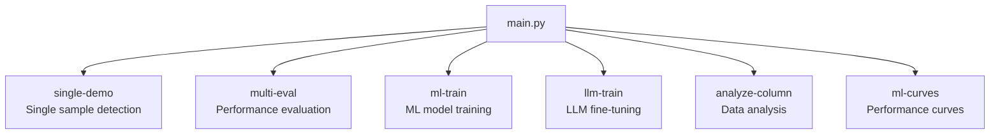

# Command Line Usage Guide

## Overview

The Data Quality Detection System provides a unified command-line interface through `main.py`. All functionality is accessed through subcommands, each designed for specific use cases.

```bash
python main.py [command] [options]
```

## Available Commands



## Command Reference

### 1. single-demo - Single Sample Detection

The primary command for running comprehensive data quality detection on a single dataset.

#### Basic Usage

```bash
# Simplest form - runs all detection methods
python main.py single-demo --data-file your_data.csv

# Specify output directory
python main.py single-demo --data-file your_data.csv --output-dir results/analysis
```

#### Required Arguments
- `--data-file PATH`: Path to input CSV file

#### Detection Method Options

By default, all available detection methods run. Use these flags to selectively enable methods:

```bash
# Validation only (fastest)
python main.py single-demo --data-file data.csv --enable-validation

# Pattern-based detection
python main.py single-demo --data-file data.csv --enable-pattern

# ML-based detection (requires trained models)
python main.py single-demo --data-file data.csv --enable-ml

# LLM-based detection (requires API/model)
python main.py single-demo --data-file data.csv --enable-llm

# Multiple methods
python main.py single-demo --data-file data.csv --enable-validation --enable-ml
```

#### Threshold Configuration

Adjust detection sensitivity for each method:

```bash
python main.py single-demo --data-file data.csv \
    --validation-threshold 0.0 \     # 0.0 = deterministic
    --anomaly-threshold 0.7 \        # Higher = fewer detections
    --ml-threshold 0.8 \             # Similarity threshold
    --llm-threshold 0.6              # Confidence threshold
```

#### Error Injection Options

For testing and evaluation:

```bash
# No injection (production mode)
python main.py single-demo --data-file data.csv --injection-intensity 0.0

# Light injection for testing (20% of cells)
python main.py single-demo --data-file data.csv --injection-intensity 0.2

# Heavy injection with multiple errors per row
python main.py single-demo --data-file data.csv \
    --injection-intensity 0.5 \
    --max-issues-per-row 3
```

#### Weighted Combination

Use performance-based weights to combine detection results:

```bash
# Use existing weights
python main.py single-demo --data-file data.csv \
    --use-weighted-combination \
    --weights-file config/detection_weights.json

# Generate weights after detection
python main.py single-demo --data-file data.csv \
    --generate-weights \
    --weights-output-file new_weights.json
```

#### Field Selection

```bash
# Process only core fields (faster)
python main.py single-demo --data-file data.csv --core-fields-only

# Core fields include: material, color_name, category, size, care_instructions
```

#### LLM-Specific Options

```bash
python main.py single-demo --data-file data.csv --enable-llm \
    --llm-few-shot-examples \                    # Use few-shot prompting
    --llm-temporal-column "season" \             # Temporal context
    --llm-context-columns "category,brand"       # Additional context
```

#### Complete Example

```bash
python main.py single-demo \
    --data-file production_data.csv \
    --output-dir results/2024-01-15 \
    --enable-validation \
    --enable-pattern \
    --enable-ml \
    --validation-threshold 0.0 \
    --anomaly-threshold 0.75 \
    --ml-threshold 0.8 \
    --injection-intensity 0.0 \
    --use-weighted-combination \
    --weights-file config/production_weights.json
```

### 2. multi-eval - Performance Evaluation

Systematically evaluate detection performance across multiple samples.

#### Basic Usage

```bash
# Evaluate material field
python main.py multi-eval --field material

# Evaluate with specific input file
python main.py multi-eval --input data.csv --field care_instructions
```

#### Required Arguments
- `--field FIELD`: Target field to validate (e.g., 'material', 'color_name')

#### Detection Options

```bash
# Run both validation and anomaly detection (default)
python main.py multi-eval --field material --run both

# Run all detection methods
python main.py multi-eval --field material --run all --ml-detector --llm-detector

# Specific combinations
python main.py multi-eval --field material \
    --run validation \           # Options: validation, anomaly, ml, llm, both, all
    --ml-detector \              # Enable ML detection
    --llm-detector               # Enable LLM detection
```

#### Sampling Configuration

```bash
python main.py multi-eval --field material \
    --num-samples 100 \          # Number of test samples (default: 32)
    --max-errors 5 \             # Max errors per sample (default: 3)
    --error-probability 0.15     # Injection probability (default: 0.1)
```

#### Threshold Configuration

```bash
python main.py multi-eval --field material \
    --validation-threshold 0.0 \
    --anomaly-threshold 0.7 \
    --ml-threshold 0.75 \
    --llm-threshold 0.6 \
    --high-confidence-threshold 0.85
```

#### Performance Options

```bash
python main.py multi-eval --field material \
    --batch-size 64 \            # Batch size for ML/LLM
    --max-workers 8              # Parallel workers (default: 7)
```

#### Output and Analysis

```bash
python main.py multi-eval --field material \
    --output-dir evaluation_results \
    --ignore-errors "TOO_SHORT" "INVALID_FORMAT" \  # Ignore specific error types
    --ignore-fp                  # Ignore false positives in metrics
```

### 3. ml-train - ML Model Training

Train or optimize ML-based anomaly detection models.

#### Basic Usage

```bash
# Train models for all fields
python main.py ml-train --data-file training_data.csv

# Train specific fields
python main.py ml-train --data-file training_data.csv --fields material color_name

# Use hyperparameter search
python main.py ml-train --data-file training_data.csv \
    --use-hp-search \
    --hp-trials 20
```

#### Anomaly Detection Mode

```bash
# Check for anomalies using existing models
python main.py ml-train --data-file production_data.csv \
    --check-anomalies material \
    --threshold 0.7 \
    --output anomaly_results.csv
```

### 4. analyze-column - Data Analysis

Analyze column distributions and patterns before detection.

#### Basic Usage

```bash
# Analyze default column (color_name)
python main.py analyze-column data/products.csv

# Analyze specific column
python main.py analyze-column data/products.csv material

# Output includes:
# - Unique value count
# - Top 20 most frequent values
# - Pattern analysis
# - Sample values
```

### 5. ml-curves - Performance Curves

Generate precision-recall and ROC curves for threshold optimization.

#### Basic Usage

```bash
# Generate ML curves for all fields
python main.py ml-curves data/products.csv

# Generate LLM curves for specific fields
python main.py ml-curves data/products.csv \
    --detection-type llm \
    --fields material color_name

# Custom output directory
python main.py ml-curves data/products.csv \
    --output-dir performance_curves

# Test specific thresholds
python main.py ml-curves data/products.csv \
    --thresholds 0.5 0.6 0.7 0.8 0.9
```

## Output Formats

### Directory Structure

All commands create consistent output structures:

```
output_dir/
├── report.json                    # Main detection report
├── viewer_report.json            # Formatted for HTML viewer
├── anomaly_summary.csv           # CSV summary of detections
├── confusion_matrix/             # Performance visualizations
│   ├── confusion_matrix.png
│   ├── metrics_by_field.png
│   └── detection_comparison.png
├── logs/
│   └── detection.log            # Detailed execution logs
└── weights.json                 # Generated weights (if requested)
```

### Report Format

The main report.json contains:

```json
{
    "metadata": {
        "timestamp": "2024-01-15T10:30:00Z",
        "version": "1.0",
        "command": "single-demo",
        "parameters": {...}
    },
    "summary": {
        "total_records": 1000,
        "fields_analyzed": 15,
        "errors_injected": 150,
        "errors_detected": 142,
        "detection_methods": ["validation", "pattern", "ml"]
    },
    "field_results": {
        "material": {
            "total_values": 1000,
            "errors_injected": 20,
            "validation_detected": 18,
            "pattern_detected": 15,
            "ml_detected": 19
        }
    },
    "detailed_results": [...]
}
```

### Using the HTML Viewer

1. Open `data_quality_viewer.html` in a web browser
2. Upload the generated files:
   - `anomaly_summary.csv` - Detection results
   - `viewer_report.json` - Detailed report data
3. Use the interactive interface to:
   - Filter by field, method, or confidence
   - View detection distributions
   - Analyze false positives/negatives
   - Export filtered results

## Advanced Usage Patterns

### Batch Processing

Process multiple files:

```bash
#!/bin/bash
for file in data/*.csv; do
    echo "Processing $file..."
    python main.py single-demo \
        --data-file "$file" \
        --output-dir "results/$(basename $file .csv)" \
        --enable-validation \
        --enable-pattern
done
```

### Progressive Evaluation

Test with increasing error rates:

```bash
#!/bin/bash
for intensity in 0.1 0.2 0.3 0.4 0.5; do
    python main.py single-demo \
        --data-file clean_data.csv \
        --injection-intensity $intensity \
        --output-dir "results/intensity_$intensity" \
        --generate-weights
done
```

### Pipeline Integration

```bash
# CI/CD pipeline example
python main.py multi-eval \
    --field material \
    --num-samples 100 \
    --output-dir ci_results || exit 1

# Check if performance meets threshold (implement your own check)
# Example: Extract F1 score from report and compare
F1_SCORE=$(jq '.performance_metrics.overall_f1' ci_results/report.json)
python -c "import sys; sys.exit(0 if $F1_SCORE >= 0.85 else 1)" || exit 1
```

### Monitoring Script

```bash
#!/bin/bash
# Daily monitoring script

DATE=$(date +%Y%m%d)
OUTPUT_DIR="/monitoring/results/$DATE"

# Run detection
python main.py single-demo \
    --data-file /data/daily_export.csv \
    --output-dir "$OUTPUT_DIR" \
    --injection-intensity 0.0 \
    --use-weighted-combination \
    --weights-file /config/production_weights.json

# Check for critical errors
CRITICAL_ERRORS=$(jq '.summary.critical_errors' "$OUTPUT_DIR/report.json")
if [ "$CRITICAL_ERRORS" -gt 0 ]; then
    # Send alert
    echo "Critical errors detected: $CRITICAL_ERRORS" | mail -s "Data Quality Alert" admin@example.com
fi
```

## Performance Tips

### Memory Optimization

```bash
# For large datasets
python main.py single-demo --data-file large_data.csv \
    --core-fields-only \         # Process fewer fields
    --batch-size 32              # Smaller batches
```

### Speed Optimization

```bash
# Fast validation only
python main.py single-demo --data-file data.csv \
    --enable-validation \        # Fastest method
    --max-workers 16             # More parallel workers
```

### GPU Utilization

```bash
# For ML/LLM methods
export CUDA_VISIBLE_DEVICES=0    # Use specific GPU
python main.py single-demo --data-file data.csv \
    --enable-ml \
    --enable-llm \
    --batch-size 128             # Larger batches for GPU
```

## Exit Codes

| Code | Meaning | Action |
|------|---------|--------|
| 0 | Success | None needed |
| 1 | General error | Check logs |
| 2 | Invalid arguments | Review command syntax |
| 3 | File not found | Verify file paths |
| 4 | Configuration error | Check config files |
| 5 | Model/resource error | Ensure models exist |

## Common Issues and Solutions

### 1. Module Import Errors

```bash
# Solution: Activate virtual environment
source venv/bin/activate
pip install -r requirements.txt
```

### 2. Out of Memory

```bash
# Solution: Reduce load
python main.py single-demo --data-file data.csv \
    --core-fields-only \
    --batch-size 16
```

### 3. Slow Performance

```bash
# Solution: Use faster methods
python main.py single-demo --data-file data.csv \
    --enable-validation \
    --enable-pattern \
    --max-workers 8
```

### 4. Missing Models

```bash
# Solution: Train models first
python main.py ml-train --data-file training_data.csv --fields material color_name
```

## Next Steps

- Configure your brand: See [Adding New Brands](08-adding-brands.md)
- Add custom fields: See [Adding New Fields](07-adding-fields.md)
- Understand the architecture: See [Architecture and Design](04-architecture-design.md)
- Deploy to production: See [Operations Guide](09-operations.md)