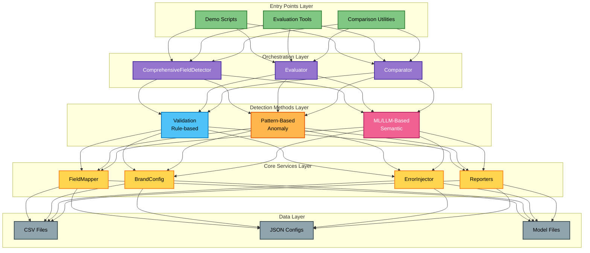

# Introduction and Overview

## What is the Data Quality Detection System?

The Data Quality Detection System is a comprehensive, multi-method data quality monitoring solution for detecting errors and anomalies in structured data. Originally designed for fashion/retail product catalogs, the system is field-agnostic and brand-independent, making it adaptable to various data domains.

## Key Features

- 🎯 **Multi-Method Detection**: Combines rule-based validation, pattern matching, machine learning, and language models
- 📊 **Comprehensive Evaluation**: Built-in metrics, confusion matrix analysis, and performance tracking
- 🔧 **Highly Configurable**: Customizable field mappings, detection thresholds, and brand configurations
- 💾 **Memory Efficient**: Sequential processing, model caching, and optimized resource usage
- 📈 **Performance Optimized**: Weighted combination based on historical performance data
- 🌐 **Brand Agnostic**: Supports multiple brands through configuration files
- 📱 **Visual Interface**: Interactive HTML5 viewer for result exploration

## Detection Methods Overview

The system employs four complementary detection approaches, each with different confidence levels and use cases:

### 1. Validation (Rule-Based)
- **Confidence**: 100% (deterministic)
- **Purpose**: High-confidence error detection using business rules
- **Best for**: Known patterns, format violations, business rule compliance
- **Speed**: Very fast

### 2. Pattern-Based Anomaly Detection
- **Confidence**: 70-80% (configurable)
- **Purpose**: Medium-confidence detection using statistical patterns
- **Best for**: Outliers, unusual patterns, format deviations
- **Speed**: Fast

### 3. ML-Based Detection
- **Confidence**: Configurable (typically 70-85%)
- **Purpose**: Semantic similarity analysis using sentence transformers
- **Best for**: Contextual anomalies, semantic inconsistencies
- **Speed**: Medium (GPU accelerated)

### 4. LLM-Based Detection
- **Confidence**: Configurable (typically 60-80%)
- **Purpose**: Advanced semantic understanding with language models
- **Best for**: Complex semantic errors, contextual understanding
- **Speed**: Slower (GPU accelerated)

## System Architecture Overview

The system follows a modular, layered architecture with clear separation of concerns:



## Design Principles

### 1. Modularity
Each detection method is self-contained and implements common interfaces, allowing new methods to be added without modifying existing code.

### 2. Extensibility
The system is designed to be easily extended with new fields, detection methods, and output formats through configuration and plugins.

### 3. Performance
Sequential processing, model caching, and GPU acceleration ensure efficient resource usage even with large datasets.

### 4. Flexibility
Configurable thresholds, weights, and field mappings allow the system to adapt to different domains and use cases.

## Use Cases

The Data Quality Detection System is suitable for various scenarios:

### Data Quality Monitoring
- Continuous monitoring of data quality in production systems
- Real-time anomaly alerts
- Quality trend analysis

### Data Validation
- Pre-processing validation before data ingestion
- ETL pipeline integration
- Data migration validation

### Anomaly Detection
- Identifying unusual patterns and outliers
- Fraud detection
- Quality control

### Compliance Checking
- Ensuring data meets business rules and standards
- Regulatory compliance validation
- Data governance enforcement

### Data Cleansing
- Identifying and categorizing data issues
- Prioritizing corrections based on confidence
- Automated error correction suggestions

## Project Structure

```
detection-system/
├── main.py                           # Main entry point with all commands
├── single_sample_multi_field_demo/   # Demo and evaluation tools
├── multi_sample_evaluation/          # Batch evaluation utilities
├── ml_curve_generator/              # ML performance analysis
├── analyze_column/                  # Data analysis tools
├── validators/                      # Rule-based validators
│   ├── material/
│   ├── color_name/
│   └── .../
├── anomaly_detectors/              # Detection method implementations
│   ├── pattern_based/
│   ├── ml_based/
│   └── llm_based/
├── common/                         # Shared utilities
├── brand_configs/                  # Brand configuration files
├── data/                          # Sample data and models
└── docs/                          # Documentation
```

## Performance Characteristics

### Resource Requirements
- **Memory**: 8GB minimum, 16GB+ recommended for ML/LLM
- **CPU**: Multi-core processor for parallel processing
- **GPU**: Optional but recommended for ML/LLM acceleration
- **Storage**: 5GB+ for models and cached data

### Processing Speed
- **Validation**: ~10,000 records/second
- **Pattern Detection**: ~5,000 records/second
- **ML Detection**: ~500-1,000 records/second (GPU)
- **LLM Detection**: ~50-100 records/second (GPU)

### Scalability
- Field-level parallelization
- Batch processing for large datasets
- Distributed processing support (future)

## Getting Started

To get started with the Data Quality Detection System:

1. **Installation**: Follow the [Installation and Setup Guide](02-installation-setup.md)
2. **Quick Demo**: Run the [Quick Start Tutorial](02-installation-setup.md#quick-start)
3. **Command Line**: Learn the [CLI Reference](03-command-line-usage.md)
4. **Configuration**: Set up your [Brand Configuration](08-adding-brands.md)

## Documentation Guide

This documentation is organized into the following sections:

1. **Introduction and Overview** (this document)
2. **[Installation and Setup](02-installation-setup.md)** - Get the system running
3. **[Command Line Usage](03-command-line-usage.md)** - All CLI commands and options
4. **[Architecture and Design](04-architecture-design.md)** - System architecture details
5. **[Theoretical Approach](05-theoretical-approach.md)** - Detection methods theory
6. **[Code Structure](06-code-structure.md)** - Classes and implementation details
7. **[Adding New Fields](07-adding-fields.md)** - Extend with new field types
8. **[Adding New Brands](08-adding-brands.md)** - Configure for new brands
9. **[Operations Guide](09-operations.md)** - Deployment and monitoring

## Support and Contribution

The Data Quality Detection System is designed to be extensible and customizable. Whether you're adding new fields, creating custom validators, or implementing new detection methods, this documentation provides comprehensive guidance.

For issues, questions, or contributions, please refer to the project repository.