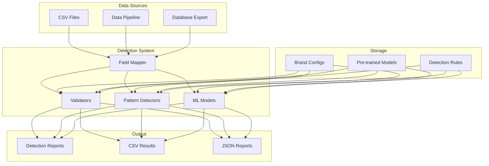

# Operations and Deployment Guide

## Overview

This guide covers deployment options, monitoring, and operational best practices for the Data Quality Detection System in production environments. The system is designed as a batch processing tool that can be integrated into data pipelines or run on-demand.

**Note**: This documentation includes both current capabilities and future/example implementations. Some features mentioned (such as Docker deployment, Prometheus monitoring, health checks, and various automation scripts) are not currently implemented in the codebase but are provided as examples for production deployment planning.

## Deployment Architecture



## Deployment Options

### 1. Standalone Deployment

Simple deployment for small to medium-scale usage.

#### System Requirements

**Minimum Requirements:**
- CPU: 4 cores
- RAM: 8GB
- Storage: 20GB SSD
- Python: 3.8+

**Recommended Requirements:**
- CPU: 8+ cores
- RAM: 16-32GB
- Storage: 50GB+ SSD
- GPU: NVIDIA CUDA-capable (for ML/LLM acceleration)

#### Installation Steps

```bash
# 1. Clone repository
git clone <repository-url>
cd <project-directory>

# 2. Create virtual environment
python3.8 -m venv venv
source venv/bin/activate

# 3. Install dependencies
pip install -r requirements.txt

# 4. Configure brand settings
cp brand_configs/esqualo.json brand_configs/your_brand.json
# Edit brand_configs/your_brand.json

# 5. Train models (if using ML)
python main.py ml-train --data-file training_data.csv

# 6. Run detection
python main.py single-demo --data-file your_data.csv
```

### 2. Container Deployment

Note: The project doesn't currently include Docker configuration files. To deploy using containers, you would need to create your own Dockerfile based on the requirements.

Example Dockerfile structure:
- Base image: python:3.8
- Install system dependencies
- Copy and install Python requirements
- Copy application code
- Set appropriate environment variables
- Define entrypoint as `python main.py`

For GPU support, use NVIDIA's CUDA-enabled Python images and ensure the container runtime supports GPU access.

### 3. Kubernetes Batch Processing

Run as Kubernetes jobs for scalable batch processing.

#### Kubernetes Job Configuration

```yaml
apiVersion: batch/v1
kind: Job
metadata:
  name: detection-job
  labels:
    app: data-quality-detection
spec:
  parallelism: 1
  completions: 1
  backoffLimit: 3
  template:
    metadata:
      labels:
        app: data-quality-detection
    spec:
      restartPolicy: OnFailure
      containers:
      - name: detection
        image: your-registry/detection-system:latest
        command: ["python", "main.py", "single-demo"]
        args:
          - "--data-file"
          - "/data/input.csv"
          - "--output-dir"
          - "/data/results"
        resources:
          requests:
            memory: "8Gi"
            cpu: "4"
          limits:
            memory: "16Gi"
            cpu: "8"
            nvidia.com/gpu: "1"  # If using GPU
        volumeMounts:
        - name: data
          mountPath: /data
        - name: config
          mountPath: /app/brand_configs
      volumes:
      - name: data
        persistentVolumeClaim:
          claimName: detection-data-pvc
      - name: config
        configMap:
          name: brand-config
```

### 4. Pipeline Integration

Integrate into existing data pipelines.

#### Apache Airflow DAG

```python
from airflow import DAG
from airflow.operators.bash import BashOperator
from airflow.operators.python import PythonOperator
from datetime import datetime, timedelta

default_args = {
    'owner': 'data-team',
    'depends_on_past': False,
    'start_date': datetime(2024, 1, 1),
    'email_on_failure': True,
    'email_on_retry': False,
    'retries': 1,
    'retry_delay': timedelta(minutes=5)
}

dag = DAG(
    'data_quality_detection',
    default_args=default_args,
    description='Daily data quality detection',
    schedule_interval='0 2 * * *',  # 2 AM daily
    catchup=False
)

# Task 1: Extract data
extract_data = BashOperator(
    task_id='extract_data',
    bash_command='python scripts/extract_daily_data.py',
    dag=dag
)

# Task 2: Run detection
run_detection = BashOperator(
    task_id='run_detection',
    bash_command='''
    python main.py single-demo \
        --data-file {{ ds }}_data.csv \
        --output-dir results/{{ ds }} \
        --enable-validation \
        --enable-pattern \
        --enable-ml
    ''',
    dag=dag
)

# Task 3: Process results
def process_results(**context):
    import json
    import pandas as pd
    
    date = context['ds']
    with open(f'results/{date}/report.json', 'r') as f:
        report = json.load(f)
    
    # Process and send alerts
    if report['summary']['critical_errors'] > 0:
        send_alert(report)
    
    # Store metrics
    store_metrics(report['metrics'])

process_results_task = PythonOperator(
    task_id='process_results',
    python_callable=process_results,
    dag=dag
)

extract_data >> run_detection >> process_results_task
```

## Production Configuration

### 1. Environment Variables

```bash
# Detection settings
export DETECTION_LOG_LEVEL=INFO
export DETECTION_OUTPUT_DIR=/var/log/detection
export DETECTION_BATCH_SIZE=1000
export DETECTION_MAX_WORKERS=8

# Model settings
export MODEL_CACHE_DIR=/opt/models
export CUDA_VISIBLE_DEVICES=0

# Monitoring
export METRICS_ENDPOINT=http://prometheus:9090
export ALERT_WEBHOOK=https://hooks.slack.com/...
```

### 2. Configuration Management

#### Production Configuration

```json
{
    "environment": "production",
    "log_level": "INFO",
    "performance": {
        "batch_size": 10000,
        "max_workers": 16,
        "enable_gpu": true,
        "cache_models": true
    },
    "monitoring": {
        "metrics_enabled": true,
        "metrics_port": 8080,
        "health_check_path": "/health"
    },
    "error_handling": {
        "continue_on_error": true,
        "max_retries": 3,
        "retry_delay": 60
    }
}
```

### 3. Resource Optimization

#### Memory Management

```python
# config/memory_settings.py
MEMORY_SETTINGS = {
    "max_dataframe_size": 1000000,  # Max rows to process at once
    "chunk_size": 10000,             # Process in chunks
    "model_cache_size": 5,           # Number of models to keep in memory
    "result_buffer_size": 50000      # Results to keep before writing
}
```

#### GPU Utilization

```python
# config/gpu_settings.py
GPU_SETTINGS = {
    "batch_size": {
        "ml_detection": 128,
        "llm_detection": 32
    },
    "memory_fraction": 0.8,  # Use 80% of GPU memory
    "allow_growth": True     # Grow memory as needed
}
```

## Monitoring and Observability

### 1. Logging Configuration

```python
# config/logging_config.py
LOGGING_CONFIG = {
    'version': 1,
    'disable_existing_loggers': False,
    'formatters': {
        'standard': {
            'format': '%(asctime)s [%(levelname)s] %(name)s: %(message)s'
        },
        'json': {
            'class': 'pythonjsonlogger.jsonlogger.JsonFormatter',
            'format': '%(asctime)s %(name)s %(levelname)s %(message)s'
        }
    },
    'handlers': {
        'console': {
            'class': 'logging.StreamHandler',
            'formatter': 'standard'
        },
        'file': {
            'class': 'logging.handlers.RotatingFileHandler',
            'filename': 'logs/detection.log',
            'maxBytes': 10485760,  # 10MB
            'backupCount': 5,
            'formatter': 'json'
        }
    },
    'loggers': {
        'detection': {
            'handlers': ['console', 'file'],
            'level': 'INFO',
            'propagate': False
        }
    }
}
```

### 2. Metrics Collection

```python
# monitoring/metrics.py
from prometheus_client import Counter, Histogram, Gauge

# Define metrics
detection_counter = Counter(
    'detection_total',
    'Total detections',
    ['method', 'field', 'error_type']
)

processing_time = Histogram(
    'detection_processing_seconds',
    'Processing time in seconds',
    ['method', 'field']
)

active_detections = Gauge(
    'detection_active',
    'Currently active detections'
)

# Usage in code
with processing_time.labels(method='validation', field='material').time():
    results = validator.validate(data)

detection_counter.labels(
    method='validation',
    field='material',
    error_type='EMPTY_VALUE'
).inc()
```

### 3. Health Checks

```python
# monitoring/health.py
from flask import Flask, jsonify

app = Flask(__name__)

@app.route('/health')
def health_check():
    checks = {
        'status': 'healthy',
        'checks': {
            'database': check_database(),
            'models': check_models_loaded(),
            'disk_space': check_disk_space(),
            'memory': check_memory_usage()
        }
    }
    
    # Determine overall health
    if any(not v for v in checks['checks'].values()):
        checks['status'] = 'unhealthy'
        return jsonify(checks), 503
    
    return jsonify(checks), 200

def check_models_loaded():
    try:
        from anomaly_detectors.ml_based import model_cache
        return len(model_cache) > 0
    except:
        return False
```

## Performance Tuning

### 1. Batch Size Optimization

```python
# scripts/optimize_batch_size.py
def find_optimal_batch_size(data_file, field):
    batch_sizes = [100, 500, 1000, 5000, 10000]
    results = []
    
    for batch_size in batch_sizes:
        start_time = time.time()
        
        run_detection(
            data_file=data_file,
            field=field,
            batch_size=batch_size
        )
        
        duration = time.time() - start_time
        throughput = get_row_count(data_file) / duration
        
        results.append({
            'batch_size': batch_size,
            'duration': duration,
            'throughput': throughput
        })
    
    # Find optimal
    optimal = max(results, key=lambda x: x['throughput'])
    print(f"Optimal batch size: {optimal['batch_size']}")
    return optimal['batch_size']
```

### 2. Parallel Processing

```python
# config/parallel_settings.py
import multiprocessing

PARALLEL_SETTINGS = {
    'max_workers': min(multiprocessing.cpu_count() - 1, 16),
    'chunk_size': 1000,
    'method_parallelism': {
        'validation': True,
        'pattern': True,
        'ml': False,  # GPU bound
        'llm': False  # GPU bound
    }
}
```

### 3. Caching Strategy

```python
# common/caching.py
from functools import lru_cache
import joblib

# Model caching
model_cache = {}

def get_cached_model(model_name):
    if model_name not in model_cache:
        model_cache[model_name] = load_model(model_name)
    return model_cache[model_name]

# Result caching
@lru_cache(maxsize=10000)
def get_validation_result(value, field_type):
    validator = get_validator(field_type)
    return validator.validate(value)

# Pattern caching
pattern_cache = joblib.Memory(
    location='cache/patterns',
    verbose=0
)

@pattern_cache.cache
def compute_patterns(data, field):
    # Expensive pattern computation
    return analyze_patterns(data, field)
```

## Operational Procedures

### 1. Deployment Checklist

- [ ] Update configuration files
- [ ] Test with sample data
- [ ] Verify model availability
- [ ] Check disk space (>20GB free)
- [ ] Confirm GPU availability (if using ML/LLM)
- [ ] Set up monitoring alerts
- [ ] Configure log rotation
- [ ] Document deployment version

### 2. Daily Operations

```bash
#!/bin/bash
# daily_operations.sh

# Set date
DATE=$(date +%Y%m%d)
LOG_FILE="logs/operations_${DATE}.log"

# Function to log
log() {
    echo "[$(date +'%Y-%m-%d %H:%M:%S')] $1" | tee -a $LOG_FILE
}

# Check system health
log "Starting daily operations check"

# Check disk space
DISK_USAGE=$(df -h /data | tail -1 | awk '{print $5}' | sed 's/%//')
if [ $DISK_USAGE -gt 80 ]; then
    log "WARNING: Disk usage is ${DISK_USAGE}%"
    # Send alert
fi

# Check previous day's results
YESTERDAY=$(date -d "yesterday" +%Y%m%d)
if [ -f "results/${YESTERDAY}/report.json" ]; then
    ERRORS=$(jq '.summary.total_errors' "results/${YESTERDAY}/report.json")
    log "Yesterday's detection found ${ERRORS} errors"
else
    log "ERROR: Yesterday's results not found"
fi

# Run test detection
log "Running test detection"
python main.py single-demo \
    --data-file data/test_sample.csv \
    --output-dir results/test_${DATE} \
    --injection-intensity 0.0

# Verify test results
if [ $? -eq 0 ]; then
    log "Test detection successful"
else
    log "ERROR: Test detection failed"
    # Send alert
fi

# Clean old logs
find logs/ -name "*.log" -mtime +30 -delete
log "Cleaned logs older than 30 days"

log "Daily operations check complete"
```

### 3. Troubleshooting Guide

#### Common Issues and Solutions

**1. Out of Memory Error**
```bash
# Symptoms: Process killed, MemoryError
# Solutions:
- Reduce batch size
- Enable chunking
- Use --core-fields-only flag
- Increase system memory

# Example fix:
python main.py single-demo \
    --data-file large_data.csv \
    --batch-size 1000 \
    --core-fields-only
```

**2. GPU Memory Error**
```bash
# Symptoms: CUDA out of memory
# Solutions:
- Reduce ML/LLM batch size
- Clear GPU cache
- Use CPU fallback

# Example fix:
export CUDA_VISIBLE_DEVICES=""  # Force CPU
python main.py single-demo --data-file data.csv
```

**3. Slow Performance**
```bash
# Symptoms: Long processing times
# Solutions:
- Enable only necessary detection methods
- Increase worker count
- Use GPU acceleration
- Optimize batch sizes

# Example fix:
python main.py single-demo \
    --data-file data.csv \
    --enable-validation \
    --enable-pattern \
    --max-workers 16
```

**4. Configuration Errors**
```bash
# Symptoms: Field not found, mapping errors
# Solutions:
- Verify brand configuration
- Check column names (case-sensitive)
- Validate JSON syntax

# Debug commands:
python -m json.tool brand_configs/your_brand.json  # Validate JSON
python scripts/validate_config.py your_brand        # Validate mappings
```

### 4. Backup and Recovery

```bash
#!/bin/bash
# backup_detection_system.sh

BACKUP_DIR="/backup/detection_system/$(date +%Y%m%d)"
mkdir -p $BACKUP_DIR

# Backup configurations
cp -r brand_configs $BACKUP_DIR/
cp -r config $BACKUP_DIR/

# Backup models
cp -r data/models $BACKUP_DIR/

# Backup recent results
find results -mtime -7 -type f -exec cp --parents {} $BACKUP_DIR \;

# Create backup manifest
cat > $BACKUP_DIR/manifest.txt << EOF
Backup Date: $(date)
System Version: $(git describe --tags)
Configuration Files: $(find brand_configs -name "*.json" | wc -l)
Model Files: $(find data/models -name "*.pkl" | wc -l)
EOF

# Compress backup
tar -czf "${BACKUP_DIR}.tar.gz" -C /backup/detection_system $(basename $BACKUP_DIR)
rm -rf $BACKUP_DIR

echo "Backup completed: ${BACKUP_DIR}.tar.gz"
```

## Monitoring Dashboard

### Grafana Dashboard Configuration

```json
{
  "dashboard": {
    "title": "Data Quality Detection System",
    "panels": [
      {
        "title": "Detection Rate",
        "targets": [
          {
            "expr": "rate(detection_total[5m])",
            "legendFormat": "{{method}} - {{field}}"
          }
        ]
      },
      {
        "title": "Processing Time",
        "targets": [
          {
            "expr": "histogram_quantile(0.95, detection_processing_seconds)",
            "legendFormat": "95th percentile"
          }
        ]
      },
      {
        "title": "Error Distribution",
        "targets": [
          {
            "expr": "sum by (error_type) (detection_total)",
            "legendFormat": "{{error_type}}"
          }
        ]
      },
      {
        "title": "System Health",
        "targets": [
          {
            "expr": "up{job='detection_system'}",
            "legendFormat": "Status"
          }
        ]
      }
    ]
  }
}
```

## Security Considerations

### 1. Access Control

```yaml
# k8s/rbac.yaml
apiVersion: rbac.authorization.k8s.io/v1
kind: Role
metadata:
  name: detection-system-role
rules:
- apiGroups: [""]
  resources: ["configmaps", "secrets"]
  verbs: ["get", "list"]
- apiGroups: ["batch"]
  resources: ["jobs"]
  verbs: ["create", "get", "list", "delete"]
```

### 2. Data Encryption

```python
# security/encryption.py
from cryptography.fernet import Fernet

class DataEncryption:
    def __init__(self, key_path='keys/data.key'):
        self.key = self._load_or_generate_key(key_path)
        self.cipher = Fernet(self.key)
    
    def encrypt_sensitive_data(self, data):
        return self.cipher.encrypt(data.encode())
    
    def decrypt_sensitive_data(self, encrypted_data):
        return self.cipher.decrypt(encrypted_data).decode()
```

### 3. Audit Logging

```python
# security/audit.py
import json
from datetime import datetime

class AuditLogger:
    def __init__(self, log_file='audit.log'):
        self.log_file = log_file
    
    def log_detection_run(self, user, data_file, config):
        audit_entry = {
            'timestamp': datetime.utcnow().isoformat(),
            'user': user,
            'action': 'detection_run',
            'data_file': data_file,
            'config': config,
            'ip_address': get_client_ip()
        }
        
        with open(self.log_file, 'a') as f:
            f.write(json.dumps(audit_entry) + '\n')
```

## Disaster Recovery

### Recovery Time Objective (RTO): 4 hours
### Recovery Point Objective (RPO): 24 hours

### Recovery Procedures

1. **System Failure**
   - Restore from container image
   - Apply latest configuration
   - Restore model files from backup
   - Resume processing from last checkpoint

2. **Data Corruption**
   - Identify corrupted data window
   - Restore from backup
   - Reprocess affected time period
   - Validate results

3. **Model Corruption**
   - Restore models from backup
   - Retrain if necessary
   - Validate detection accuracy
   - Update model version tracking

## Maintenance Schedule

### Daily
- Check system health
- Review error logs
- Monitor disk usage
- Verify backup completion

### Weekly
- Analyze detection performance
- Review false positive rates
- Update detection thresholds
- Clean temporary files

### Monthly
- Update models with new training data
- Review and update configurations
- Performance optimization
- Security patches

### Quarterly
- Full system backup test
- Disaster recovery drill
- Performance benchmarking
- Documentation update

## Next Steps

- Review [Command Line Usage](03-command-line-usage.md) for operational commands
- Configure monitoring using templates above
- Set up automated backups
- Establish operational runbooks