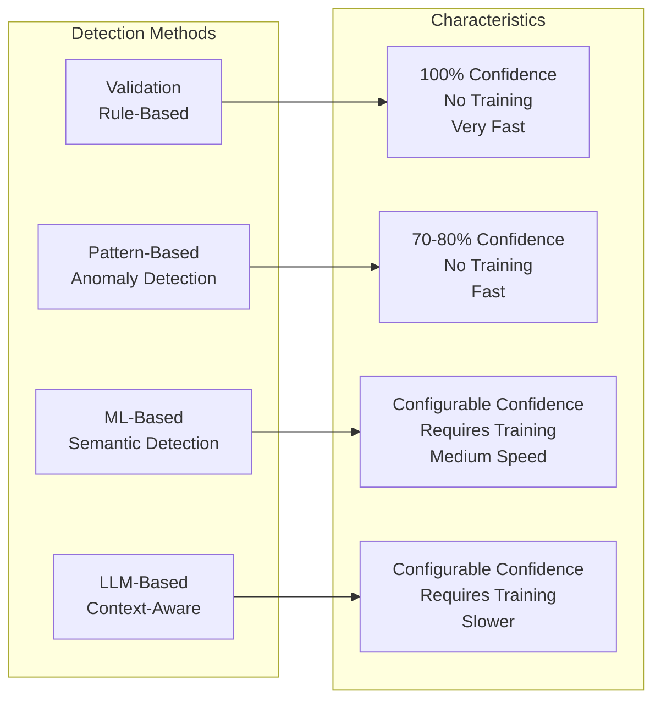
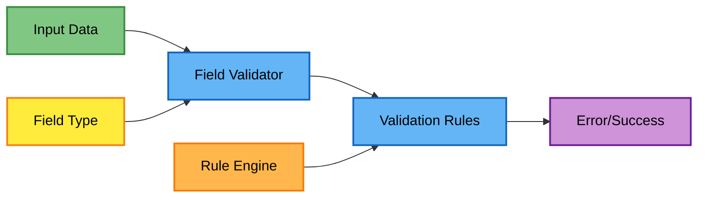
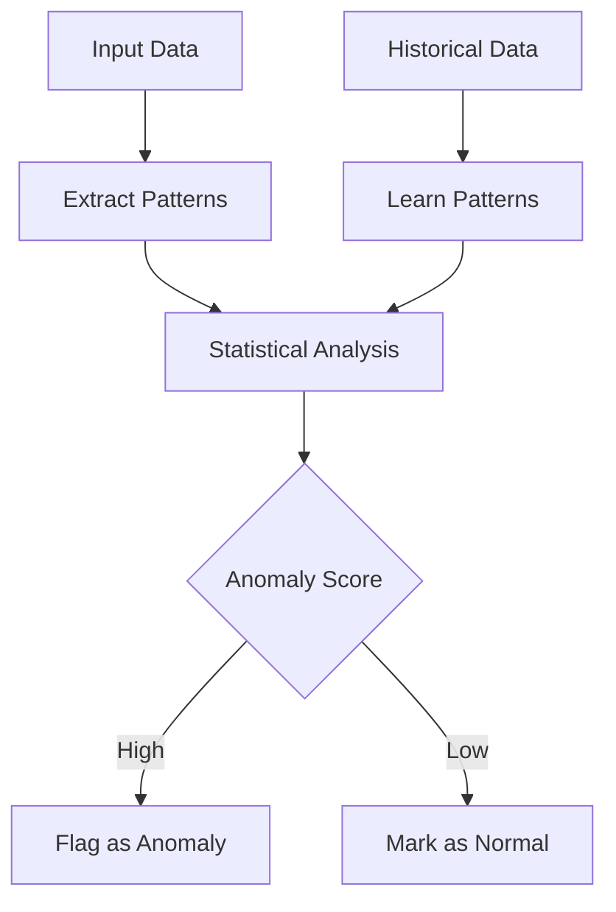
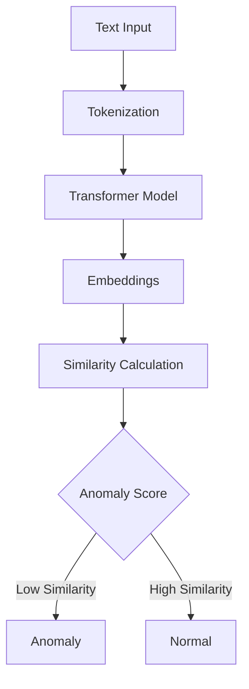
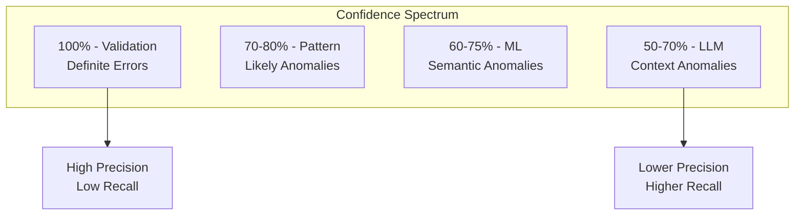
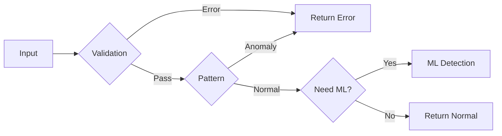
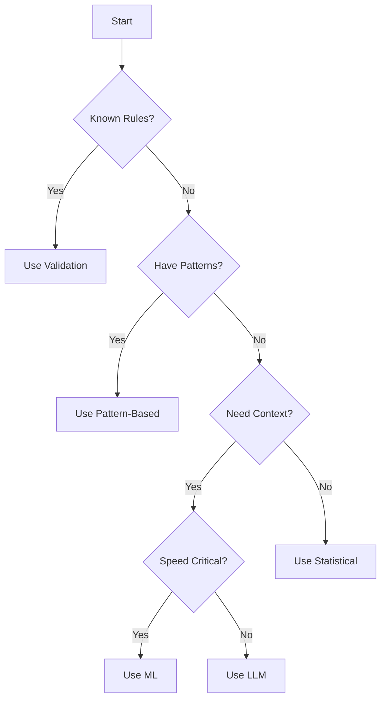

# Theoretical Approach and Detection Methods

## Overview

The Data Quality Detection System employs a multi-layered approach to anomaly detection, combining deterministic rule-based validation with probabilistic machine learning methods. This document explains the theoretical foundation behind each detection method and how they work together to provide comprehensive data quality monitoring.

## Detection Philosophy

Our approach is based on the principle that different types of data quality issues require different detection strategies:

1. **Deterministic Errors**: Format violations, business rule breaches → Rule-based validation
2. **Statistical Anomalies**: Outliers, unusual patterns → Pattern-based detection
3. **Semantic Anomalies**: Contextual inconsistencies → ML-based detection
4. **Complex Logic Errors**: Natural language understanding → LLM-based detection

## Detection Method Comparison



### Method Summary

| Method | Confidence | Training Required | Speed | Best Use Cases |
|--------|------------|------------------|--------|----------------|
| **Validation** | 100% | No | Very Fast (~1ms/record) | Format errors, business rules, required fields |
| **Pattern-Based** | 70-80% | No | Fast (~5ms/record) | Known patterns, outliers, statistical anomalies |
| **ML-Based** | Configurable | Yes | Medium (~20ms/record) | Semantic similarity, contextual errors |
| **LLM-Based** | Configurable | Yes | Slower (~100ms/record) | Complex logic, natural language understanding |

## 1. Rule-Based Validation

### Theoretical Foundation

Rule-based validation is grounded in formal logic and domain expertise. It provides deterministic, explainable results based on predefined constraints.

### How It Works



### Rule Categories

#### Format Rules
Validate data structure and syntax:
```python
# Example: Email validation
pattern = r'^[a-zA-Z0-9._%+-]+@[a-zA-Z0-9.-]+\.[a-zA-Z]{2,}$'
if not re.match(pattern, value):
    return ValidationError("Invalid email format")
```

#### Domain Rules
Enforce business logic constraints:
```python
# Example: Material percentage validation
if sum(material_percentages) != 100:
    return ValidationError("Material percentages must sum to 100%")
```

#### Referential Rules
Check relationships between fields:
```python
# Example: Category-specific validation
if category == "Shoes" and size_type == "Letter":
    return ValidationError("Shoes should use numeric sizes")
```

### Advantages
- **100% Confidence**: No false positives for defined rules
- **Fast Execution**: No model loading or complex computations
- **Explainable**: Clear reason for each error
- **No Training Required**: Works immediately

### Limitations
- Cannot detect unknown patterns
- Requires explicit rule definition
- May miss subtle anomalies
- High maintenance for complex domains

## 2. Pattern-Based Anomaly Detection

### Theoretical Foundation

Pattern-based detection uses statistical analysis and pattern matching to identify deviations from expected norms. It's based on the principle that anomalies are statistically rare events.

### Statistical Methods

#### Frequency Analysis
```python
# Identify rare values
value_counts = df[column].value_counts()
frequency_threshold = 0.01  # 1% threshold
rare_values = value_counts[value_counts / len(df) < frequency_threshold]
```

#### Pattern Matching
```python
# Define expected patterns
patterns = [
    r'^\d{3}-\d{3}-\d{4}$',  # Phone number
    r'^[A-Z]{2}\d{4}$'       # Product code
]
# Flag values not matching any pattern
```

#### Statistical Outliers
- **Z-Score Method**: Values beyond 3 standard deviations
- **IQR Method**: Values outside Q1-1.5×IQR to Q3+1.5×IQR
- **Isolation Forest**: Anomaly detection algorithm

### Implementation Approach



### Advantages
- No training required
- Fast execution
- Works with limited data
- Good for known patterns

### Limitations
- May miss semantic anomalies
- Sensitive to threshold selection
- Limited context understanding
- Can produce false positives

## 3. ML-Based Semantic Detection

### Theoretical Foundation

ML-based detection uses deep learning, specifically sentence transformers, to understand semantic meaning and context. It's based on the principle that similar items should have similar vector representations in embedding space.

### Embedding Theory



### Mathematical Foundation

#### Cosine Similarity
```
similarity(A, B) = (A · B) / (||A|| × ||B||)
```

Where:
- A, B are embedding vectors
- · represents dot product
- ||·|| represents vector magnitude

#### Anomaly Score
```
anomaly_score = 1 - max(similarity(item, known_good_items))
```

### Training Process

1. **Data Collection**: Gather clean, representative samples
2. **Embedding Generation**: Convert text to vectors using pre-trained models
3. **Clustering**: Group similar items together
4. **Threshold Learning**: Determine optimal similarity thresholds

### Model Architecture

We use sentence transformers based on BERT architecture:
- **Input**: Text sequences up to 512 tokens
- **Model**: Pre-trained transformer (e.g., 'all-MiniLM-L6-v2')
- **Output**: 384-dimensional embeddings

### Advantages
- Understands semantic meaning
- Handles variations and synonyms
- Can detect subtle anomalies
- Transfer learning from pre-trained models

### Limitations
- Requires training data
- Computationally intensive
- Black-box nature
- May miss rule violations

## 4. LLM-Based Contextual Detection

### Theoretical Foundation

LLM-based detection leverages large language models' ability to understand complex context and reasoning. It uses few-shot learning and prompt engineering to identify anomalies that require sophisticated understanding.

### Prompt Engineering

```python
prompt = f"""
Analyze this product data for anomalies:
Field: {field_name}
Value: {value}
Context: {context}

Consider:
1. Semantic consistency
2. Business logic
3. Domain knowledge

Is this value anomalous? Explain why.
"""
```

### Few-Shot Learning

Provide examples to guide the model:
```python
examples = [
    {"value": "100% Cotton", "label": "normal"},
    {"value": "200% Cotton", "label": "anomaly"},
    {"value": "Cotton 100%", "label": "normal"}
]
```

### Context Integration

LLMs can consider multiple fields simultaneously:
- Temporal context (season vs. description)
- Cross-field validation (size vs. category)
- Business logic (price vs. material quality)

### Advantages
- Sophisticated reasoning
- Natural language understanding
- Handles complex logic
- No specific training required

### Limitations
- Slow processing speed
- High computational cost
- Potential hallucinations
- Requires careful prompt design

## Confidence Levels and Thresholds

### Confidence Spectrum



### Threshold Selection

Each method uses configurable thresholds:

```python
# Validation: Binary (pass/fail)
validation_threshold = 0.0  # Always deterministic

# Pattern: Probability-based
pattern_threshold = 0.7  # 70% confidence

# ML: Similarity-based
ml_threshold = 0.75  # 75% similarity required

# LLM: Confidence score
llm_threshold = 0.6  # 60% confidence
```

## Combination Strategies

### 1. Priority-Based Combination

Methods are prioritized by confidence level:

```python
def priority_combination(results):
    if results['validation']:
        return results['validation']  # Highest priority
    elif results['pattern']:
        return results['pattern']
    elif results['ml']:
        return results['ml']
    else:
        return results['llm']
```

### 2. Weighted Average Combination

Results are combined using learned weights:

```python
def weighted_combination(results, weights):
    score = 0
    for method, result in results.items():
        score += weights[method] * result.confidence
    return score > threshold
```

### Weight Learning

Weights are learned from historical performance:
```python
weights = {
    'validation': 1.0,    # Perfect precision
    'pattern': 0.85,      # High precision
    'ml': 0.75,          # Good balance
    'llm': 0.65          # Higher recall
}
```

## Performance Optimization

### Cascade Strategy

Process methods in order of speed/confidence:



### Batch Processing

Optimize for throughput:
- Validation: Process row-by-row
- Pattern: Vectorized operations
- ML: Batch embeddings (GPU)
- LLM: Batch prompts

### Caching Strategy

```python
# Cache embeddings for ML
embedding_cache = LRUCache(maxsize=10000)

# Cache LLM responses
llm_cache = TTLCache(maxsize=1000, ttl=3600)
```

## Choosing the Right Method

### Decision Framework



### Use Case Recommendations

| Use Case | Recommended Methods | Rationale |
|----------|-------------------|-----------|
| **High-Speed Screening** | Validation + Pattern | Fast with good coverage |
| **Comprehensive Analysis** | All methods | Maximum detection capability |
| **Production Monitoring** | Validation + Weighted ML | Balance of speed and accuracy |
| **Development/Testing** | All methods + injection | Evaluate system performance |

## Future Directions

### Research Areas
1. **Active Learning**: Improve models from user feedback
2. **Ensemble Methods**: Better combination strategies
3. **Explainable AI**: Make ML decisions interpretable
4. **Real-time Adaptation**: Online learning from data streams

### Planned Enhancements
1. **Graph Neural Networks**: For relational anomalies
2. **Attention Mechanisms**: Better context understanding
3. **Multi-modal Detection**: Combine text, numeric, and categorical
4. **Automated Threshold Tuning**: Self-optimizing thresholds

## Summary

The multi-method approach provides:
- **Comprehensive Coverage**: Different methods catch different anomalies
- **Flexible Confidence**: Adjust thresholds based on use case
- **Scalable Performance**: Choose methods based on requirements
- **Future-Proof**: Easy to add new detection methods

Each method has its place in the detection pipeline, and the combination of all methods provides the most robust data quality monitoring solution.