# Theoretical Approach and Detection Methods

## Overview

The Data Quality Detection System employs a multi-layered approach to anomaly detection, combining deterministic rule-based validation with advanced machine learning methods. This document explains the theoretical foundation behind each detection method and how they work together to provide comprehensive data quality monitoring.

## Detection Philosophy

Our approach is based on the principle that different types of data quality issues require different detection strategies with progressive confidence levels:

1. **Deterministic Errors**: Format violations, business rule breaches → Rule-based validation (100% confidence)
2. **Pattern Anomalies**: Known pattern mismatches, invalid formats → JSON-configured pattern detection (70-80% confidence)
3. **Semantic Anomalies**: Contextual inconsistencies, meaning deviations → ML centroid-based detection (60-75% confidence)
4. **Complex Linguistic Errors**: Language model violations → LLM probability-based detection (50-70% confidence)

## Core Innovation: Progressive Detection Architecture

```mermaid
graph TD
    A[Input Value] --> B{Validation Rules}
    B -->|Pass| C{Pattern Rules}
    B -->|Fail| CERTAIN[🚨 CERTAIN ANOMALY<br/>100% Confidence]
    
    C -->|Match Known| VALID[✅ VALID VALUE]
    C -->|No Match| D{ML Centroid Similarity}
    
    D -->|High Similarity<br/>>threshold| LIKELY_VALID[✅ LIKELY VALID<br/>75% Confidence]
    D -->|Low Similarity<br/><threshold| E{LLM Language Probability}
    
    E -->|High Probability| MAYBE_VALID[⚠️ UNCERTAIN<br/>60% Confidence]
    E -->|Low Probability| LIKELY_ANOMALY[🚨 LIKELY ANOMALY<br/>80% Confidence]
```



## Detection Method Comparison

| Method | Confidence | Training Required | Speed | Theoretical Basis | Best Use Cases |
|--------|------------|------------------|--------|------------------|----------------|
| **Validation** | 100% | No | Very Fast (~1ms/record) | Boolean Logic | Format errors, business rules |
| **Pattern-Based** | 70-80% | No | Fast (~5ms/record) | Rule-Based Matching | Known patterns, regex validation |
| **ML-Based** | 60-75% | Yes | Medium (~20ms/record) | Embedding Similarity | Semantic consistency |
| **LLM-Based** | 50-70% | Yes | Slower (~100ms/record) | Language Probability | Complex linguistic patterns |

## 1. Rule-Based Validation

### Theoretical Foundation

Rule-based validation is grounded in formal logic and domain expertise. It provides deterministic, explainable results based on predefined constraints using sophisticated multi-layered validation logic.

### Implementation Architecture


### Multi-Layered Validation Process

```python
class Validator(ValidatorInterface):
    def _validate_entry(self, value):
        # Layer 1: Basic checks (null, empty, whitespace)
        if pd.isna(value) or not isinstance(value, str):
            return ValidationError("MISSING_VALUE", 1.0)
            
        # Layer 2: Tokenization and character validation
        tokens = self._tokenize(value)
        if invalid_chars := self._find_invalid_chars(tokens):
            return ValidationError("INVALID_CHARACTERS", 0.8)
            
        # Layer 3: Format pattern validation
        if not self._matches_format(value):
            return ValidationError("INVALID_FORMAT", 0.9)
            
        # Layer 4: Domain-specific business rules
        if business_rule_violation := self._check_business_rules(tokens):
            return ValidationError(business_rule_violation, 0.9)
            
        # Layer 5: Semantic consistency checks
        if semantic_error := self._check_semantic_consistency(tokens):
            return ValidationError(semantic_error, 0.7)
            
        return None  # Valid
```

### Advantages
- **100% Confidence**: No false positives for well-defined rules
- **Fast Execution**: Deterministic logic with minimal computation
- **Explainable**: Clear mapping from rule violation to error
- **No Training Required**: Domain expertise encoded directly

### Limitations
- Cannot detect unknown patterns or subtle semantic errors
- Requires explicit rule definition for all edge cases
- High maintenance for complex, evolving domains

## 2. Pattern-Based Detection

### Theoretical Foundation

Pattern-based detection uses JSON-configured rule matching and known value lookup rather than statistical analysis. It's based on explicit pattern definitions and format validation rules.

### Implementation Architecture

```python
class PatternBasedDetector:
    def __init__(self, field_name):
        self.known_values = set()      # From JSON config
        self.format_patterns = []      # Regex patterns
        self.validation_rules = []     # Custom rules
        self._load_rules_from_json(field_name)
    
    def detect_anomaly(self, value):
        # 1. Known value lookup (O(1))
        if value.lower() in self.known_values:
            return None  # Valid
            
        # 2. Format pattern validation (O(n) patterns)
        for pattern in self.format_patterns:
            if not re.match(pattern['regex'], value):
                return AnomalyError(
                    "INVALID_FORMAT", 
                    confidence=pattern['confidence'],
                    message=pattern['message']
                )
        
        # 3. Custom validation rules
        for rule in self.validation_rules:
            if rule.violates(value):
                return AnomalyError(rule['error_type'], rule['confidence'])
                
        return None  # Passed all checks
```

### Configuration-Driven Approach

```json
{
  "field_name": "material",
  "known_values": ["cotton", "polyester", "wool", "silk"],
  "format_patterns": [
    {
      "name": "basic_format",
      "regex": "^[a-zA-Z\\s\\-%]+$",
      "message": "Invalid characters in material",
      "confidence": 0.8
    }
  ],
  "validation_rules": [
    {
      "name": "not_empty",
      "type": "length_check",
      "min_length": 1,
      "confidence": 1.0
    }
  ]
}
```

### Advantages
- **No Training Required**: Uses predefined rules and value sets
- **Fast Detection**: O(1) lookup for known values, O(n) for patterns
- **Configurable**: Rules updated via JSON without code changes
- **Good Coverage**: Effective for domains with known valid patterns

### Limitations
- Cannot understand semantic meaning or context
- Limited to explicitly defined patterns
- May miss novel but valid variations

## 3. ML-Based Semantic Detection

### Theoretical Foundation

**Core Innovation: Centroid-Based Similarity Detection**

Our ML approach is built on the insight that valid data forms semantic clusters in embedding space. Instead of complex outlier detection, we compute a single "centroid of normality" and measure similarity to this reference point.

### Mathematical Model

**1. Embedding Generation**
```
f: Text → ℝᵈ where d ∈ {384, 768}
Each text value is encoded into a dense vector representation
```

**2. Reference Centroid Computation**
```
c_ref = (1/n) Σᵢ₌₁ⁿ f(xᵢ)
where {xᵢ} are all clean training samples
```

**3. Anomaly Detection via Cosine Similarity**
```
similarity(v) = (f(v) · c_ref) / (||f(v)|| × ||c_ref||)
anomaly = similarity(v) < threshold
```

### Training Methodology: Triplet Learning

**Triplet Loss Function**
```
L(a,p,n) = max(0, d(a,p) - d(a,n) + margin)

Where:
- a (anchor): Clean text sample (e.g., "cotton")
- p (positive): Another clean text (e.g., "wool")  
- n (negative): Error-injected text (e.g., "cott0n")
- d(x,y): Distance = 1 - cosine_similarity(x,y)
```

**Training Process**
```python
def train_ml_detector(clean_texts, field_name):
    # 1. Generate triplets with error injection
    triplets = []
    for anchor in clean_texts:
        positive = random.choice(clean_texts)
        negative = inject_error(anchor, error_rules)
        triplets.append((anchor, positive, negative))
    
    # 2. Fine-tune sentence transformer
    model = SentenceTransformer(base_model)
    train_loss = TripletLoss(model, margin=0.5)
    model.fit(triplets, epochs=3)
    
    # 3. Compute reference centroid
    embeddings = model.encode(clean_texts)
    centroid = np.mean(embeddings, axis=0)
    
    # 4. Save model and centroid
    model.save(f'models/{field_name}/')
    np.save(f'models/{field_name}/centroid.npy', centroid)
```

**Detection Process (Production)**
```python
def detect_anomaly(model, centroid, value, threshold=0.7):
    # 1. Encode input value
    embedding = model.encode([value])
    
    # 2. Single similarity computation
    similarity = cosine_similarity(embedding, centroid.reshape(1, -1))[0][0]
    
    # 3. Threshold decision
    if similarity < threshold:
        return AnomalyError("ML_SEMANTIC_ANOMALY", 
                          probability=1-similarity)
    return None
```

### Why This Approach Was Chosen

**Theoretical Advantages:**
- **Manifold Hypothesis**: Valid data lies on lower-dimensional manifold
- **Cluster Assumption**: Semantically similar values cluster together
- **Centroid Efficiency**: Single reference point enables O(1) detection
- **Transfer Learning**: Leverages pre-trained language understanding

**Practical Benefits:**
- **Fast Inference**: One similarity computation vs. multiple comparisons
- **Semantic Understanding**: Handles synonyms and variations
- **Robust Training**: Triplet loss ensures semantic clustering
- **Scalable**: Training complexity independent of detection complexity

### Limitations
- Requires representative training data
- Black-box nature limits explainability
- May struggle with highly diverse valid values

## 4. LLM-Based Language Modeling Detection

### Theoretical Foundation

**Core Principle: Domain-Specific Language Probability**

The LLM approach fine-tunes language models on field-specific data to learn probability distributions over valid text sequences. Anomalies are detected by their low probability under the learned model.

### Mathematical Model

**1. Masked Language Modeling**
```
P(wᵢ | w₁, ..., wᵢ₋₁, wᵢ₊₁, ..., wₙ)
Model learns to predict masked tokens in context
```

**2. Sequence Probability Scoring**
```
anomaly_score = -(1/n) Σᵢ₌₁ⁿ log P(wᵢ | context)
Higher scores indicate more anomalous sequences
```

**3. Threshold Decision**
```
anomaly = anomaly_score > threshold
```

### Training Process

**Masked Language Model Fine-tuning**
```python
def train_llm_detector(clean_texts, field_name):
    # 1. Create masked dataset
    dataset = []
    for text in clean_texts:
        tokens = tokenizer(text)
        # Randomly mask 15% of tokens
        masked_tokens = mask_random_tokens(tokens, mask_prob=0.15)
        dataset.append({
            'input_ids': masked_tokens,
            'labels': tokens  # Original tokens as targets
        })
    
    # 2. Fine-tune pre-trained model
    model = AutoModelForMaskedLM.from_pretrained('distilbert-base-uncased')
    trainer = Trainer(
        model=model,
        train_dataset=dataset,
        args=TrainingArguments(epochs=3, batch_size=8)
    )
    trainer.train()
    
    # 3. Save field-specific model
    model.save_pretrained(f'models/{field_name}_llm/')
    tokenizer.save_pretrained(f'models/{field_name}_llm/')
```

**Detection Process**
```python
def calculate_anomaly_score(model, tokenizer, text):
    # 1. Tokenize input
    inputs = tokenizer(text, return_tensors='pt')
    
    # 2. Get token probabilities
    with torch.no_grad():
        outputs = model(**inputs)
        logits = outputs.logits
        probs = torch.softmax(logits, dim=-1)
    
    # 3. Compute average negative log probability
    token_ids = inputs['input_ids'][0]
    total_neg_log_prob = 0.0
    count = 0
    
    for i, token_id in enumerate(token_ids):
        if token_id not in [tokenizer.pad_token_id, tokenizer.cls_token_id]:
            prob = probs[0, i, token_id].item()
            total_neg_log_prob += -torch.log(torch.tensor(prob)).item()
            count += 1
    
    return total_neg_log_prob / count if count > 0 else 10.0
```

### Advanced Features

**1. Dynamic Context Encoding**
```python
class DynamicAwareEncoder(nn.Module):
    def forward(self, text_embeddings, temporal_info, categorical_info):
        # Fuse text with temporal and categorical context
        temporal_emb = self.temporal_encoder(temporal_info)
        categorical_emb = self.categorical_encoder(categorical_info)
        return self.fusion_layer([text_embeddings, temporal_emb, categorical_emb])
```

**2. Prototype-Based Reprogramming**
- K-means clustering to identify semantic prototypes
- Adjust scores based on prototype similarity
- Dynamic threshold adaptation

**3. Few-Shot Learning Capability**
- In-context learning with examples
- Meta-learning for quick adaptation

### Advantages
- **Deep Linguistic Understanding**: Captures complex language patterns
- **Context Awareness**: Considers broader context beyond single fields  
- **Adaptability**: Can incorporate temporal and categorical information
- **Transfer Learning**: Benefits from massive pre-training

### Limitations
- **Computational Cost**: Slow processing (~100ms/record)
- **Resource Requirements**: High memory and GPU usage
- **Complexity**: Requires careful training and hyperparameter tuning

## Confidence Levels and Ensemble Strategy

### Confidence Hierarchy


### Combination Strategies

**1. Priority-Based (Cascade)**
```python
def detect_with_priority(value):
    # Check methods in confidence order
    if validation_error := validate(value):
        return validation_error  # 100% confidence
    elif pattern_anomaly := detect_pattern(value):
        return pattern_anomaly   # 70-80% confidence
    elif ml_anomaly := detect_ml(value):
        return ml_anomaly        # 60-75% confidence
    elif llm_anomaly := detect_llm(value):
        return llm_anomaly       # 50-70% confidence
    return None  # No anomalies detected
```

**2. Weighted Ensemble**
```python
def detect_with_ensemble(value, weights):
    scores = {
        'validation': get_validation_score(value),
        'pattern': get_pattern_score(value),
        'ml': get_ml_score(value),
        'llm': get_llm_score(value)
    }
    
    final_score = sum(weights[method] * score 
                     for method, score in scores.items())
    return final_score > threshold
```

## Performance Optimization

### Computational Complexity Analysis

| Method | Training | Inference | Memory | Scalability |
|--------|----------|-----------|---------|-------------|
| Validation | N/A | O(1) | Low | Excellent |
| Pattern | N/A | O(p) patterns | Low | Excellent |
| ML | O(n²) triplets | O(1) similarity | Medium | Good |
| LLM | O(n·k) tokens | O(k) tokens | High | Limited |

### Optimization Strategies

**1. Cascade Processing**


**2. Batch Processing**
```python
# Optimize ML detection with batch encoding
def batch_ml_detect(values, model, centroid):
    embeddings = model.encode(values, batch_size=32)  # GPU batch
    similarities = cosine_similarity(embeddings, centroid.reshape(1, -1))
    return similarities < threshold
```

**3. Caching Strategy**
```python
from functools import lru_cache

@lru_cache(maxsize=10000)
def cached_ml_embedding(value):
    return model.encode([value])

@lru_cache(maxsize=1000)  
def cached_llm_score(value):
    return calculate_anomaly_score(llm_model, tokenizer, value)
```

## Field-Specific Recommendations

### Decision Framework

| Field Type | Recommended Methods | Theoretical Rationale |
|------------|-------------------|----------------------|
| **Structured** (EAN, dates) | Validation + Pattern | Deterministic rules sufficient |
| **Semi-Structured** (color codes) | Pattern + ML | Known patterns with semantic variations |
| **Semantic** (materials) | ML + LLM | Requires deep semantic understanding |
| **Natural Language** (descriptions) | ML + LLM | Complex linguistic patterns |
| **Categorical** (sizes, seasons) | Validation + Pattern | Limited valid sets with clear rules |

### Performance Profiles


## Future Directions

### Research Areas
1. **Online Learning**: Continuous model improvement from user feedback
2. **Federated Learning**: Collaborative learning across different datasets
3. **Explainable ML**: Making centroid-based decisions interpretable
4. **Multi-modal Detection**: Combining text, numeric, and categorical features

### Planned Enhancements
1. **Adaptive Thresholds**: Self-tuning based on performance feedback
2. **Graph Neural Networks**: For relational anomaly detection
3. **Attention Visualization**: Understanding what models focus on
4. **Real-time Learning**: Incremental updates to models

## Summary

The multi-method theoretical approach provides:

- **Comprehensive Coverage**: Each method targets different anomaly types
- **Progressive Confidence**: From deterministic rules to probabilistic ML
- **Scalable Performance**: Choose methods based on speed/accuracy requirements
- **Robust Architecture**: Ensemble methods improve overall reliability

**Key Innovations:**
1. **Centroid-based ML**: Fast, semantically meaningful anomaly detection
2. **Domain-specific LLM**: Language models fine-tuned for specific fields
3. **Progressive confidence**: Layered detection with increasing sophistication
4. **JSON-configurable patterns**: Flexible rule management without code changes

This theoretical foundation enables robust, explainable, and efficient data quality monitoring across diverse domains and use cases.