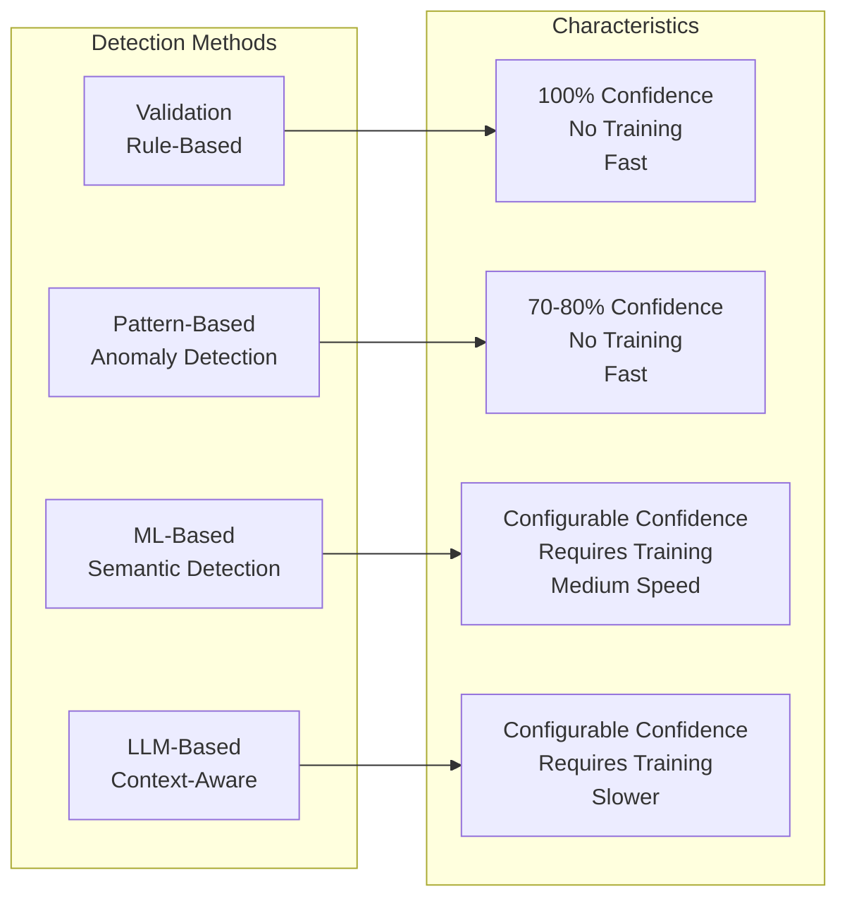
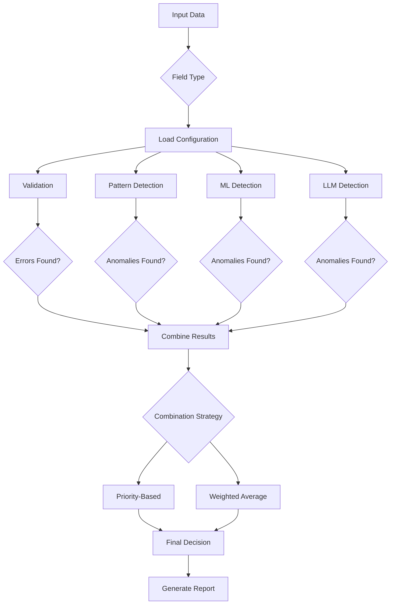
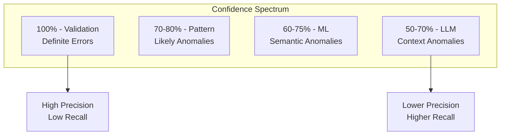
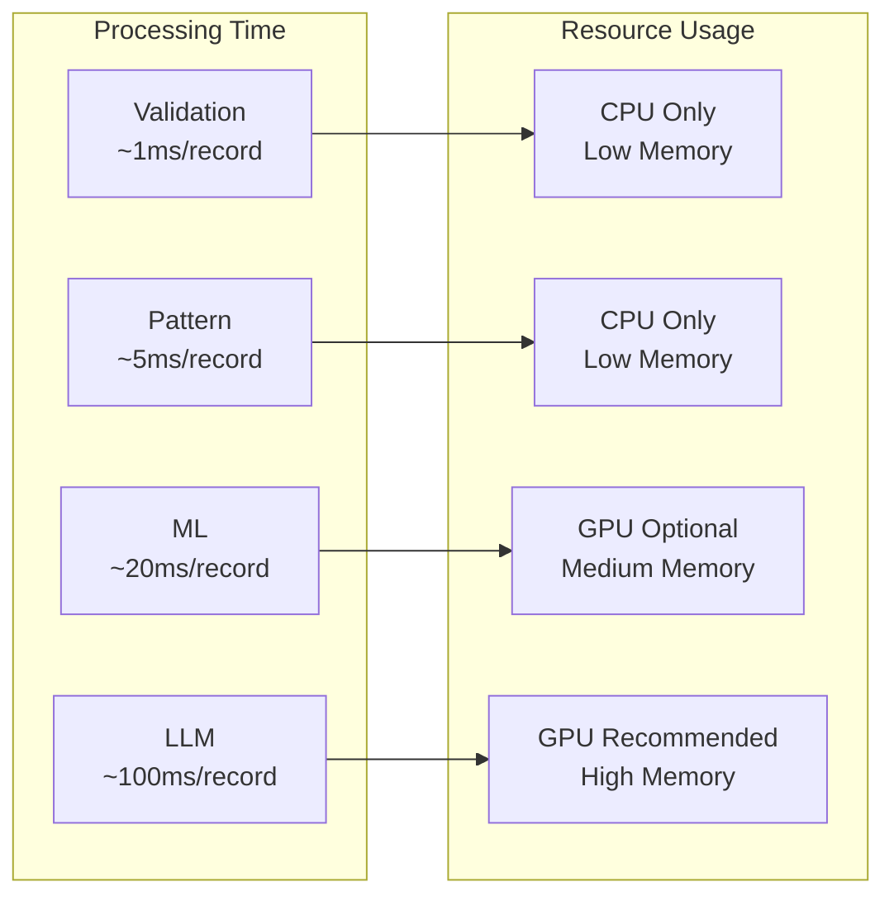
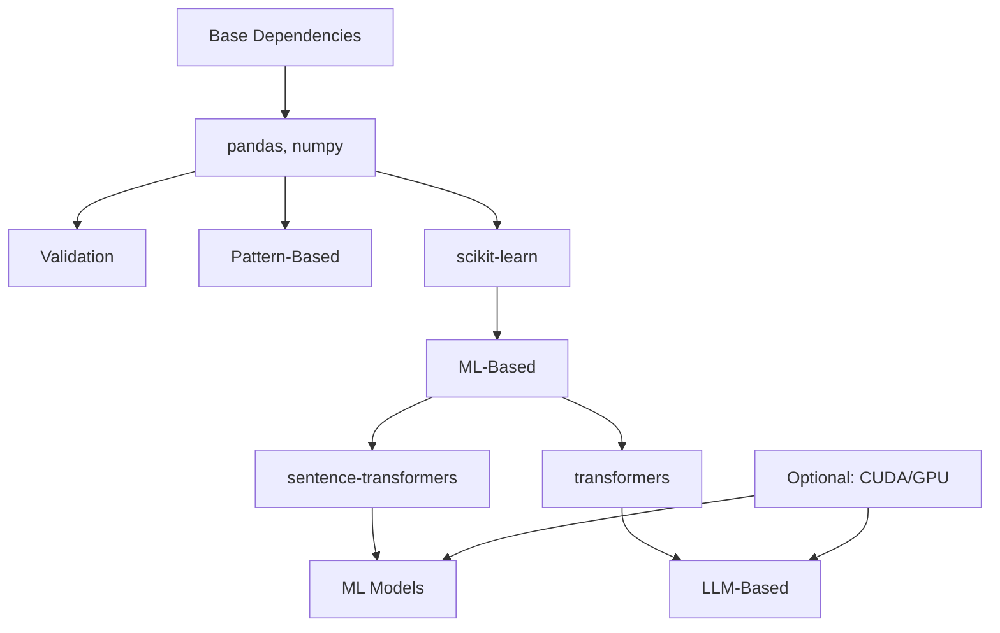

# Detection Methods Overview

The Data Quality Detection System employs four complementary detection methods, each designed to identify different types of data quality issues with varying levels of confidence. This document provides an overview of all detection methods and guidance on when to use each one.

## Detection Method Comparison



## Method Summary

| Method | Confidence | Training Required | Speed | Best Use Cases |
|--------|------------|------------------|--------|----------------|
| **Validation** | 100% | No | Very Fast | Format errors, business rules, required fields |
| **Pattern-Based** | 70-80% | No | Fast | Known patterns, outliers, statistical anomalies |
| **ML-Based** | Configurable | Yes | Medium | Semantic similarity, contextual errors |
| **LLM-Based** | Configurable | Yes | Slower | Complex logic, natural language understanding |

## Detection Flow



## Method Selection Guide

### Use Validation When:
- ✅ You need 100% confidence in error detection
- ✅ Checking format compliance (emails, phone numbers, etc.)
- ✅ Enforcing business rules (required fields, value ranges)
- ✅ Speed is critical
- ❌ You need to detect subtle or contextual errors

### Use Pattern-Based Detection When:
- ✅ You have known good patterns or values
- ✅ Detecting statistical outliers
- ✅ No training data available
- ✅ Need fast detection with reasonable accuracy
- ❌ Dealing with complex semantic relationships

### Use ML-Based Detection When:
- ✅ You have training data available
- ✅ Detecting semantic anomalies
- ✅ Context matters for detection
- ✅ GPU acceleration is available
- ❌ You need explainable decisions

### Use LLM-Based Detection When:
- ✅ Complex natural language understanding required
- ✅ Context spans multiple fields
- ✅ Need sophisticated reasoning
- ✅ Have computational resources
- ❌ Speed is critical

## Confidence Levels

Each method operates at different confidence levels:



## Combination Strategies

The system supports two strategies for combining detection results:

### 1. Priority-Based Combination
Methods are prioritized by confidence level:
1. Validation (highest priority)
2. Pattern-Based
3. ML-Based
4. LLM-Based

```python
if validation_error:
    return validation_error
elif pattern_anomaly:
    return pattern_anomaly
elif ml_anomaly:
    return ml_anomaly
else:
    return llm_anomaly
```

### 2. Weighted Average Combination
Results are combined using learned weights:

```python
final_score = (
    validation_weight * validation_score +
    pattern_weight * pattern_score +
    ml_weight * ml_score +
    llm_weight * llm_score
)
```

## Performance Considerations



## Field-Specific Configurations

Different fields may benefit from different detection methods:

| Field Type | Recommended Methods | Rationale |
|------------|-------------------|-----------|
| **Material** | Validation + ML | Semantic understanding needed |
| **Color** | Pattern + ML | Known patterns with variations |
| **Size** | Validation + Pattern | Strict formats with known values |
| **Description** | ML + LLM | Natural language processing |
| **Price** | Validation + Pattern | Numerical rules and outliers |

## Enabling/Disabling Methods

Control which methods run via command line:

```bash
# Run all methods (default behavior when no methods are explicitly enabled)
python main.py single-demo \
    --data-file data.csv

# Run specific methods
python main.py single-demo \
    --data-file data.csv \
    --enable-validation \
    --enable-pattern

# Adjust thresholds
python main.py single-demo \
    --data-file data.csv \
    --validation-threshold 0.0 \
    --anomaly-threshold 0.8 \
    --ml-threshold 0.75
```

## Method Dependencies



## Choosing the Right Mix

For different use cases, consider these combinations:

### High-Speed Screening
- ✅ Validation + Pattern-Based
- ❌ ML + LLM
- **Use when**: Processing large volumes quickly

### Comprehensive Analysis
- ✅ All methods enabled
- **Use when**: Thorough analysis needed

### Production Monitoring
- ✅ Validation + Weighted ML
- **Use when**: Balance of speed and accuracy

### Development/Testing
- ✅ All methods with error injection
- **Use when**: Evaluating system performance

## Next Steps

- Explore the [API Reference](../api/interfaces.md)
- Learn about [Configuration](../configuration/brand-config.md)
- Read about [Adding New Fields](../development/new-fields.md)