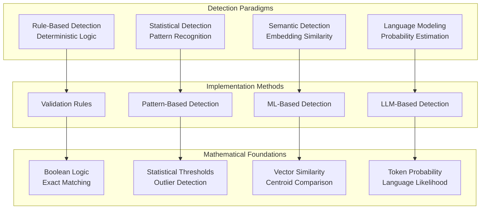
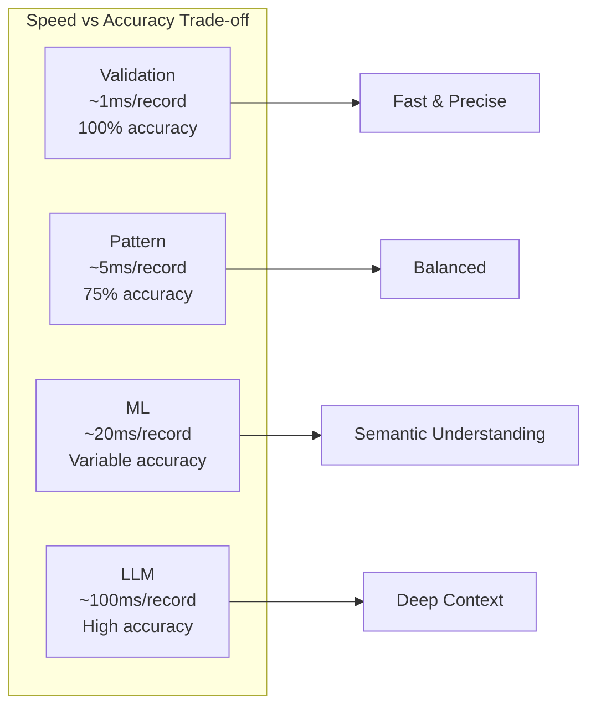

# Detection Methods Overview

The Data Quality Detection System employs four complementary detection methods, each leveraging different theoretical foundations to identify data quality issues. This document provides comprehensive theoretical explanations of how each method works, why specific approaches were chosen, and the mathematical foundations underlying the detection algorithms.

## Theoretical Foundation Overview



## 1. Validation-Based Detection

### Theoretical Approach
Pure rule-based validation using deterministic logic and exact pattern matching.

**Mathematical Foundation:**
- **Boolean Logic**: Each validation rule evaluates to `True` (valid) or `False` (invalid)
- **Set Theory**: Value membership testing against predefined valid sets
- **Regular Expressions**: Pattern matching using finite state automata

**Why This Approach:**
- **Deterministic Results**: 100% confidence when rules are well-defined
- **No Training Required**: Domain knowledge encoded directly as rules
- **Computational Efficiency**: O(1) or O(log n) lookup operations
- **Explainable**: Clear mapping from rule to violation

### Implementation Details
```python
def validate(value, rules):
    for rule in rules:
        if not rule.evaluate(value):
            return ValidationError(rule.message, confidence=1.0)
    return None
```

## 2. Pattern-Based Detection

### Theoretical Approach
Statistical anomaly detection using pattern recognition and outlier identification without requiring training data.

**Mathematical Foundation:**
- **Statistical Thresholds**: Values outside μ ± kσ flagged as outliers
- **Set Membership**: Direct lookup against known valid values
- **String Distance Metrics**: Edit distance for approximate matching
- **Frequency Analysis**: Rare patterns identified as potential anomalies

**Why This Approach:**
- **No Training Data Required**: Works with predefined patterns and statistical analysis
- **Fast Detection**: O(1) lookup for known patterns, O(n) for statistical analysis
- **Moderate Confidence**: 70-80% accuracy based on statistical principles
- **Adaptable**: Rules can be updated without retraining

### Implementation Strategy
```python
def detect_pattern_anomaly(value, patterns):
    # 1. Exact pattern matching
    if value in patterns.known_valid:
        return None
    
    # 2. Statistical outlier detection
    if is_statistical_outlier(value, patterns.distribution):
        return PatternAnomaly(confidence=0.75)
    
    # 3. Format validation
    if not matches_expected_format(value, patterns.format_rules):
        return FormatAnomaly(confidence=0.8)
```

## 3. ML-Based Detection: Centroid Similarity Approach

### Theoretical Foundation

**Core Principle: Semantic Embedding Space**
The ML-based detector operates on the principle that semantically similar values cluster together in high-dimensional embedding space. Clean, valid data forms coherent clusters, while anomalies are distributed as outliers.

**Mathematical Model:**

1. **Embedding Generation**: Each text value is encoded into a dense vector representation using sentence transformers:
   ```
   f: Text → ℝᵈ
   where d is the embedding dimension (typically 384 or 768)
   ```

2. **Reference Centroid Computation**: During training, a reference centroid is computed from clean data:
   ```
   c_ref = (1/n) Σᵢ₌₁ⁿ f(xᵢ)
   where {xᵢ} are clean training samples
   ```

3. **Anomaly Detection**: At inference time, cosine similarity to the reference centroid determines anomalousness:
   ```
   similarity(v) = (f(v) · c_ref) / (||f(v)|| × ||c_ref||)
   anomaly = similarity(v) < threshold
   ```

### Training Methodology: Triplet Learning

**Triplet Loss Function:**
The model is fine-tuned using triplet loss to maximize semantic coherence:

```
L(a,p,n) = max(0, d(a,p) - d(a,n) + margin)

Where:
- a (anchor): Clean text sample
- p (positive): Another clean text sample  
- n (negative): Error-injected anomalous text
- d(x,y): Distance function (typically 1 - cosine_similarity)
```

**Training Strategy:**
1. **Triplet Generation**: For each clean text, create triplets where:
   - Anchor: Original clean text (e.g., "cotton")
   - Positive: Any other clean text (e.g., "wool") 
   - Negative: Error-injected variant (e.g., "cott0n", "furniture")

2. **Error Injection**: Systematic corruption using domain-specific rules:
   - Character substitution/deletion
   - OCR-like errors
   - Semantic category violations
   - Format violations

3. **Objective**: Train the model so that all clean values are semantically similar, while anomalies are pushed away in embedding space.

### Why This Approach Was Chosen

**Advantages:**
- **Semantic Understanding**: Captures meaning beyond exact string matching
- **Robust to Variations**: Handles legitimate variations in clean data
- **Scalable**: Once trained, inference is fast (O(1) centroid comparison)
- **Transfer Learning**: Leverages pre-trained language models

**Theoretical Justification:**
- **Manifold Hypothesis**: Clean data lies on a lower-dimensional manifold in embedding space
- **Cluster Assumption**: Similar semantic values cluster together
- **Centroid Representation**: Mean embedding effectively represents the "prototypical" clean value

### Implementation Architecture

```python
class MLAnomalyDetector:
    def __init__(self, field_name):
        self.model = None           # Fine-tuned sentence transformer
        self.reference_centroid = None  # Mean of clean embeddings
        
    def learn_patterns(self, clean_data):
        # 1. Fine-tune model using triplet loss
        triplets = create_triplets(clean_data, error_rules)
        self.model = fine_tune_with_triplets(triplets)
        
        # 2. Compute reference centroid
        embeddings = self.model.encode(clean_data)
        self.reference_centroid = np.mean(embeddings, axis=0)
        
    def detect_anomaly(self, value):
        embedding = self.model.encode([value])
        similarity = cosine_similarity(embedding, self.reference_centroid)
        return similarity < self.threshold
```

## 4. LLM-Based Detection: Language Modeling Approach

### Theoretical Foundation

**Core Principle: Language Model Probability**
The LLM-based detector leverages the fundamental insight that language models assign higher probabilities to text sequences that follow learned patterns. Anomalous text receives lower probability scores.

**Mathematical Model:**

1. **Masked Language Modeling**: The model learns to predict masked tokens in context:
   ```
   P(wᵢ | w₁, ..., wᵢ₋₁, wᵢ₊₁, ..., wₙ)
   ```

2. **Sequence Probability**: For a complete sequence, we compute the average negative log-likelihood:
   ```
   anomaly_score = -(1/n) Σᵢ₌₁ⁿ log P(wᵢ | context)
   
   where higher scores indicate more anomalous text
   ```

3. **Threshold Decision**: Values with scores above a threshold are flagged as anomalies:
   ```
   anomaly = anomaly_score > threshold
   ```

### Training Methodology: Domain-Specific Language Modeling

**Masked Language Model Fine-tuning:**

1. **Data Preparation**: Clean field-specific text is prepared for self-supervised learning
2. **Random Masking**: Tokens are randomly masked with probability p=0.15
3. **Objective Function**: Minimize cross-entropy loss for predicting masked tokens:
   ```
   L = -Σᵢ log P(wᵢ | context \ {wᵢ})
   ```

**Training Process:**
```python
def train_language_model(clean_texts, field_name):
    # 1. Tokenize and create masked examples
    dataset = create_masked_dataset(clean_texts, mask_prob=0.15)
    
    # 2. Fine-tune pre-trained BERT/DistilBERT
    model = AutoModelForMaskedLM.from_pretrained('distilbert-base-uncased')
    trainer = Trainer(model=model, train_dataset=dataset)
    trainer.train()
    
    # 3. Save field-specific model
    model.save_pretrained(f'models/{field_name}_model')
```

### Advanced Features

**1. Dynamic Context Encoding**
Incorporates additional context for improved detection:
- **Temporal Context**: Season, date information
- **Categorical Context**: Related fields (category, brand)
- **Multi-field Context**: Cross-field dependencies

```python
class DynamicAwareEncoder:
    def encode_with_context(self, text, temporal_info, categorical_info):
        # Fuse text embeddings with context
        text_emb = self.text_encoder(text)
        temporal_emb = self.temporal_encoder(temporal_info)
        categorical_emb = self.categorical_encoder(categorical_info)
        
        return self.fusion_layer([text_emb, temporal_emb, categorical_emb])
```

**2. Prototype-Based Reprogramming**
Uses clustering to identify semantic prototypes:
- **K-means Clustering**: Group similar values into prototypes
- **Prototype Adjustment**: Adjust anomaly scores based on prototype similarity
- **Dynamic Thresholding**: Adapt thresholds based on prototype confidence

**3. Few-Shot Learning**
Enables adaptation with minimal examples:
- **In-Context Learning**: Use examples as context for predictions
- **Meta-Learning**: Quickly adapt to new patterns with few examples

### Why This Approach Was Chosen

**Advantages:**
- **Deep Semantic Understanding**: Captures complex linguistic patterns
- **Context Awareness**: Considers broader context beyond individual fields
- **Adaptability**: Can incorporate temporal and categorical context
- **Transfer Learning**: Leverages massive pre-training on diverse text

**Theoretical Justification:**
- **Language Model Hypothesis**: Valid text follows learned language patterns
- **Probability as Anomaly Score**: Lower probability indicates deviation from learned patterns
- **Contextual Understanding**: Transformer attention captures long-range dependencies

## Detection Method Comparison

| Aspect | Validation | Pattern-Based | ML-Based | LLM-Based |
|--------|------------|---------------|----------|-----------|
| **Theoretical Basis** | Boolean Logic | Statistical Analysis | Embedding Similarity | Language Probability |
| **Training Required** | No | No | Yes (Triplet Learning) | Yes (Language Modeling) |
| **Mathematical Foundation** | Set Theory | Statistical Thresholds | Vector Similarity | Token Probability |
| **Confidence Level** | 100% | 70-80% | Configurable (60-75%) | Configurable (50-70%) |
| **Computational Complexity** | O(1) | O(log n) | O(1) inference | O(n) sequence length |
| **Semantic Understanding** | None | Limited | High | Very High |
| **Context Awareness** | None | None | Limited | High |
| **Explainability** | Perfect | Good | Moderate | Limited |

## Combined Detection Strategy

### Ensemble Decision Making

The system combines multiple detection methods using two strategies:

**1. Priority-Based Combination**
Methods ordered by confidence level:
```python
def combined_detect(value):
    if validation_error := validate(value):
        return validation_error  # Highest confidence
    elif pattern_anomaly := detect_pattern(value):
        return pattern_anomaly
    elif ml_anomaly := detect_ml(value):
        return ml_anomaly
    elif llm_anomaly := detect_llm(value):
        return llm_anomaly
    return None
```

**2. Weighted Ensemble**
Probabilistic combination of all methods:
```python
def weighted_ensemble(value):
    scores = {
        'validation': validate_score(value),
        'pattern': pattern_score(value), 
        'ml': ml_score(value),
        'llm': llm_score(value)
    }
    
    final_score = sum(weight * score for method, score in scores.items())
    return final_score > threshold
```

## Performance Characteristics



## Field-Specific Recommendations

Based on theoretical analysis and empirical results:

| Field Type | Recommended Methods | Theoretical Rationale |
|------------|-------------------|----------------------|
| **Structured Fields** (EAN, dates) | Validation + Pattern | Deterministic rules sufficient |
| **Semi-Structured** (color codes) | Pattern + ML | Known patterns with variations |
| **Semantic Fields** (materials) | ML + LLM | Requires semantic understanding |
| **Natural Language** (descriptions) | ML + LLM | Complex linguistic patterns |
| **Categorical** (sizes, seasons) | Validation + Pattern | Limited valid sets |

## Next Steps

- Explore [Field-Specific Configuration](../configuration/field-config.md)
- Learn about [Model Training](../development/model-training.md) 
- Review [Performance Optimization](../operations/performance.md)