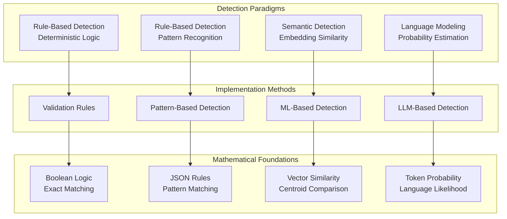

# Detection Methods Overview

The Data Quality Detection System employs four complementary detection methods, each leveraging different theoretical foundations to identify data quality issues. This document provides comprehensive theoretical explanations of how each method works, why specific approaches were chosen, and the mathematical foundations underlying the detection algorithms.

## Executive Summary

**Four-Layered Detection Strategy:**

1. **Validation** (100% confidence): Deterministic rule-based checks using domain expertise encoded as validation logic
2. **Pattern-Based** (70-80% confidence): JSON-configurable pattern matching against known values and regex rules  
3. **ML-Based** (60-75% confidence): Semantic similarity detection using fine-tuned sentence transformers with centroid comparison
4. **LLM-Based** (50-70% confidence): Language model probability scoring with contextual understanding

**Key Innovation: Centroid-Based ML Detection**
Unlike traditional anomaly detection, our ML approach trains models to cluster all valid values around a central reference point (centroid). During inference, we simply measure how far a new value is from this learned center of "normal" data. This approach is both fast and semantically meaningful.

**Key Innovation: Domain-Specific Language Modeling**
The LLM approach fine-tunes language models on field-specific data to learn what "normal" text looks like for each data type. Anomalies are detected by their low probability under the learned language model.

## Core Concept: Progressive Confidence Levels

```mermaid
graph LR
    A[Input Value] --> B{Validation Rules}
    B -->|Pass| C{Pattern Match}
    B -->|Fail| CERTAIN[🚨 CERTAIN ANOMALY]
    
    C -->|Match Known| VALID[✅ VALID]
    C -->|No Match| D{ML Similarity}
    
    D -->|High Similarity| LIKELY_VALID[✅ LIKELY VALID]
    D -->|Low Similarity| E{LLM Probability}
    
    E -->|High Probability| MAYBE_VALID[⚠️ MAYBE VALID]
    E -->|Low Probability| LIKELY_ANOMALY[🚨 LIKELY ANOMALY]
```



Each layer provides different confidence levels, allowing the system to make progressively more nuanced decisions as data complexity increases.

## Theoretical Foundation Overview



## 1. Validation-Based Detection

### Theoretical Approach
Pure rule-based validation using deterministic logic and exact pattern matching.

**Mathematical Foundation:**
- **Boolean Logic**: Each validation rule evaluates to `True` (valid) or `False` (invalid)
- **Set Theory**: Value membership testing against predefined valid sets
- **Regular Expressions**: Pattern matching using finite state automata

**Why This Approach:**
- **Deterministic Results**: 100% confidence when rules are well-defined
- **No Training Required**: Domain knowledge encoded directly as rules
- **Computational Efficiency**: O(1) or O(log n) lookup operations
- **Explainable**: Clear mapping from rule to violation

### Implementation Details
Validation uses sophisticated rule-based logic with tokenization and semantic analysis:
```python
class Validator(ValidatorInterface):
    def _validate_entry(self, value):
        # Multi-layered validation:
        # 1. Basic checks (null, empty, whitespace)
        # 2. Character validation and tokenization
        # 3. Format pattern matching
        # 4. Domain-specific business rules
        # 5. Semantic consistency checks
        
        if validation_fails(value):
            return ValidationError(error_type, probability, details)
        return None
```

## 2. Pattern-Based Detection

### Theoretical Approach
Rule-based pattern matching using JSON-configured detection rules rather than statistical analysis.

**Mathematical Foundation:**
- **Set Membership**: Direct lookup against known valid values
- **Regular Expression Matching**: Pattern validation using regex engines
- **Rule-Based Logic**: Configurable validation rules and format patterns
- **Confidence Scoring**: Rule-specific confidence levels based on pattern types

**Why This Approach:**
- **No Training Data Required**: Uses predefined rules and known value sets
- **Fast Detection**: O(1) lookup for known values, O(n) for regex patterns
- **Moderate Confidence**: 70-80% accuracy based on rule coverage
- **Configurable**: Rules can be updated via JSON without code changes

### Implementation Strategy
```python
class PatternBasedDetector:
    def detect_anomaly(self, value):
        # 1. Known value lookup
        if value.lower() in self.known_values:
            return None
        
        # 2. Format pattern validation
        for pattern in self.format_patterns:
            if not re.match(pattern['regex'], value):
                return AnomalyError(pattern['message'])
        
        # 3. Custom validation rules
        for rule in self.validation_rules:
            if rule.violates(value):
                return AnomalyError(rule['message'])
```

## 3. ML-Based Detection: Centroid Similarity Approach

### Theoretical Foundation

**Core Principle: Semantic Embedding Space**
The ML-based detector operates on the principle that semantically similar values cluster together in high-dimensional embedding space. Clean, valid data forms coherent clusters, while anomalies are distributed as outliers.

**Mathematical Model:**

1. **Embedding Generation**: Each text value is encoded into a dense vector representation using sentence transformers:
   ```
   f: Text → ℝᵈ
   where d is the embedding dimension (typically 384 or 768)
   ```

2. **Reference Centroid Computation**: During training, a reference centroid is computed from clean data:
   ```
   c_ref = (1/n) Σᵢ₌₁ⁿ f(xᵢ)
   where {xᵢ} are clean training samples
   ```

3. **Anomaly Detection**: At inference time, cosine similarity to the reference centroid determines anomalousness:
   ```
   similarity(v) = (f(v) · c_ref) / (||f(v)|| × ||c_ref||)
   anomaly = similarity(v) < threshold
   ```

### Training Methodology: Triplet Learning

**Triplet Loss Function:**
The model is fine-tuned using triplet loss to maximize semantic coherence:

```
L(a,p,n) = max(0, d(a,p) - d(a,n) + margin)

Where:
- a (anchor): Clean text sample
- p (positive): Another clean text sample  
- n (negative): Error-injected anomalous text
- d(x,y): Distance function (typically 1 - cosine_similarity)
```

**Training Strategy:**
The training happens offline and produces two key artifacts:
1. **Fine-tuned Model**: A sentence transformer optimized for the specific field
2. **Reference Centroid**: The mean embedding vector of all clean training data

**Triplet Generation Process:**
1. **Triplet Creation**: For each clean text, create triplets where:
   - Anchor: Original clean text (e.g., "cotton")
   - Positive: Any other clean text (e.g., "wool") 
   - Negative: Error-injected variant (e.g., "cott0n", "furniture")

2. **Error Injection**: Systematic corruption using domain-specific rules:
   - Character substitution/deletion (typos)
   - OCR-like errors (character confusion)
   - Semantic category violations (wrong domain words)
   - Format violations (structural errors)

3. **Training Objective**: Minimize distance between anchor/positive pairs while maximizing distance between anchor/negative pairs. This teaches the model that all clean values should be semantically close.

**Centroid Computation Phase:**
After training, we compute the reference centroid:
```
centroid = mean(embeddings_of_all_clean_training_data)
```
This single vector represents the "center of normality" for the field.

**Detection Phase (Production):**
```
1. Encode new value: embedding = model.encode(value)
2. Compute similarity: similarity = cosine_similarity(embedding, centroid)  
3. Anomaly decision: is_anomaly = similarity < threshold
```

The beauty of this approach is that detection requires only a single similarity computation, making it extremely fast while leveraging all the semantic understanding from training.

### Why This Approach Was Chosen

**Advantages:**
- **Semantic Understanding**: Captures meaning beyond exact string matching
- **Robust to Variations**: Handles legitimate variations in clean data
- **Scalable**: Once trained, inference is fast (O(1) centroid comparison)
- **Transfer Learning**: Leverages pre-trained language models

**Theoretical Justification:**
- **Manifold Hypothesis**: Clean data lies on a lower-dimensional manifold in embedding space
- **Cluster Assumption**: Similar semantic values cluster together
- **Centroid Representation**: Mean embedding effectively represents the "prototypical" clean value

### Implementation Architecture

```python
class MLAnomalyDetector:
    def __init__(self, field_name, threshold=0.7):
        self.field_name = field_name
        self.model = None           # Pre-trained sentence transformer
        self.reference_centroid = None  # Pre-computed centroid from training
        self.threshold = threshold
        
    def learn_patterns(self, df, column_name):
        # Load pre-trained model and reference centroid
        self.model, self.column_name, self.reference_centroid = \
            load_model_for_field(self.field_name)
        
    def detect_anomaly(self, value):
        # Encode value and compare to reference centroid
        embedding = self.model.encode([value])
        similarity = cosine_similarity(embedding, self.reference_centroid)
        
        if similarity < self.threshold:
            return AnomalyError("ML_SEMANTIC_ANOMALY", 
                              probability=1-similarity)
        return None
```

## 4. LLM-Based Detection: Language Modeling Approach

### Theoretical Foundation

**Core Principle: Language Model Probability**
The LLM-based detector leverages the fundamental insight that language models assign higher probabilities to text sequences that follow learned patterns. Anomalous text receives lower probability scores.

**Mathematical Model:**

1. **Masked Language Modeling**: The model learns to predict masked tokens in context:
   ```
   P(wᵢ | w₁, ..., wᵢ₋₁, wᵢ₊₁, ..., wₙ)
   ```

2. **Sequence Probability**: For a complete sequence, we compute the average negative log-likelihood:
   ```
   anomaly_score = -(1/n) Σᵢ₌₁ⁿ log P(wᵢ | context)
   
   where higher scores indicate more anomalous text
   ```

3. **Threshold Decision**: Values with scores above a threshold are flagged as anomalies:
   ```
   anomaly = anomaly_score > threshold
   ```

### Training Methodology: Domain-Specific Language Modeling

**Masked Language Model Fine-tuning:**

1. **Data Preparation**: Clean field-specific text is prepared for self-supervised learning
2. **Random Masking**: Tokens are randomly masked with probability p=0.15
3. **Objective Function**: Minimize cross-entropy loss for predicting masked tokens:
   ```
   L = -Σᵢ log P(wᵢ | context \ {wᵢ})
   ```

**Training Process:**
The training produces a field-specific language model that understands what "normal" text looks like for that data type.

```python
def train_language_model(clean_texts, field_name):
    # 1. Tokenize and create masked examples
    dataset = create_masked_dataset(clean_texts, mask_prob=0.15)
    
    # 2. Fine-tune pre-trained BERT/DistilBERT on field data
    model = AutoModelForMaskedLM.from_pretrained('distilbert-base-uncased')
    trainer = Trainer(model=model, train_dataset=dataset)
    trainer.train()
    
    # 3. Save field-specific model
    model.save_pretrained(f'models/{field_name}_model')
```

**Detection Process:**
```python
def detect_anomaly(model, tokenizer, text):
    # 1. Calculate how "probable" this text is under the learned model
    tokens = tokenizer(text)
    probabilities = model.predict_token_probabilities(tokens)
    
    # 2. Compute anomaly score (higher = more anomalous)
    anomaly_score = -mean(log(probabilities))
    
    # 3. Compare to threshold
    return anomaly_score > threshold
```

### Advanced Features

**1. Dynamic Context Encoding**
Incorporates additional context for improved detection:
- **Temporal Context**: Season, date information
- **Categorical Context**: Related fields (category, brand)
- **Multi-field Context**: Cross-field dependencies

```python
class DynamicAwareEncoder:
    def encode_with_context(self, text, temporal_info, categorical_info):
        # Fuse text embeddings with context
        text_emb = self.text_encoder(text)
        temporal_emb = self.temporal_encoder(temporal_info)
        categorical_emb = self.categorical_encoder(categorical_info)
        
        return self.fusion_layer([text_emb, temporal_emb, categorical_emb])
```

**2. Prototype-Based Reprogramming**
Uses clustering to identify semantic prototypes:
- **K-means Clustering**: Group similar values into prototypes
- **Prototype Adjustment**: Adjust anomaly scores based on prototype similarity
- **Dynamic Thresholding**: Adapt thresholds based on prototype confidence

**3. Few-Shot Learning**
Enables adaptation with minimal examples:
- **In-Context Learning**: Use examples as context for predictions
- **Meta-Learning**: Quickly adapt to new patterns with few examples

### Why This Approach Was Chosen

**Advantages:**
- **Deep Semantic Understanding**: Captures complex linguistic patterns
- **Context Awareness**: Considers broader context beyond individual fields
- **Adaptability**: Can incorporate temporal and categorical context
- **Transfer Learning**: Leverages massive pre-training on diverse text

**Theoretical Justification:**
- **Language Model Hypothesis**: Valid text follows learned language patterns
- **Probability as Anomaly Score**: Lower probability indicates deviation from learned patterns
- **Contextual Understanding**: Transformer attention captures long-range dependencies

## Detection Method Comparison

| Aspect | Validation | Pattern-Based | ML-Based | LLM-Based |
|--------|------------|---------------|----------|-----------|
| **Theoretical Basis** | Boolean Logic | Rule-Based Matching | Embedding Similarity | Language Probability |
| **Training Required** | No | No | Yes (Triplet Learning) | Yes (Language Modeling) |
| **Mathematical Foundation** | Set Theory | Regex + Rule Logic | Vector Similarity | Token Probability |
| **Confidence Level** | 100% | 70-80% | Configurable (60-75%) | Configurable (50-70%) |
| **Computational Complexity** | O(1) | O(1) lookup + O(n) regex | O(1) inference | O(n) sequence length |
| **Semantic Understanding** | None | Limited | High | Very High |
| **Context Awareness** | None | None | Limited | High |
| **Explainability** | Perfect | Good | Moderate | Limited |

## Combined Detection Strategy

### Ensemble Decision Making

The system combines multiple detection methods using two strategies:

**1. Priority-Based Combination**
Methods ordered by confidence level:
```python
def combined_detect(value):
    if validation_error := validate(value):
        return validation_error  # Highest confidence
    elif pattern_anomaly := detect_pattern(value):
        return pattern_anomaly
    elif ml_anomaly := detect_ml(value):
        return ml_anomaly
    elif llm_anomaly := detect_llm(value):
        return llm_anomaly
    return None
```

**2. Weighted Ensemble**
Probabilistic combination of all methods:
```python
def weighted_ensemble(value):
    scores = {
        'validation': validate_score(value),
        'pattern': pattern_score(value), 
        'ml': ml_score(value),
        'llm': llm_score(value)
    }
    
    final_score = sum(weight * score for method, score in scores.items())
    return final_score > threshold
```

## Performance Characteristics


## Field-Specific Recommendations

Based on theoretical analysis and empirical results:

| Field Type | Recommended Methods | Theoretical Rationale |
|------------|-------------------|----------------------|
| **Structured Fields** (EAN, dates) | Validation + Pattern | Deterministic rules sufficient |
| **Semi-Structured** (color codes) | Pattern + ML | Known patterns with variations |
| **Semantic Fields** (materials) | ML + LLM | Requires semantic understanding |
| **Natural Language** (descriptions) | ML + LLM | Complex linguistic patterns |
| **Categorical** (sizes, seasons) | Validation + Pattern | Limited valid sets |

## Next Steps

- Explore [Field-Specific Configuration](../configuration/field-config.md)
- Learn about [Model Training](../development/model-training.md) 
- Review [Performance Optimization](../operations/performance.md)