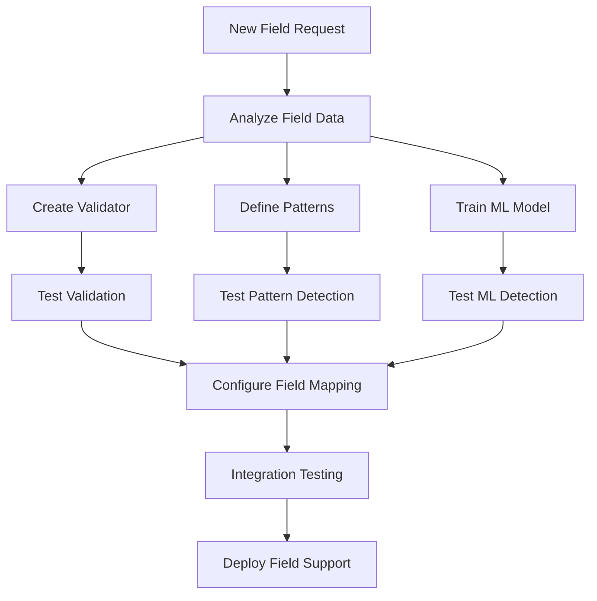

# Adding New Fields Guide

This guide walks you through the process of adding support for new fields in the Data Quality Detection System. The system's modular architecture makes it straightforward to extend with new field types.

## Overview

Adding a new field involves:
1. Creating validation rules
2. Defining pattern-based detection rules
3. Training ML models (optional)
4. Configuring field mappings
5. Testing the implementation



## Adding a New Field

Follow this process to add a new validator powered by JSON rules.

### 1. Create Directory Structure

```bash
validators/
└── new_field/
    ├── rules.json
```

### 2. Define Rules in rules.json

Create `validators/new_field/rules.json`:

```json
{
  "field_name": "new_field",
  "description": "Describe the field and its rules",
  "rule_flow": [
    {"name": "not_empty", "type": "not_empty", "error_type": "MISSING_VALUE", "probability": 1.0},
    {"name": "type_string", "type": "type_is_string", "allow_numeric_cast": false, "error_type": "INVALID_TYPE", "probability": 1.0}
  ]
}
```

See `validators/README.md` for the list of supported rule types and examples in other fields.

### 3. No Python stub required

Validators are instantiated generically via `JsonRulesValidator(field_name)` and read your `rules.json`. No per-field `validate.py` is needed.

### 4. Test the Validator

```python
from validators.rules_engine import JsonRulesValidator
import pandas as pd

validator = JsonRulesValidator("new_field")
assert validator._validate_entry("") is not None
```

## Step 3: Define Pattern-Based Rules

Pattern-based detection identifies anomalies using statistical and rule-based approaches.

Create `anomaly_detectors/pattern_based/rules/new_field.json`:

```json
{
  "field_name": "new_field",
  "description": "Pattern rules for new field validation",
  "known_values": ["AB1234", "CD5678", "EF9012"],
  "format_patterns": [
    {"name": "standard_format", "pattern": "^[A-Z]{2}\\d{4}$", "confidence": 0.8, "message": "Does not match standard format"}
  ],
  "validation_rules": [
    {"name": "not_empty", "type": "not_empty", "message": "Value cannot be empty"},
    {"name": "no_special_chars", "type": "regex", "pattern": "^[A-Za-z0-9]+$", "message": "Contains special characters"}
  ]
}
```

## Step 4: Train ML Model (Optional)

For semantic understanding, train an ML model.

```python
# Example: derive clean training data
import pandas as pd

data = pd.read_csv('data/full_dataset.csv')
clean_data = data[data['quality_flag'] == 'clean']
field_values = clean_data['new_field'].dropna().unique()
pd.DataFrame({'new_field': field_values}).to_csv('data/new_field_training.csv', index=False)
```

Run recall-focused training or anomaly check via CLI (see `ml-train` reference).

## Step 5: Configure Field Mapping

Update brand configuration to include the new field.

```python
from common.brand_config import load_brand_config
config = load_brand_config('your_brand')
print(config.get_column_name('new_field'))
```

The field is recognized once it's in brand config and the validator/rules exist.

## Step 6: Test Implementation

### 6.1 Manual Testing

```python
from validators.rules_engine import JsonRulesValidator
validator = Validator()
for value in ['AB1234', 'CD5678', 'EF9012']:
    assert validator._validate_entry(value) is None
for value in ['', 'abc123', '123ABC']:
    err = validator._validate_entry(value)
    print(value, getattr(err, 'error_type', None))
```

### 6.2 Integration Tests

```bash
python main.py single-demo --data-file test_data/new_field_test.csv --enable-validation --enable-pattern --enable-ml --output-dir test_results/new_field
```

### 6.3 Performance Testing

```bash
python main.py multi-eval data/full_dataset.csv --field new_field --num-samples 100 --output-dir evaluation_results/new_field
```

## Documentation

Create a short `docs/fields/new_field.md` describing the field, format, and rules.

## Best Practices

1. Start Simple: Basic validation first
2. Use Existing Patterns: Reuse similar field logic where possible
3. Collect Real Data: Analyze patterns with `analyze-column`
4. Progressive Thresholds: Start conservative; tune with evaluation
5. Monitor and Iterate: Adjust based on false positive/negative rates

## Troubleshooting

1. Import Errors: Ensure `__init__.py` exists in `validators/new_field/`
2. Pattern Not Matching: Test regex in isolation
3. Field Not Detected: Verify field mapping via `load_brand_config`