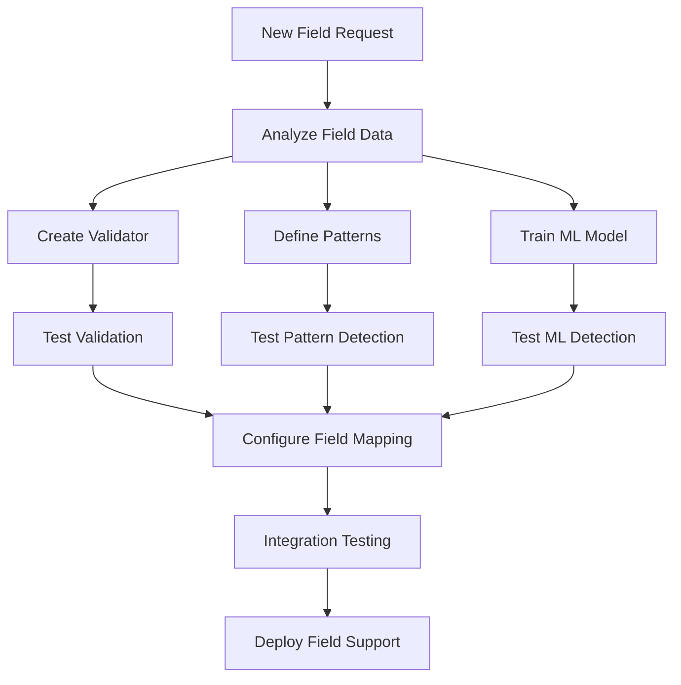

# Adding New Fields Guide

This guide walks you through the process of adding support for new fields in the Data Quality Detection System. The system's modular architecture makes it straightforward to extend with new field types.

## Overview

Adding a new field involves:
1. Creating validation rules
2. Defining pattern-based detection rules
3. Training ML models (optional)
4. Configuring field mappings
5. Testing the implementation



## Step 1: Analyze the Field

Understand your field's characteristics:

```python
# Analyze field data distribution
import subprocess
subprocess.run(["python", "analyze_column/analyze_column.py", "data/sample.csv", "new_field_name"]) 

# Or use the main entry point
subprocess.run(["python", "main.py", "analyze-column", "data/sample.csv", "new_field_name"]) 
```

## Step 2: Create a Validator

Validators provide high-confidence error detection through business rules.

### 2.1 Implement Validator Class

Create `validators/new_field/validate.py`:

```python
from validators.validator_interface import ValidatorInterface
from validators.validation_error import ValidationError
import re

class Validator(ValidatorInterface):
    def __init__(self):
        self.field_type = "new_field"
        self.valid_pattern = re.compile(r'^[A-Z]{2}\d{4}$')
        self.min_length = 6
        self.max_length = 50
        
    def _validate_entry(self, value):
        str_value = str(value).strip()
        if not str_value or str_value.lower() in ['nan', 'none', 'null']:
            return ValidationError(error_type="EMPTY_VALUE", probability=1.0)
        if len(str_value) < self.min_length:
            return ValidationError(error_type="TOO_SHORT", probability=1.0)
        if len(str_value) > self.max_length:
            return ValidationError(error_type="TOO_LONG", probability=1.0)
        if not self.valid_pattern.match(str_value):
            return ValidationError(error_type="INVALID_FORMAT", probability=1.0)
        return None
```

### 2.2 Create Error Messages

Create `validators/new_field/error_messages.json` with concise messages your reporter can render.

## Step 3: Define Pattern-Based Rules

Pattern-based detection identifies anomalies using statistical and rule-based approaches.

Create `anomaly_detectors/pattern_based/rules/new_field.json`:

```json
{
  "field_name": "new_field",
  "description": "Pattern rules for new field validation",
  "known_values": ["AB1234", "CD5678", "EF9012"],
  "format_patterns": [
    {"name": "standard_format", "pattern": "^[A-Z]{2}\\d{4}$", "confidence": 0.8, "message": "Does not match standard format"}
  ],
  "validation_rules": [
    {"name": "not_empty", "type": "not_empty", "message": "Value cannot be empty"},
    {"name": "no_special_chars", "type": "regex", "pattern": "^[A-Za-z0-9]+$", "message": "Contains special characters"}
  ]
}
```

## Step 4: Train ML Model (Optional)

For semantic understanding, train an ML model.

```python
# Example: derive clean training data
import pandas as pd

data = pd.read_csv('data/full_dataset.csv')
clean_data = data[data['quality_flag'] == 'clean']
field_values = clean_data['new_field'].dropna().unique()
pd.DataFrame({'new_field': field_values}).to_csv('data/new_field_training.csv', index=False)
```

Run recall-focused training or anomaly check via CLI (see `ml-train` reference).

## Step 5: Configure Field Mapping

Update brand configuration to include the new field.

```python
from common.brand_config import load_brand_config
config = load_brand_config('your_brand')
print(config.get_column_name('new_field'))
```

The field is recognized once it's in brand config and the validator/rules exist.

## Step 6: Test Implementation

### 6.1 Manual Testing

```python
from validators.new_field.validate import Validator
validator = Validator()
for value in ['AB1234', 'CD5678', 'EF9012']:
    assert validator._validate_entry(value) is None
for value in ['', 'abc123', '123ABC']:
    err = validator._validate_entry(value)
    print(value, getattr(err, 'error_type', None))
```

### 6.2 Integration Tests

```python
import subprocess
subprocess.run([
  "python", "main.py", "single-demo",
  "--data-file", "test_data/new_field_test.csv",
  "--enable-validation", "--enable-pattern", "--enable-ml",
  "--output-dir", "test_results/new_field",
])
```

### 6.3 Performance Testing

```python
import subprocess
subprocess.run([
  "python", "main.py", "multi-eval",
  "data/full_dataset.csv", "--field", "new_field",
  "--num-samples", "100",
  "--output-dir", "evaluation_results/new_field",
])
```

## Documentation

Create a short `docs/fields/new_field.md` describing the field, format, and rules.

## Best Practices

1. Start Simple: Basic validation first
2. Use Existing Patterns: Reuse similar field logic where possible
3. Collect Real Data: Analyze patterns with `analyze-column`
4. Progressive Thresholds: Start conservative; tune with evaluation
5. Monitor and Iterate: Adjust based on false positive/negative rates

## Troubleshooting

1. Import Errors: Ensure `__init__.py` exists in `validators/new_field/`
2. Pattern Not Matching: Test regex in isolation
3. Field Not Detected: Verify field mapping via `load_brand_config`