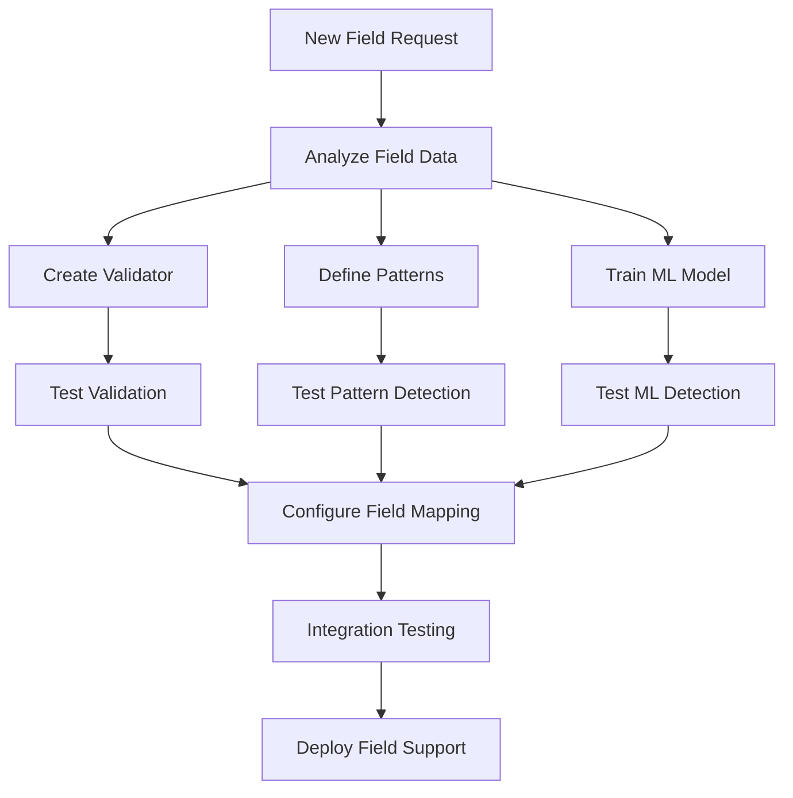

# Adding New Fields Guide

This guide walks you through the process of adding support for new fields in the Data Quality Detection System. The system's modular architecture makes it straightforward to extend with new field types.

## Overview

Adding a new field involves:
1. Creating validation rules
2. Defining pattern-based detection rules
3. Training ML models (optional)
4. Configuring field mappings
5. Testing the implementation



## Step 1: Analyze the Field

Before implementing, understand your field's characteristics:

```bash
# Analyze field data distribution
python analyze_column.py \
    --data-file data/sample.csv \
    --column new_field_name

# Output includes:
# - Unique values count
# - Top values and frequencies
# - Pattern analysis
# - Sample values
```

## Step 2: Create a Validator

Validators provide high-confidence error detection through business rules.

### 2.1 Create Directory Structure

```bash
mkdir -p validators/new_field
cd validators/new_field
```

### 2.2 Implement Validator Class

Create `validators/new_field/validate.py`:

```python
from validators.validator_interface import ValidatorInterface
from validators.validation_error import ValidationError
import re

class Validator(ValidatorInterface):
    def __init__(self):
        self.field_type = "new_field"
        # Define patterns and rules
        self.valid_pattern = re.compile(r'^[A-Z]{2}\d{4}$')
        self.min_length = 6
        self.max_length = 50
        
    def validate(self, value, row_index=None):
        """Validate a single value."""
        errors = []
        
        # Convert to string for validation
        str_value = str(value).strip()
        
        # Check for empty values
        if not str_value or str_value.lower() in ['nan', 'none', 'null']:
            errors.append(ValidationError(
                error_type="EMPTY_VALUE",
                severity="ERROR",
                confidence=1.0,
                details={
                    "value": value,
                    "row_index": row_index
                }
            ))
            return errors
        
        # Check length constraints
        if len(str_value) < self.min_length:
            errors.append(ValidationError(
                error_type="TOO_SHORT",
                severity="ERROR",
                confidence=1.0,
                details={
                    "value": str_value,
                    "min_length": self.min_length,
                    "actual_length": len(str_value)
                }
            ))
        
        if len(str_value) > self.max_length:
            errors.append(ValidationError(
                error_type="TOO_LONG",
                severity="WARNING",
                confidence=1.0,
                details={
                    "value": str_value,
                    "max_length": self.max_length,
                    "actual_length": len(str_value)
                }
            ))
        
        # Check format pattern
        if not self.valid_pattern.match(str_value):
            errors.append(ValidationError(
                error_type="INVALID_FORMAT",
                severity="ERROR",
                confidence=1.0,
                details={
                    "value": str_value,
                    "expected_pattern": self.valid_pattern.pattern
                }
            ))
        
        # Add custom business logic
        if self._violates_business_rule(str_value):
            errors.append(ValidationError(
                error_type="BUSINESS_RULE_VIOLATION",
                severity="ERROR",
                confidence=1.0,
                details={
                    "value": str_value,
                    "rule": "Custom business rule description"
                }
            ))
        
        return errors
    
    def _violates_business_rule(self, value):
        """Implement custom business logic."""
        # Example: Check against forbidden values
        forbidden = ['XX0000', 'TEST01']
        return value in forbidden
```

### 2.3 Create Error Messages

Create `validators/new_field/error_messages.json`:

```json
{
    "EMPTY_VALUE": {
        "message": "Value cannot be empty",
        "description": "This field is required and must contain a valid value",
        "severity": "ERROR",
        "examples": ["", " ", "null", "NaN"]
    },
    "TOO_SHORT": {
        "message": "Value is too short",
        "description": "Value must be at least {min_length} characters long",
        "severity": "ERROR",
        "examples": ["AB1", "X"]
    },
    "TOO_LONG": {
        "message": "Value exceeds maximum length",
        "description": "Value must not exceed {max_length} characters",
        "severity": "WARNING",
        "examples": ["Very long string that exceeds the maximum allowed length..."]
    },
    "INVALID_FORMAT": {
        "message": "Invalid format",
        "description": "Value must match pattern: 2 uppercase letters followed by 4 digits",
        "severity": "ERROR",
        "examples": ["abc123", "12ABCD", "AB12345"]
    },
    "BUSINESS_RULE_VIOLATION": {
        "message": "Business rule violation",
        "description": "Value violates business constraints",
        "severity": "ERROR",
        "examples": ["XX0000", "TEST01"]
    }
}
```

## Step 3: Define Pattern-Based Rules

Pattern-based detection identifies anomalies using statistical and rule-based approaches.

### 3.1 Create Pattern Rules

Create `anomaly_detectors/pattern_based/rules/new_field.json`:

```json
{
    "field_name": "new_field",
    "description": "Pattern rules for new field validation",
    "version": "1.0",
    
    "known_values": [
        "AB1234", "CD5678", "EF9012",
        "GH3456", "IJ7890", "KL2345"
    ],
    
    "format_patterns": [
        {
            "name": "standard_format",
            "pattern": "^[A-Z]{2}\\d{4}$",
            "confidence": 0.8,
            "message": "Does not match standard format"
        },
        {
            "name": "legacy_format",
            "pattern": "^\\d{2}[A-Z]{4}$",
            "confidence": 0.7,
            "message": "Matches legacy format (deprecated)"
        }
    ],
    
    "statistical_rules": {
        "length": {
            "min": 6,
            "max": 10,
            "typical": 6
        },
        "character_distribution": {
            "letters": 0.33,
            "digits": 0.67,
            "special": 0.0
        }
    },
    
    "validation_rules": [
        {
            "name": "not_empty",
            "type": "not_empty",
            "message": "Value cannot be empty"
        },
        {
            "name": "no_special_chars",
            "type": "regex",
            "pattern": "^[A-Za-z0-9]+$",
            "message": "Contains special characters"
        }
    ],
    
    "anomaly_patterns": [
        {
            "name": "suspicious_pattern",
            "pattern": "(00000|11111|99999)",
            "confidence": 0.9,
            "message": "Contains suspicious repeated digits"
        },
        {
            "name": "test_data",
            "pattern": "(TEST|DEMO|SAMPLE)",
            "confidence": 0.95,
            "message": "Appears to be test data"
        }
    ]
}
```

## Step 4: Train ML Model (Optional)

For semantic understanding, train an ML model.

### 4.1 Prepare Training Data

Create a clean dataset with valid examples:

```python
import pandas as pd

# Load and filter clean data
data = pd.read_csv('data/full_dataset.csv')
clean_data = data[data['quality_flag'] == 'clean']

# Extract field values
field_values = clean_data['new_field'].dropna().unique()

# Save training data
pd.DataFrame({'new_field': field_values}).to_csv(
    'data/new_field_training.csv', 
    index=False
)
```

### 4.2 Configure Model Training

Add to `anomaly_detectors/ml_based/model_config.py`:

```python
FIELD_CONFIGS = {
    # ... existing fields ...
    
    'new_field': {
        'model_name': 'sentence-transformers/all-MiniLM-L6-v2',
        'max_length': 128,
        'training_params': {
            'epochs': 10,
            'batch_size': 32,
            'learning_rate': 2e-5,
            'warmup_steps': 100
        },
        'threshold': 0.75,
        'min_samples': 100
    }
}
```

### 4.3 Train the Model

```bash
python anomaly_detectors/ml_based/model_training.py \
    --field new_field \
    --data-file data/new_field_training.csv \
    --output-dir models/new_field \
    --epochs 10
```

## Step 5: Configure Field Mapping

Update brand configuration to include the new field.

### 5.1 Update Brand Config

Edit `brand_configs/your_brand.json`:

```json
{
    "field_mappings": {
        // ... existing mappings ...
        "new_field": "Your_Column_Name"
    },
    
    "field_configs": {
        "new_field": {
            "display_name": "New Field",
            "description": "Description of the new field",
            "data_type": "string",
            "required": true,
            "detection_methods": ["validation", "pattern", "ml"]
        }
    }
}
```

### 5.2 Add to Standard Fields

Update `common/field_definitions.py`:

```python
STANDARD_FIELDS = {
    # ... existing fields ...
    
    'new_field': {
        'name': 'new_field',
        'display_name': 'New Field',
        'category': 'product_info',
        'data_type': 'string',
        'validation_enabled': True,
        'pattern_enabled': True,
        'ml_enabled': True,
        'llm_enabled': False
    }
}
```

## Step 6: Test Implementation

### 6.1 Unit Tests

Create `tests/test_new_field.py`:

```python
import pytest
from validators.new_field.validate import Validator

class TestNewFieldValidator:
    def setup_method(self):
        self.validator = Validator()
    
    def test_valid_values(self):
        valid_values = ['AB1234', 'CD5678', 'EF9012']
        for value in valid_values:
            errors = self.validator.validate(value)
            assert len(errors) == 0
    
    def test_empty_value(self):
        errors = self.validator.validate('')
        assert len(errors) == 1
        assert errors[0].error_type == 'EMPTY_VALUE'
    
    def test_invalid_format(self):
        invalid_values = ['abc123', '123ABC', 'ABCDEF']
        for value in invalid_values:
            errors = self.validator.validate(value)
            assert any(e.error_type == 'INVALID_FORMAT' for e in errors)
    
    def test_business_rules(self):
        errors = self.validator.validate('XX0000')
        assert any(e.error_type == 'BUSINESS_RULE_VIOLATION' for e in errors)
```

### 6.2 Integration Tests

Test with the complete system:

```bash
# Test with sample data
python single_sample_multi_field_demo.py \
    --data-file test_data/new_field_test.csv \
    --fields new_field \
    --enable-all \
    --output-dir test_results/new_field

# Verify results
python verify_field_detection.py \
    --results test_results/new_field/detection_report.json \
    --field new_field
```

### 6.3 Performance Testing

```bash
# Test with larger dataset
python multi_sample_evaluation.py \
    --data-file data/full_dataset.csv \
    --fields new_field \
    --num-samples 10 \
    --sample-size 1000
```

## Step 7: Documentation

### 7.1 Update Field Documentation

Create `docs/fields/new_field.md`:

```markdown
# New Field

## Description
Brief description of what this field represents.

## Format
- Pattern: `^[A-Z]{2}\d{4}$`
- Length: 6 characters
- Example: `AB1234`

## Validation Rules
1. Cannot be empty
2. Must match format pattern
3. Cannot contain special characters
4. Business rule constraints

## Common Issues
- Invalid format: Use 2 uppercase letters + 4 digits
- Test data: Remove TEST, DEMO, SAMPLE values
- Legacy format: Update from old format `12ABCD`
```

### 7.2 Update API Documentation

Add field to API examples and configuration guides.

## Best Practices

### 1. Start Simple
Begin with basic validation rules and gradually add complexity:
```python
# Phase 1: Basic validation (empty, format)
# Phase 2: Business rules
# Phase 3: Statistical anomalies
# Phase 4: ML-based detection
```

### 2. Use Existing Patterns
Look for similar fields to reuse patterns:
```python
# If similar to existing field
from validators.similar_field.validate import Validator as BaseValidator

class Validator(BaseValidator):
    def __init__(self):
        super().__init__()
        self.field_type = "new_field"
        # Override specific attributes
```

### 3. Collect Real Data
Use actual data for pattern discovery:
```python
# Analyze real data patterns
analyzer = FieldAnalyzer('new_field')
patterns = analyzer.discover_patterns(data)
analyzer.generate_rules(patterns)
```

### 4. Progressive Thresholds
Start with conservative thresholds:
```json
{
    "thresholds": {
        "validation": 0.0,    // 100% confidence
        "pattern": 0.8,       // Start high
        "ml": 0.8,           // Start high
        "llm": 0.7           // Adjust based on results
    }
}
```

### 5. Monitor and Iterate
Track field performance:
```python
# Monitor false positive/negative rates
monitor = FieldMonitor('new_field')
monitor.track_performance(results)
monitor.suggest_threshold_adjustments()
```

## Troubleshooting

### Common Issues

1. **Import Errors**
   ```python
   # Ensure __init__.py exists
   touch validators/new_field/__init__.py
   ```

2. **Pattern Not Matching**
   ```python
   # Test patterns independently
   import re
   pattern = re.compile(r'^[A-Z]{2}\d{4}$')
   print(pattern.match('AB1234'))  # Should return match object
   ```

3. **ML Model Not Loading**
   ```bash
   # Check model path
   ls -la models/new_field/
   # Verify model files exist
   ```

4. **Field Not Detected**
   ```bash
   # Check field mapping
   python -c "from common.brand_config import BrandConfig; \
             config = BrandConfig('your_brand'); \
             print(config.get_field_mapping('new_field'))"
   ```

## Checklist

Before deploying a new field:

- [ ] Validator implemented and tested
- [ ] Error messages defined
- [ ] Pattern rules created
- [ ] ML model trained (if applicable)
- [ ] Field mapping configured
- [ ] Unit tests passing
- [ ] Integration tests passing
- [ ] Documentation updated
- [ ] Performance acceptable
- [ ] Code reviewed

## Next Steps

- Learn about [Creating Validators](validators.md) in detail
- Understand [Training Models](training.md) for ML detection
- Explore [Testing](testing.md) strategies