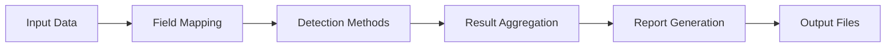

# Basic Usage Guide

This guide covers the fundamental usage patterns and workflows for the Data Quality Detection System.

## Core Concepts

### Detection Workflow



### Key Components

1. **Data Input**: CSV files with structured data
2. **Field Mapping**: Maps your columns to standard fields
3. **Detection Methods**: Multiple approaches to find issues
4. **Results**: Comprehensive reports with confidence scores
5. **Visualization**: Interactive HTML viewer

## Command Structure

### Using Detection Methods

By default, if no detection methods are explicitly enabled, all available methods will run. Use the `--enable` flags to selectively enable specific methods:

```bash
# Run only validation
python main.py single-demo \
    --data-file your_data.csv \
    --enable-validation

# Run validation and pattern detection
python main.py single-demo \
    --data-file your_data.csv \
    --enable-validation \
    --enable-pattern

# Run all methods explicitly
python main.py single-demo \
    --data-file your_data.csv \
    --enable-validation \
    --enable-pattern \
    --enable-ml \
    --enable-llm
```

### Basic Detection Run

Simplest form - runs all available detection methods:

```bash
python main.py single-demo --data-file your_data.csv
```

With custom output directory:

```bash
python main.py single-demo \
    --data-file your_data.csv \
    --output-dir results/my_analysis
```

## Error Injection

The system can inject synthetic errors to test detection capabilities.

### Injection Intensity

Control how many errors are injected:

```bash
# Light injection (20% of cells)
python main.py single-demo \
    --data-file clean_data.csv \
    --injection-intensity 0.2

# Heavy injection (50% of cells)
python main.py single-demo \
    --data-file clean_data.csv \
    --injection-intensity 0.5 \
    --max-issues-per-row 3
```

### No Injection (Production Mode)

For real data analysis without synthetic errors:

```bash
python main.py single-demo \
    --data-file production_data.csv \
    --injection-intensity 0.0
```

## Detection Methods

### 1. Validation (Rule-Based)
- **Use Case**: Format validation, business rules
- **Confidence**: 100%
- **Speed**: Fast

Example:
```bash
python main.py single-demo \
    --data-file your_data.csv \
    --enable-validation \
    --validation-threshold 0.0
```

### 2. Pattern-Based Detection
- **Use Case**: Anomaly detection based on known patterns
- **Confidence**: 70-80%
- **Speed**: Fast

Example:
```bash
python main.py single-demo \
    --data-file your_data.csv \
    --enable-pattern \
    --anomaly-threshold 0.7
```

### 3. ML-Based Detection
- **Use Case**: Semantic similarity anomalies
- **Confidence**: Configurable
- **Speed**: Medium
- **Requirement**: Trained models

Example:
```bash
python main.py single-demo \
    --data-file your_data.csv \
    --enable-ml \
    --ml-threshold 0.7
```

### 4. LLM-Based Detection
- **Use Case**: Complex semantic understanding
- **Confidence**: Configurable
- **Speed**: Slower
- **Requirement**: Language models

Example:
```bash
python main.py single-demo \
    --data-file your_data.csv \
    --enable-llm \
    --llm-threshold 0.6 \
    --llm-few-shot-examples
```

## Threshold Configuration

Adjust detection sensitivity per method:

```bash
python main.py single-demo \
    --data-file your_data.csv \
    --validation-threshold 0.0 \
    --anomaly-threshold 0.7 \
    --ml-threshold 0.8 \
    --llm-threshold 0.6
```

### Threshold Guidelines

- **Lower values**: More sensitive (more detections)
- **Higher values**: Less sensitive (fewer detections)
- **0.0**: Detect everything (validation only)
- **1.0**: Detect nothing

## Field Selection

### Core Fields Only

Process only essential fields to save memory:

```bash
python main.py single-demo \
    --data-file your_data.csv \
    --core-fields-only
```

Core fields typically include:
- material
- color_name
- category
- size
- care_instructions

## Advanced Options

### Weighted Combination

Use optimized weights for better accuracy:

```bash
python main.py single-demo \
    --data-file your_data.csv \
    --use-weighted-combination \
    --weights-file detection_weights.json
```

### Generate Weights

Create optimized weights based on performance:

```bash
python main.py single-demo \
    --data-file your_data.csv \
    --injection-intensity 0.2 \
    --generate-weights \
    --weights-output-file custom_weights.json
```

### LLM Context Enhancement

Provide context for better LLM detection:

```bash
python main.py single-demo \
    --data-file your_data.csv \
    --enable-llm \
    --llm-temporal-column date_created \
    --llm-context-columns category,brand,season
```

## Output Files

After running detection, you'll find the following files in your output directory:

```
output_dir/
├── report.json                    # Detailed results
├── viewer_report.json            # Web viewer format
├── anomaly_summary.csv           # Summary CSV
├── sample_with_errors.csv        # Data with injections
├── sample_with_results.csv       # Results per row
└── confusion_matrix/             # Performance visuals
    ├── overall_matrix.png
    ├── per_field_matrix.png
    └── summary_visual.png
```

The output directory contains:
- **report.json**: Complete detection results in JSON format
- **viewer_report.json**: Formatted for the HTML viewer
- **anomaly_summary.csv**: CSV summary of all detected anomalies
- **sample_with_errors.csv**: Your data with synthetic errors injected (if using evaluation mode)
- **sample_with_results.csv**: Original data with detection results added
- **confusion_matrix/**: Folder containing performance visualization images

## Practical Examples

### 1. Pre-Import Validation

```bash
python main.py single-demo \
    --data-file import_batch.csv \
    --enable-validation \
    --validation-threshold 0.0 \
    --injection-intensity 0.0 \
    --output-dir validation_results
```

### 2. Anomaly Detection

```bash
python main.py single-demo \
    --data-file historical_data.csv \
    --enable-pattern \
    --enable-ml \
    --anomaly-threshold 0.8 \
    --ml-threshold 0.75 \
    --injection-intensity 0.0
```

### 3. Full System Test

```bash
python main.py single-demo \
    --data-file test_data.csv \
    --injection-intensity 0.3 \
    --max-issues-per-row 2 \
    --generate-weights \
    --output-dir test_results
```

### 4. Production Monitoring

```bash
python main.py single-demo \
    --data-file daily_data.csv \
    --injection-intensity 0.0 \
    --use-weighted-combination \
    --weights-file config/production_weights.json \
    --core-fields-only \
    --output-dir monitoring/$(date +%Y%m%d)
```

## Performance Tips

### Memory Optimization
- Use `--core-fields-only` for large files
- Process in batches for very large datasets
- Disable memory-intensive methods (LLM) if needed

### Speed Optimization
- Use only required detection methods
- Increase thresholds to reduce processing
- Use validation-only for quick checks

### Accuracy Optimization
- Generate and use weighted combinations
- Fine-tune thresholds based on your data
- Train custom ML models for your fields

## Next Steps

1. **Multi-Sample Evaluation**: Use `multi-eval` for batch processing
2. **Model Training**: Train ML models with `ml-train`
3. **Field Analysis**: Use `analyze-column` to understand your data
4. **Custom Configuration**: Set up brand-specific rules