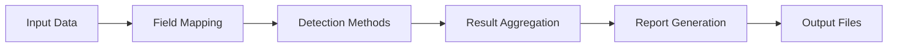

# Basic Usage Guide

This guide covers the fundamental usage patterns and workflows for the Data Quality Detection System.

## Core Concepts

### Detection Workflow



### Key Components

1. **Data Input**: CSV files with structured data
2. **Field Mapping**: Maps your columns to standard fields
3. **Detection Methods**: Multiple approaches to find issues
4. **Results**: Comprehensive reports with confidence scores
5. **Visualization**: Interactive HTML viewer

## Basic Commands

### 1. Simple Detection

Run detection on your data with default settings:

```bash
python single_sample_multi_field_demo/single_sample_multi_field_demo.py \
    --data-file data/products.csv
```

### 2. Specify Output Location

```bash
python single_sample_multi_field_demo/single_sample_multi_field_demo.py \
    --data-file data/products.csv \
    --output-dir results/my_analysis
```

### 3. Select Specific Fields

Process only core fields defined in brand configuration:

```bash
python single_sample_multi_field_demo/single_sample_multi_field_demo.py \
    --data-file data/products.csv \
    --core-fields-only
```

## Working with Detection Methods

### Enable Specific Methods

By default, if no detection methods are explicitly enabled, all available methods run. To selectively enable methods:

```bash
# Only validation and ML
python single_sample_multi_field_demo/single_sample_multi_field_demo.py \
    --data-file data/products.csv \
    --enable-validation \
    --enable-ml
```

### Adjusting Thresholds

```bash
python single_sample_multi_field_demo/single_sample_multi_field_demo.py \
    --data-file data/products.csv \
    --ml-threshold 0.8 \
    --anomaly-threshold 0.75
```

## Understanding Results

### Output Files

After running detection, you'll find:

```
output_dir/
├── sample_with_errors.csv      # Data with error markers
├── sample_with_results.csv     # Original data + detection results
├── detection_report.json       # Detailed JSON report
├── summary_report.txt          # Human-readable summary
└── confusion_matrix.png        # Performance visualization (if applicable)
```

### Result Structure

Each detected issue includes:

```json
{
    "row_index": 42,
    "field": "material",
    "detection_method": "ml",
    "error_type": "semantic_anomaly",
    "confidence": 0.85,
    "message": "Unusual material description",
    "original_value": "cottn blen",
    "suggested_value": "cotton blend"
}
```

## Common Workflows

### 1. Data Quality Assessment

Quick assessment of your data quality:

```bash
# Analyze data distribution first
python analyze_column/analyze_column.py \
    --data-file data/products.csv \
    --column material

# Run comprehensive detection
python single_sample_multi_field_demo/single_sample_multi_field_demo.py \
    --data-file data/products.csv \
    --enable-validation \
    --enable-pattern \
    --enable-ml \
    --output-dir results/assessment
```

### 2. Pre-Import Validation

Validate data before importing to production:

```bash
python single_sample_multi_field_demo/single_sample_multi_field_demo.py \
    --data-file data/import_batch.csv \
    --enable-validation \
    --validation-threshold 0.0
```

### 3. Anomaly Detection

Find unusual patterns in existing data:

```bash
python single_sample_multi_field_demo/single_sample_multi_field_demo.py \
    --data-file data/catalog.csv \
    --enable-pattern \
    --enable-ml \
    --anomaly-threshold 0.7
```

### 4. Performance Testing

Test with synthetic errors:

```bash
python single_sample_multi_field_demo/single_sample_multi_field_demo.py \
    --data-file data/clean_data.csv \
    --injection-intensity 0.2 \
    --enable-validation \
    --enable-pattern \
    --enable-ml \
    --output-dir results/performance_test
```

## Visualization

### Using the HTML Viewer

1. Open the viewer:
   ```bash
   open single_sample_multi_field_demo/data_quality_viewer.html
   ```

2. Upload your files:
   - CSV: `sample_with_results.csv`
   - JSON: `detection_report.json`

3. Explore:
   - Filter by detection method
   - Sort by confidence score
   - View error distribution
   - Export filtered results

### Key Features

- **Interactive Filtering**: Filter by field, method, confidence
- **Detailed Views**: Click rows for full error details
- **Statistics**: Summary charts and metrics
- **Export**: Download filtered results

## Configuration Tips

### Brand Configuration

Set up your brand mapping:

```bash
# Use predefined brand (brand config is now static)
python single_sample_multi_field_demo/single_sample_multi_field_demo.py \
    --data-file data/products.csv

# Brand configuration is deprecated - uses static config
```

### Performance Optimization

For large datasets:

```bash
python single_sample_multi_field_demo/single_sample_multi_field_demo.py \
    --data-file data/large_catalog.csv \
    --core-fields-only
```

## Interpreting Confidence Scores

### Confidence Levels

- **100%**: Definite error (validation rules)
- **80-99%**: High confidence anomaly
- **60-79%**: Medium confidence anomaly
- **Below 60%**: Low confidence, review manually

### Method-Specific Interpretation

| Method | Typical Range | Interpretation |
|--------|--------------|----------------|
| Validation | 100% | Rule violation |
| Pattern | 70-90% | Statistical outlier |
| ML | 60-85% | Semantic anomaly |
| LLM | 50-80% | Context-based issue |

## Best Practices

### 1. Start with Analysis

Always analyze your data first:

```bash
# List columns
python analyze_column/analyze_column.py --data-file data.csv --list-columns

# Analyze specific columns
python analyze_column/analyze_column.py --data-file data.csv --column material
```

### 2. Progressive Detection

Start with high-confidence methods:

```bash
# Step 1: Validation only
python single_sample_multi_field_demo/single_sample_multi_field_demo.py \
    --data-file data.csv \
    --enable-validation

# Step 2: Add pattern detection
python single_sample_multi_field_demo/single_sample_multi_field_demo.py \
    --data-file data.csv \
    --enable-validation \
    --enable-pattern

# Step 3: Full detection
python single_sample_multi_field_demo/single_sample_multi_field_demo.py \
    --data-file data.csv \
    --enable-validation \
    --enable-pattern \
    --enable-ml \
    --enable-llm
```

### 3. Iterative Refinement

1. Run initial detection
2. Review false positives
3. Adjust thresholds
4. Update configurations
5. Re-run detection

### 4. Document Your Settings

Keep track of successful configurations:

```json
// my_detection_config.json
{
    "description": "Optimal settings for product catalog",
    "thresholds": {
        "validation": 0.0,
        "pattern": 0.75,
        "ml": 0.8,
        "llm": 0.7
    },
    "fields": ["material", "color_name", "category"],
    "notes": "Reduced ML threshold to catch more typos"
}
```

## Troubleshooting

### No Errors Detected

- Check if data is actually clean
- Lower detection thresholds
- Enable more detection methods
- Try with `--injection-intensity` for testing

### Too Many False Positives

- Increase detection thresholds
- Review and update validation rules
- Use weighted combination mode
- Focus on specific fields

### Performance Issues

- Use `--core-fields-only` to process subset of fields
- Disable resource-intensive methods (LLM) by not using --enable-llm
- Process smaller files or split large files

## Next Steps

- Set up [Custom Configuration](../configuration/brand-config.md)
- Learn about [Adding New Fields](../development/new-fields.md)