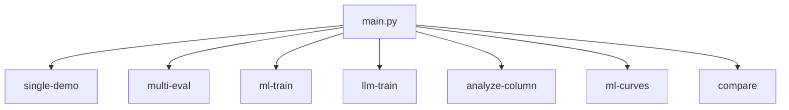

# CLI Reference

This document provides a comprehensive reference for all command-line interfaces in the Data Quality Detection System.

## Main Entry Point

The system provides a unified entry point through `main.py`:

```bash
python main.py [command] [options]
```

### Available Commands



## Command Reference

### single-demo
Run single sample demonstration with comprehensive detection.

```bash
python main.py single-demo [options]
```

#### Required Arguments
- `--data-file PATH`: Path to input CSV file

#### Optional Arguments

**Output Options:**
- `--output-dir PATH`: Output directory (default: `results/demo_{timestamp}`)
- `--output-prefix STR`: Prefix for output files

**Detection Methods:**
- `--enable-all`: Enable all detection methods
- `--enable-validation`: Enable validation detection
- `--enable-pattern`: Enable pattern-based detection
- `--enable-ml`: Enable ML-based detection
- `--enable-llm`: Enable LLM-based detection
- `--disable-validation`: Disable validation
- `--disable-pattern`: Disable pattern detection
- `--disable-ml`: Disable ML detection
- `--disable-llm`: Disable LLM detection

**Thresholds:**
- `--validation-threshold FLOAT`: Validation threshold (default: 0.0)
- `--anomaly-threshold FLOAT`: Pattern anomaly threshold (default: 0.7)
- `--ml-threshold FLOAT`: ML threshold (default: 0.7)
- `--llm-threshold FLOAT`: LLM threshold (default: 0.6)

**Error Injection:**
- `--injection-intensity FLOAT`: Error injection rate 0-1 (default: 0.0)
- `--anomaly-proportion FLOAT`: Proportion of anomalies vs errors (default: 0.5)

**Performance:**
- `--sample-size INT`: Number of rows to process (default: all)
- `--batch-size INT`: Batch size for processing (default: 100)
- `--device STR`: Device for ML/LLM (cpu/cuda) (default: auto)

**Combination Strategy:**
- `--use-weighted-combination`: Use weighted score combination
- `--weights-file PATH`: Path to detection weights JSON

**Field Selection:**
- `--fields FIELD1 FIELD2`: Specific fields to analyze
- `--core-fields-only`: Process only core fields
- `--exclude-fields FIELD1 FIELD2`: Fields to exclude

#### Examples

```bash
# Basic usage
python main.py single-demo --data-file data/products.csv

# With error injection for testing
python main.py single-demo \
    --data-file data/products.csv \
    --injection-intensity 0.2 \
    --output-dir results/test

# Specific methods and thresholds
python main.py single-demo \
    --data-file data/products.csv \
    --enable-validation \
    --enable-ml \
    --ml-threshold 0.8 \
    --disable-pattern \
    --disable-llm

# Using weighted combination
python main.py single-demo \
    --data-file data/products.csv \
    --use-weighted-combination \
    --weights-file config/detection_weights.json
```

### multi-eval
Run evaluation across multiple samples for performance analysis.

```bash
python main.py multi-eval [options]
```

#### Arguments

**Required:**
- `--data-file PATH`: Input data file

**Sampling:**
- `--num-samples INT`: Number of evaluation samples (default: 10)
- `--sample-size INT`: Size of each sample (default: 1000)
- `--seed INT`: Random seed for reproducibility

**Evaluation:**
- `--injection-intensities FLOAT [FLOAT ...]`: List of injection intensities
- `--cross-validation`: Enable cross-validation
- `--cv-folds INT`: Number of CV folds (default: 5)

#### Examples

```bash
# Basic evaluation
python main.py multi-eval \
    --data-file data/products.csv \
    --num-samples 20 \
    --sample-size 500

# Multiple injection intensities
python main.py multi-eval \
    --data-file data/products.csv \
    --injection-intensities 0.1 0.2 0.3 0.4 \
    --num-samples 10
```

### ml-train
Train ML-based anomaly detection models.

```bash
python main.py ml-train [options]
```

#### Arguments

**Required:**
- `--field FIELD`: Field to train model for
- `--data-file PATH`: Training data file

**Training:**
- `--epochs INT`: Training epochs (default: 10)
- `--batch-size INT`: Training batch size (default: 32)
- `--learning-rate FLOAT`: Learning rate (default: 2e-5)
- `--model-name STR`: Base model name (default: sentence-transformers)

**Output:**
- `--output-dir PATH`: Model output directory
- `--save-every INT`: Save checkpoint every N epochs

#### Examples

```bash
# Train material field model
python main.py ml-train \
    --field material \
    --data-file data/clean_materials.csv \
    --epochs 20 \
    --output-dir models/material

# Train with custom parameters
python main.py ml-train \
    --field color_name \
    --data-file data/colors.csv \
    --batch-size 64 \
    --learning-rate 1e-5
```

### analyze-column
Analyze data distribution and patterns in columns.

```bash
python main.py analyze-column [options]
```

#### Arguments

**Required (one of):**
- `--column COLUMN`: Column to analyze
- `--list-columns`: List all columns

**Input:**
- `--data-file PATH`: Input data file

**Analysis:**
- `--show-stats`: Show statistical summary
- `--show-patterns`: Show pattern analysis
- `--top-n INT`: Number of top values to show (default: 20)
- `--sample-values INT`: Number of sample values (default: 10)

#### Examples

```bash
# List available columns
python main.py analyze-column \
    --data-file data/products.csv \
    --list-columns

# Analyze specific column
python main.py analyze-column \
    --data-file data/products.csv \
    --column material \
    --show-stats \
    --show-patterns
```

### ml-curves
Generate performance curves for ML models.

```bash
python main.py ml-curves [options]
```

#### Arguments

**Required:**
- `--field FIELD`: Field to analyze
- `--data-file PATH`: Data file with ground truth

**Analysis:**
- `--thresholds FLOAT [FLOAT ...]`: Threshold values to test
- `--metric STR`: Metric to optimize (precision/recall/f1)
- `--output-dir PATH`: Output directory for plots

#### Examples

```bash
# Generate curves for material field
python main.py ml-curves \
    --field material \
    --data-file data/test_materials.csv \
    --thresholds 0.5 0.6 0.7 0.8 0.9 \
    --output-dir plots/material
```

## Global Options

These options are available for all commands:

### Logging and Debug
- `--verbose`, `-v`: Increase verbosity (can be repeated)
- `--quiet`, `-q`: Decrease verbosity
- `--debug`: Enable debug mode
- `--log-file PATH`: Save logs to file

### Configuration
- `--config PATH`: Path to configuration file
- `--brand BRAND`: Brand name for configuration
- `--env ENV`: Environment (dev/staging/prod)

### Performance
- `--parallel`: Enable parallel processing
- `--num-workers INT`: Number of parallel workers
- `--memory-limit GB`: Memory limit in GB

## Configuration Files

### Command Arguments from File

Save frequently used arguments in JSON files:

```json
// single_demo_args.json
{
    "data_file": "data/products.csv",
    "enable_validation": true,
    "enable_ml": true,
    "ml_threshold": 0.75,
    "output_dir": "results/daily"
}
```

Use with:
```bash
python main.py single-demo --args-file single_demo_args.json
```

### Environment Variables

Configure defaults via environment variables:

```bash
export DQ_DATA_PATH=/data/quality
export DQ_OUTPUT_PATH=/results
export DQ_LOG_LEVEL=INFO
export DQ_DEVICE=cuda
```

## Output Formats

### Standard Output Structure

All commands create consistent output structure:

```
output_dir/
├── detection_report.json    # Detailed results
├── summary_report.txt       # Human-readable summary
├── metrics.json            # Performance metrics
├── sample_with_results.csv # Data with detection results
└── logs/
    └── detection.log       # Detailed logs
```

### JSON Report Format

```json
{
    "metadata": {
        "timestamp": "2024-01-15T10:30:00Z",
        "version": "1.0",
        "command": "single-demo",
        "parameters": {...}
    },
    "summary": {
        "total_records": 1000,
        "errors_detected": 150,
        "detection_methods": ["validation", "ml"]
    },
    "results": {...}
}
```

## Exit Codes

| Code | Meaning |
|------|---------|
| 0 | Success |
| 1 | General error |
| 2 | Invalid arguments |
| 3 | File not found |
| 4 | Configuration error |
| 5 | Model/resource error |

## Advanced Usage

### Piping and Chaining

```bash
# Analyze column and pipe to detection
python main.py analyze-column --data-file data.csv --column material | \
python main.py single-demo --data-file data.csv --fields material

# Chain multiple evaluations
for intensity in 0.1 0.2 0.3; do
    python main.py multi-eval \
        --data-file data.csv \
        --injection-intensity $intensity \
        --output-dir results/intensity_$intensity
done
```

### Batch Processing

```bash
# Process multiple files
for file in data/*.csv; do
    python main.py single-demo \
        --data-file "$file" \
        --output-dir "results/$(basename $file .csv)"
done
```

### Integration Examples

```bash
# Cron job for daily monitoring
0 2 * * * /usr/bin/python /app/main.py single-demo \
    --data-file /data/daily_export.csv \
    --output-dir /reports/$(date +\%Y\%m\%d) \
    --email-report admin@example.com

# CI/CD pipeline integration
python main.py multi-eval \
    --data-file $CI_DATA_FILE \
    --threshold-config $CI_THRESHOLD_CONFIG \
    --fail-on-degradation
```

## Troubleshooting

### Common Issues

1. **Command not found**
   ```bash
   # Ensure you're in the project directory
   cd /path/to/detection-system
   python main.py --help
   ```

2. **Module import errors**
   ```bash
   # Activate virtual environment
   source venv/bin/activate
   # Reinstall dependencies
   pip install -r requirements.txt
   ```

3. **Memory errors**
   ```bash
   # Reduce batch size
   python main.py single-demo --batch-size 50
   # Process sample
   python main.py single-demo --sample-size 1000
   ```

### Debug Mode

Enable detailed debugging:

```bash
python main.py single-demo \
    --data-file data.csv \
    --debug \
    --verbose \
    --log-file debug.log
```

## Next Steps

- Review [Configuration Files](config-files.md) format
- Understand [Error Codes](error-codes.md) in detail
- Explore [API Reference](../api/interfaces.md) for programmatic usage