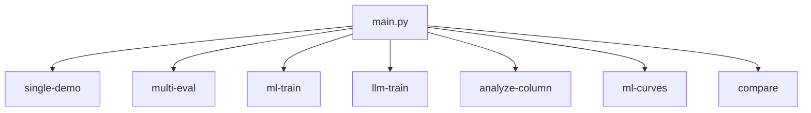

# CLI Reference

This document provides a comprehensive reference for all command-line interfaces in the Data Quality Detection System.

## Main Entry Point

The system provides a unified entry point through `main.py`:

```bash
python main.py [command] [options]
```

### Available Commands



## Command Reference

### single-demo
Run single sample demonstration with comprehensive detection.

```bash
python main.py single-demo [options]
```

#### Required Arguments
- `--data-file PATH`: Path to input CSV file

#### Optional Arguments

**Output Options:**
- `--output-dir PATH`: Output directory (default: `demo_results`)

**Detection Methods:**
- `--enable-validation`: Enable validation detection
- `--enable-pattern`: Enable pattern-based detection
- `--enable-ml`: Enable ML-based detection
- `--enable-llm`: Enable LLM-based detection

Note: If no detection methods are explicitly enabled, all available methods run by default.

**Thresholds:**
- `--validation-threshold FLOAT`: Validation threshold (default: 0.0)
- `--anomaly-threshold FLOAT`: Pattern anomaly threshold (default: 0.7)
- `--ml-threshold FLOAT`: ML threshold (default: 0.7)
- `--llm-threshold FLOAT`: LLM threshold (default: 0.6)

**Error Injection:**
- `--injection-intensity FLOAT`: Probability of injecting issues per cell (default: 0.2)
- `--max-issues-per-row INT`: Maximum fields to corrupt per row (default: 2)

**LLM Options:**
- `--llm-few-shot-examples`: Enable few-shot examples for LLM
- `--llm-temporal-column STR`: Column with temporal info for LLM
- `--llm-context-columns STR`: Comma-separated context columns

**Combination Strategy:**
- `--use-weighted-combination`: Use weighted score combination
- `--weights-file PATH`: Path to detection weights JSON (default: detection_weights.json)
- `--generate-weights`: Generate weights after completion
- `--weights-output-file PATH`: Output for generated weights
- `--baseline-weight FLOAT`: Weight for poor performing methods (default: 0.1)

**Field Selection:**
- `--core-fields-only`: Process only core fields (material, color_name, category, size, care_instructions)

#### Examples

```bash
# Basic usage
python main.py single-demo --data-file data/products.csv

# With error injection for testing
python main.py single-demo \
    --data-file data/products.csv \
    --injection-intensity 0.2 \
    --output-dir results/test

# Specific methods and thresholds
python main.py single-demo \
    --data-file data/products.csv \
    --enable-validation \
    --enable-ml \
    --ml-threshold 0.8

# Using weighted combination
python main.py single-demo \
    --data-file data/products.csv \
    --use-weighted-combination \
    --weights-file config/detection_weights.json
```

### multi-eval
Run evaluation across multiple samples for performance analysis.

```bash
python main.py multi-eval [options]
```

#### Arguments

**Required:**
- `--field FIELD`: Target field to validate (e.g., 'material', 'care_instructions')

**Optional:**
- `--validator STR`: Validator name (defaults to field name)
- `--anomaly-detector STR`: Anomaly detector name (defaults to validator name)
- `--ml-detector`: Enable ML-based detection
- `--llm-detector`: Enable LLM-based detection
- `--run CHOICE`: What to run: validation, anomaly, ml, llm, both, all (default: both)

**Sampling:**
- `--num-samples INT`: Number of samples to generate (default: 32)
- `--max-errors INT`: Max errors per sample (default: 3)
- `--error-probability FLOAT`: Error injection probability (default: 0.1)

**Output:**
- `--output-dir PATH`: Results directory (default: evaluation_results)
- `--ignore-errors ERROR [ERROR ...]`: Error rules to ignore
- `--ignore-fp`: Ignore false positives in evaluation

**Thresholds:**
- `--validation-threshold FLOAT`: Validation threshold (default: 0.0)
- `--anomaly-threshold FLOAT`: Anomaly threshold (default: 0.7)
- `--ml-threshold FLOAT`: ML threshold (default: 0.7)
- `--llm-threshold FLOAT`: LLM threshold (default: 0.6)
- `--high-confidence-threshold FLOAT`: High confidence threshold (default: 0.8)

**Performance:**
- `--batch-size INT`: Batch size (default: auto)
- `--max-workers INT`: Parallel workers (default: 7)

#### Examples

```bash
# Basic evaluation
python main.py multi-eval \
    --field material \
    --num-samples 50

# Full evaluation with all detectors
python main.py multi-eval \
    --field care_instructions \
    --run all \
    --ml-detector \
    --llm-detector \
    --num-samples 100
```

### ml-train
Train ML-based anomaly detection models or run anomaly checks.

```bash
python main.py ml-train [options]
```

#### Arguments

**Options:**
- `--use-hp-search`: Use recall-focused hyperparameter search
- `--hp-trials INT`: Number of hyperparameter search trials (default: 15)
- `--fields FIELD [FIELD ...]`: Fields to include in training (default: all)
- `--check-anomalies FIELD`: Run anomaly check on given field
- `--threshold FLOAT`: Similarity threshold for anomaly detection (default: 0.6)
- `--output PATH`: Output CSV file for anomaly check results

Note: This command primarily manages pre-trained models and hyperparameter search rather than training from scratch.

#### Examples

```bash
# Run hyperparameter search
python main.py ml-train \
    --use-hp-search \
    --fields material color_name

# Check anomalies in a field
python main.py ml-train \
    --check-anomalies material \
    --threshold 0.7 \
    --output anomaly_results.csv
```

### analyze-column
Analyze a specific column in a CSV file.

```bash
python main.py analyze-column CSV_FILE [FIELD_NAME]
```

#### Arguments

**Positional:**
- `CSV_FILE`: Path to the CSV file to analyze
- `FIELD_NAME`: Name of the field to analyze (default: color_name)

**Optional:**
- `--brand`: Brand name (deprecated - uses static config)

#### Examples

```bash
# Analyze default column (color_name)
python main.py analyze-column data/products.csv

# Analyze specific column
python main.py analyze-column data/products.csv material
```

### ml-curves
Generate precision-recall and ROC curves for ML-based and LLM-based anomaly detection.

```bash
python main.py ml-curves DATA_FILE [options]
```

#### Arguments

**Positional:**
- `DATA_FILE`: Path to the CSV data file

**Optional:**
- `--detection-type {ml,llm}`: Type of detection to evaluate (default: ml)
- `--fields FIELD [FIELD ...]`: Specific fields to generate curves for (default: all available)
- `--output-dir PATH`: Output directory for curves (default: detection_curves)
- `--thresholds FLOAT [FLOAT ...]`: Specific thresholds to test (default: ML=0.1-0.95, LLM=-0.5-0.1)
- `--brand`: Brand name (deprecated - uses static config)

#### Examples

```bash
# Generate ML curves for all fields
python main.py ml-curves data/products.csv

# Generate LLM curves for specific fields
python main.py ml-curves data/products.csv \
    --detection-type llm \
    --fields material color_name \
    --output-dir llm_curves

# Test specific thresholds
python main.py ml-curves data/products.csv \
    --thresholds 0.5 0.6 0.7 0.8 0.9
```

## Global Options

These options are available for all commands:

### Logging and Debug
- `--verbose`, `-v`: Increase verbosity (can be repeated)
- `--quiet`, `-q`: Decrease verbosity
- `--debug`: Enable debug mode
- `--log-file PATH`: Save logs to file

### Configuration
- `--config PATH`: Path to configuration file
- `--brand BRAND`: Brand name for configuration
- `--env ENV`: Environment (dev/staging/prod)

### Performance
- `--parallel`: Enable parallel processing
- `--num-workers INT`: Number of parallel workers
- `--memory-limit GB`: Memory limit in GB

## Configuration Files

### Command Arguments from File

Save frequently used arguments in JSON files:

```json
// single_demo_args.json
{
    "data_file": "data/products.csv",
    "enable_validation": true,
    "enable_ml": true,
    "ml_threshold": 0.75,
    "output_dir": "results/daily"
}
```

Use with:
```bash
python main.py single-demo --args-file single_demo_args.json
```

## Output Formats

### Standard Output Structure

All commands create consistent output structure:

```
output_dir/
├── detection_report.json    # Detailed results
├── summary_report.txt       # Human-readable summary
├── metrics.json            # Performance metrics
├── sample_with_results.csv # Data with detection results
└── logs/
    └── detection.log       # Detailed logs
```

### JSON Report Format

```json
{
    "metadata": {
        "timestamp": "2024-01-15T10:30:00Z",
        "version": "1.0",
        "command": "single-demo",
        "parameters": {...}
    },
    "summary": {
        "total_records": 1000,
        "errors_detected": 150,
        "detection_methods": ["validation", "ml"]
    },
    "results": {...}
}
```

## Exit Codes

| Code | Meaning |
|------|---------|
| 0 | Success |
| 1 | General error |
| 2 | Invalid arguments |
| 3 | File not found |
| 4 | Configuration error |
| 5 | Model/resource error |

## Advanced Usage

### Piping and Chaining

```bash
# Analyze column and pipe to detection
python main.py analyze-column --data-file data.csv --column material | \
python main.py single-demo --data-file data.csv --fields material

# Chain multiple evaluations
for intensity in 0.1 0.2 0.3; do
    python main.py multi-eval \
        --data-file data.csv \
        --injection-intensity $intensity \
        --output-dir results/intensity_$intensity
done
```

### Batch Processing

```bash
# Process multiple files
for file in data/*.csv; do
    python main.py single-demo \
        --data-file "$file" \
        --output-dir "results/$(basename $file .csv)"
done
```

### Integration Examples

```bash
# Cron job for daily monitoring
0 2 * * * /usr/bin/python /app/main.py single-demo \
    --data-file /data/daily_export.csv \
    --output-dir /reports/$(date +\%Y\%m\%d) \
    --email-report admin@example.com

# CI/CD pipeline integration
python main.py multi-eval \
    --data-file $CI_DATA_FILE \
    --threshold-config $CI_THRESHOLD_CONFIG \
    --fail-on-degradation
```

## Troubleshooting

### Common Issues

1. **Command not found**
   ```bash
   # Ensure you're in the project directory
   cd /path/to/detection-system
   python main.py --help
   ```

2. **Module import errors**
   ```bash
   # Activate virtual environment
   source venv/bin/activate
   # Reinstall dependencies
   pip install -r requirements.txt
   ```

3. **Memory errors**
   ```bash
   # Reduce batch size
   python main.py single-demo --batch-size 50
   # Process sample
   python main.py single-demo --sample-size 1000
   ```

### Debug Mode

Enable detailed debugging:

```bash
python main.py single-demo \
    --data-file data.csv \
    --debug \
    --verbose \
    --log-file debug.log
```

## Next Steps

- Review [Configuration Files](config-files.md) format
- Understand [Error Codes](error-codes.md) in detail
- Explore [API Reference](../api/interfaces.md) for programmatic usage