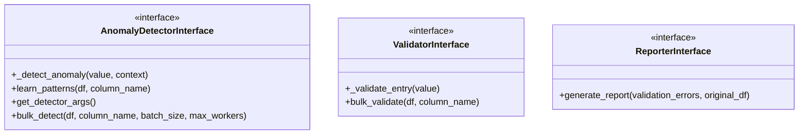

# Core Interfaces API Reference

This document provides comprehensive API documentation for the core interfaces in the Data Quality Detection System. These interfaces define the contracts that all implementations must follow.

## Overview

The system uses abstract base classes (ABCs) to define interfaces, ensuring consistency across different implementations. The main interfaces are:



## AnomalyDetectorInterface

Base interface for all anomaly detection methods.

### Location
`anomaly_detectors/anomaly_detector_interface.py`

### Methods

#### _detect_anomaly(value: Any, context: Dict[str, Any] = None) -> Optional[AnomalyError]

Contains the specific anomaly detection logic for a single data entry. This method must be implemented by subclasses.

**Parameters:**
- `value` (Any): The data from the DataFrame column to be checked for anomalies
- `context` (Optional[Dict[str, Any]]): Optional dictionary containing additional context data

**Returns:**
- None if no anomaly is detected
- An AnomalyError instance if an anomaly is detected

**Example:**
```python
def _detect_anomaly(self, value, context=None):
    if value not in self.known_patterns:
        return AnomalyError(
            anomaly_type="unknown_value",
            probability=0.85,
            anomaly_data={"value": value, "expected": self.known_patterns}
        )
    return None
```

#### learn_patterns(df: pd.DataFrame, column_name: str) -> None

Learns normal patterns from the data to establish a baseline for anomaly detection. This is an optional method that anomaly detectors can override.

**Parameters:**
- `df` (pd.DataFrame): The input DataFrame containing the data to learn from
- `column_name` (str): The name of the column to learn patterns from

**Example:**
```python
detector = PatternBasedDetector()
detector.learn_patterns(clean_data, 'material')
```

#### get_detector_args() -> Dict[str, Any]

Return arguments needed to recreate this detector instance in a worker process.

**Returns:**
- Dictionary of arguments that can be passed to the constructor

#### bulk_detect(df: pd.DataFrame, column_name: str, batch_size: Optional[int], max_workers: int) -> List[AnomalyError]

Detects anomalies in a column and returns a list of AnomalyError objects. This method runs the `_detect_anomaly` logic in parallel batches.

**Parameters:**
- `df` (pd.DataFrame): The input DataFrame containing the data to be analyzed
- `column_name` (str): The name of the column to check for anomalies
- `batch_size` (Optional[int]): Number of rows per batch. If None, automatically calculated
- `max_workers` (int): Number of parallel workers

**Returns:**
- List[AnomalyError]: A list of AnomalyError instances

**Example:**
```python
anomalies = detector.bulk_detect(data_df, 'material', batch_size=1000, max_workers=4)
```

### Implementations

- `PatternBasedDetector`: Rule-based pattern matching
- `MLAnomalyDetector`: Machine learning based detection
- `LLMAnomalyDetector`: Language model based detection

## ValidatorInterface

Base interface for field validators that enforce business rules.

### Location
`validators/validator_interface.py`

### Methods

#### _validate_entry(value: Any) -> Optional[ValidationError]

Contains the specific validation logic for a single data entry. This method must be implemented by subclasses.

**Parameters:**
- `value` (Any): The data from the DataFrame column to be validated

**Returns:**
- None if the value is valid
- A ValidationError instance if the value is invalid

**Example:**
```python
validator = MaterialValidator()
errors = validator.validate("", row_index=5)
# [ValidationError(type='EMPTY_VALUE', severity='ERROR', confidence=1.0)]
```

#### bulk_validate(df: pd.DataFrame, column_name: str) -> List[ValidationError]

Validates a column and returns a list of ValidationError objects. This method runs the `_validate_entry` logic for each row.

**Parameters:**
- `df` (pd.DataFrame): The input DataFrame containing the data to be validated
- `column_name` (str): The name of the column to validate within the DataFrame

**Returns:**
- List[ValidationError]: A list of ValidationError instances with row context

**Example:**
```python
errors = validator.bulk_validate(data_df, 'material')
```

### ValidationError Class

```python
@dataclass
class ValidationError:
    error_type: str          # Error code (e.g., 'EMPTY_VALUE')
    probability: float      # Always 1.0 for validators
    row_index: Optional[int] # Row index where error occurred
    column_name: Optional[str] # Column name where error occurred
    error_data: Any         # The actual problematic value
```

### Implementations

- `RuleBasedValidator(field_name)`: JSON rules in `validators/rule_based/rules/{field}.json`
- Custom per-field classes under `validators/{field}/validate.py`

### Creating JSON Rules

See `validators/rule_based/rules/README.md` for the rule schema and examples.

## ReporterInterface

Base interface for report generation across different formats.

### Location
`validators/reporter_interface.py`

### Methods

#### generate_report(validation_errors: List[ValidationError], original_df: pd.DataFrame) -> List[Dict[str, Any]]

Generates human-readable messages for a list of validation errors.

**Parameters:**
- `validation_errors` (List[ValidationError]): The list of ValidationError objects produced by a Validator
- `original_df` (pd.DataFrame): The original DataFrame, useful for providing additional context

**Returns:**
- List[Dict[str, Any]]: A list of dictionaries, where each dictionary contains:
  - `row_index`: The integer index of the row containing the error
  - `error_data`: The original problematic data
  - `display_message`: A human-readable string explaining the error

**Example:**
```python
report = reporter.generate_report(validation_errors, data_df)
# [{"row_index": 5, "error_data": "", "display_message": "Empty material value"}]
```

### Report Structure

Standard report structure:

```python
{
    "summary": {
        "total_records": 1000,
        "errors_found": 150,
        "detection_methods": ["validation", "pattern", "ml"],
        "timestamp": "2024-01-01T00:00:00Z"
    },
    "field_results": {
        "material": {
            "errors": 25,
            "error_rate": 0.025,
            "top_errors": [...]
        }
    },
    "detailed_results": [...]
}
```

## UnifiedDetectorInterface

High-level interface that combines multiple detection methods.

### Location
`multi_sample_evaluation/unified_detection_interface.py`

### Methods

#### detect_issues(df: pd.DataFrame, field_name: str, config: DetectionConfig) -> List[DetectionResult]

Runs detection using configured methods.

**Parameters:**
- `df` (pd.DataFrame): Input DataFrame
- `field_name` (str): Standard field name to analyze
- `config` (DetectionConfig): Configuration specifying thresholds and enabled methods

**Returns:**
- List[DetectionResult]: List of all detected issues

**Example:**
```python
config = DetectionConfig(
    validation_threshold=0.0,
    anomaly_threshold=0.7,
    ml_threshold=0.75,
    enable_validation=True,
    enable_anomaly_detection=True,
    enable_ml_detection=True
)
results = detector.detect_issues(data_df, 'material', config)
```

### DetectionConfig

Configuration class for controlling detection behavior:

```python
@dataclass
class DetectionConfig:
    validation_threshold: float
    anomaly_threshold: float
    ml_threshold: float
    llm_threshold: float = 0.6
    enable_validation: bool = True
    enable_anomaly_detection: bool = True
    enable_ml_detection: bool = True
    enable_llm_detection: bool = False
```

### DetectionResult

Unified result format for all detection methods:

```python
@dataclass
class DetectionResult:
    row_index: int
    field_name: str
    detection_type: DetectionType
    error_code: str
    confidence: float
    message: str
    details: Dict[str, Any]
    value: Any
```

## Usage Examples

### Complete Detection Pipeline

```python
from validators.rule_based.rule_based_validator import RuleBasedValidator
from validators.report import Reporter

# Initialize components
validator = RuleBasedValidator('material')
reporter = Reporter('material')

# Load and prepare data
data = pd.read_csv('data.csv')

# Detect validation errors
validation_errors = validator.bulk_validate(data, 'material')

# Generate human-readable report
validation_report = reporter.generate_report(validation_errors, data)
```